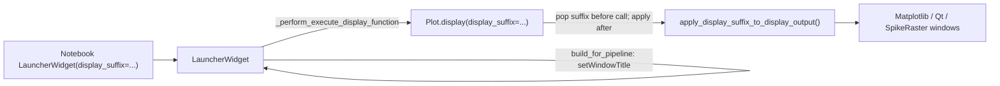

# Add `display_suffix` to LauncherWidget

## Goal

Allow notebook users to distinguish multiple concurrent launchers and their spawned display windows:

```python
widget = LauncherWidget(display_suffix='ReviewApr01')
```

- Launcher title: `Spike3D Launcher: <session_id> - ReviewApr01`
- Display windows launched from that widget get the same suffix appended to their title bars

## Architecture



## Files to change

### 1. [`LauncherWidget.py`](h:/TEMP/Spike3DEnv_ExploreUpgrade/Spike3DWorkEnv/pyPhoPlaceCellAnalysis/src/pyphoplacecellanalysis/GUI/Qt/MainApplicationWindows/LauncherWidget/LauncherWidget.py)

- Extend `__init__` signature:

  `def __init__(self, debug_print=False, should_use_nice_display_names: bool = True, display_suffix: Optional[str] = None, parent=None):`

- Store `self.display_suffix` (normalize empty/whitespace-only strings to `None`).
- Add small helper `_compose_launcher_window_title(session_id_str: str) -> str`:
  - Base: `f'Spike3D Launcher: {session_id_str}'`
  - With suffix: `f'Spike3D Launcher: {session_id_str} - {display_suffix}'`
- In `build_for_pipeline`, replace direct `setWindowTitle(...)` call with the helper.
- In `_perform_execute_display_function`, pass suffix into pipeline display:

  `kwargs['display_suffix'] = self.display_suffix` (only when not `None`)

- Update class docstring usage example to show the new kwarg.

### 2. [`Display.py`](h:/TEMP/Spike3DEnv_ExploreUpgrade/Spike3DWorkEnv/pyPhoPlaceCellAnalysis/src/pyphoplacecellanalysis/General/Pipeline/Stages/Display.py) — `Plot.display()`

- Near the top of `display()` (after `debug_print` extraction), **pop** `display_suffix` from `kwargs` so it never leaks into individual display functions:

  ```python
  display_suffix = kwargs.pop('display_suffix', None)
  if display_suffix is not None:
      display_suffix = display_suffix.strip() or None
  ```

- After `curr_display_output = display_function(...)`, if `display_suffix` is set:

  ```python
  apply_display_suffix_to_display_output(curr_display_output, display_suffix)
  ```

- Import the helper from `DisplayHelpers`.

This keeps the change centralized: no edits to individual display functions under `DisplayFunctions/`.

### 3. [`DisplayHelpers.py`](h:/TEMP/Spike3DEnv_ExploreUpgrade/Spike3DWorkEnv/pyPhoPlaceCellAnalysis/src/pyphoplacecellanalysis/General/Mixins/DisplayHelpers.py)

Add two small utilities:

**`append_display_suffix_to_title(title: str, display_suffix: str) -> str`**
- Return `title` unchanged if suffix is missing or already present at end.
- Otherwise return `f"{title} - {display_suffix}"` (matches existing title composition style in `Spike3DRasterWindowWidget.compose_window_title`).

**`apply_display_suffix_to_display_output(display_output, display_suffix: str, _visited: Optional[set] = None)`**
- Recursively walk `dict` / `list` / `tuple` values (with `_visited` id-set to avoid cycles).
- Apply suffix to known window-like objects:
  - **matplotlib `Figure`**: read current title from `fig.canvas.manager.get_window_title()` (fallback to `fig.get_label()`), then `set_window_title(...)`.
  - **Qt `QWidget` top-level windows**: read `obj.window().windowTitle()`, append suffix, `setWindowTitle(...)`.
  - **Objects with `params.window_title`**: update stored title and call `setWindowTitle` if available (covers dock-area windows, binned image renderers, etc.).
  - **`Spike3DRasterWindowWidget`**: see item 4 below.

Skip `QApplication` and non-window widgets where `isWindow()` is false.

### 4. [`Spike3DRasterWindowWidget.py`](h:/TEMP/Spike3DEnv_ExploreUpgrade/Spike3DWorkEnv/pyPhoPlaceCellAnalysis/src/pyphoplacecellanalysis/GUI/Qt/SpikeRasterWindows/Spike3DRasterWindowWidget.py) — minimal title-policy extension

Spike raster windows override `setWindowTitle` with base/suffix composition, so a naive `setWindowTitle(current + suffix)` would mis-route the suffix.

Minimal change:
- Add `self.params.launcher_display_suffix = None` in `__init__`.
- Extend `compose_window_title(...)` to accept optional `launcher_display_suffix` and append it last: `base [- dynamic_dock] [- launcher_suffix]`.
- Add `set_launcher_display_suffix(self, launcher_display_suffix: Optional[str])` that stores the value and calls `_apply_composed_window_title()`.
- `apply_display_suffix_to_display_output` calls `set_launcher_display_suffix` when present on the object.

## Notebook usage (no required notebook edit)

In [`ReviewOfWork_2026-04-01.ipynb`](h:/TEMP/Spike3DEnv_ExploreUpgrade/Spike3DWorkEnv/Spike3D/ReviewOfWork_2026-04-01.ipynb), usage would become:

```python
widget = LauncherWidget(display_suffix='ReviewApr01')
```

Per project rules, the notebook will not be edited unless you ask.

## Verification

Manual smoke test in the notebook:
1. Create two launchers with different suffixes on the same pipeline.
2. Confirm launcher title bars differ.
3. Double-click a few display functions (matplotlib ratemaps, spike raster window, pyqtgraph dock window) and confirm spawned window titles include the matching suffix.
4. Confirm `curr_active_pipeline.display(...)` without `display_suffix` behaves unchanged.
