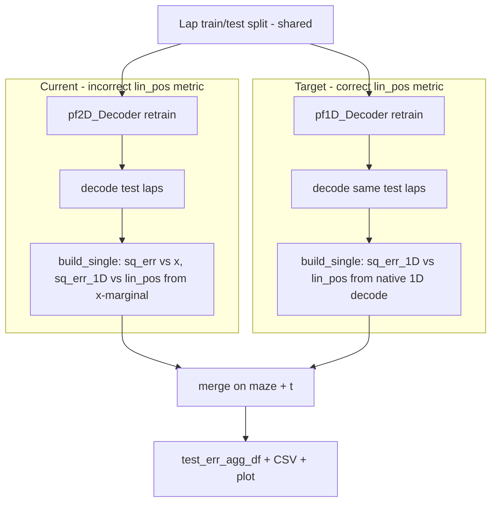

# Propagate correct lin_pos distance through Bapun pipeline

## Problem

Phase 1 added `sq_err_1D` / `err_cm_1D` in [`build_single_measured_decoded_position_comparison`](h:\TEMP\Spike3DEnv_ExploreUpgrade\Spike3DWorkEnv\pyPhoPlaceCellAnalysis\src\pyphoplacecellanalysis\General\Pipeline\Stages\ComputationFunctions\MultiContextComputationFunctions\DirectionalPlacefieldGlobalComputationFunctions.py) (~5208), but the Bapun pipeline still:

- Retrains/decodes only **`pf2D_Decoder`** ([`PendingNotebookCode.py` ~13370–13384](h:\TEMP\Spike3DEnv_ExploreUpgrade\Spike3DWorkEnv\pyPhoPlaceCellAnalysis\src\pyphoplacecellanalysis\SpecificResults\PendingNotebookCode.py))
- Populates `sq_err_1D` by comparing **2D x-marginals** to `lin_pos` (coordinate mismatch, not true lin_pos error)
- Never aggregates, exports, or plots `err_cm_1D`



## Design principles

- **Keep existing 2D metrics unchanged**: `sq_err` / `err_cm` remain pf2D x-marginal vs arena `x`.
- **Authoritative lin_pos metric**: `sq_err_1D` / `err_cm_1D` come only from **retrained `pf1D_Decoder`** decode (native 1D positions in lin_pos space).
- **Auto-enable** when session has usable `lin_pos` and each maze has `pf1D_Decoder` (per your preference); skip silently on OpenField / missing data.
- **Minimal API breakage**: extend `TrainTestSplitResult` with one optional field; keep `compute_bapun_train_test_decoder_error_distance` 3-tuple return.

---

## 1. Fix metric semantics at the source

**File:** [`DirectionalPlacefieldGlobalComputationFunctions.py`](h:\TEMP\Spike3DEnv_ExploreUpgrade\Spike3DWorkEnv\pyPhoPlaceCellAnalysis\src\pyphoplacecellanalysis\General\Pipeline\Stages\ComputationFunctions\MultiContextComputationFunctions\DirectionalPlacefieldGlobalComputationFunctions.py) — `build_single_measured_decoded_position_comparison` (~5225–5291)

Track whether positions are native 1D or extracted from 2D:

```python
raw_decoded_positions = a_decoder_decoding_result.most_likely_positions_list[epoch_idx]
is_native_1D_decode = np.ndim(raw_decoded_positions) < 2
decoded_positions = raw_decoded_positions if is_native_1D_decode else marginal_x_list[...]
```

Gate `sq_err_1D` / `err_cm_1D` on **`is_native_1D_decode and should_compute_1D_lin_pos_comparison`**. This stops the 2D path from emitting misleading lin_pos columns.

Update docstring: `sq_err_1D` = decoded lin_pos vs measured `lin_pos`; only for native 1D decoders (e.g. `pf1D_Decoder`).

---

## 2. Extend train/test split for pf1D (Bapun loop ~13363)

**File:** [`PendingNotebookCode.py`](h:\TEMP\Spike3DEnv_ExploreUpgrade\Spike3DWorkEnv\pyPhoPlaceCellAnalysis\src\pyphoplacecellanalysis\SpecificResults\PendingNotebookCode.py)

### 2a. Extract helper (new, ~13208)

```python
def _bapun_split_maze_train_test_decoder(curr_active_pipeline, maze_name, a_decoder, training_data_portion, debug_print=False):
    a_prev_computation_epochs_df = _resolve_bapun_train_test_split_laps_df(...)
    group_column_name, identity_cols = _bapun_train_test_split_group_params(a_prev_computation_epochs_df)
    an_epoch_training_df, an_epoch_test_df = a_prev_computation_epochs_df.epochs.split_into_training_and_test(...)
    return _single_compute_train_test_split_epochs_decoders(a_decoder=a_decoder, a_config=None, ...)
```

Use **pf2D_Decoder** for lap-resolution fallback in `_resolve_bapun_train_test_split_laps_df` for both calls (epochs are decoder-independent).

### 2b. Session gate helper (new)

```python
def _bapun_session_supports_lin_pos_decoder_eval(curr_active_pipeline, maze_epoch_names) -> bool:
    pos_df = curr_active_pipeline.sess.position.to_dataframe()
    if 'lin_pos' not in pos_df.columns or not pos_df['lin_pos'].notna().any():
        return False
    return all(
        hasattr(curr_active_pipeline.computation_results[m].computed_data, 'pf1D_Decoder')
        and curr_active_pipeline.computation_results[m].computed_data.pf1D_Decoder is not None
        for m in maze_epoch_names
    )
```

### 2c. Refactor Bapun loop (~13370)

```python
for a_maze_name in maze_epoch_names:
    computed_data = ...
    # 2D (existing)
    _, _, (_, _, _, a_sliced_pf2D_Decoder) = _bapun_split_maze_train_test_decoder(..., deepcopy(computed_data.pf2D_Decoder), ...)
    split_train_test_epoch_specific_pfND_Decoder_dict[an_epoch_period_description] = a_sliced_pf2D_Decoder

    # 1D lin_pos (auto when supported)
    if include_lin_pos_decoder and _bapun_session_supports_lin_pos_decoder_eval(...):
        _, _, (_, _, _, a_sliced_pf1D_Decoder) = _bapun_split_maze_train_test_decoder(..., deepcopy(computed_data.pf1D_Decoder), ...)
        split_train_test_epoch_specific_lin_pos_Decoder_dict[an_epoch_period_description] = a_sliced_pf1D_Decoder
```

Add kwarg to `compute_train_test_split_epochs_decoders`:

```python
include_lin_pos_decoder: bool = True  # auto-gated internally; set False to force skip
```

KDiba branch (~13386) unchanged.

### 2d. Extend `TrainTestSplitResult`

**File:** [`DirectionalPlacefieldGlobalComputationFunctions.py`](h:\TEMP\Spike3DEnv_ExploreUpgrade\Spike3DWorkEnv\pyPhoPlaceCellAnalysis\src\pyphoplacecellanalysis\General\Pipeline\Stages\ComputationFunctions\MultiContextComputationFunctions\DirectionalPlacefieldGlobalComputationFunctions.py) (~5834)

```python
train_lap_specific_lin_pos_Decoder_dict: Optional[Dict[types.DecoderName, BasePositionDecoder]] = serialized_field(default=None)
```

- Bump `_VersionedResultMixin_version` (e.g. `"2026.06.21_0"`)
- Update `sliced_by_neuron_id` to slice the new dict when present

### 2e. Update `_assemble_train_test_split_result` (~13254)

Accept optional `split_train_test_epoch_specific_lin_pos_Decoder_dict` and build `train_lap_specific_lin_pos_Decoder_dict` with the same `{k.split('_train')[0]: ...}` pattern as the existing 2D/1D dict.

---

## 3. Merge lin_pos errors in `compute_bapun_train_test_decoder_error_distance`

**File:** [`PendingNotebookCode.py`](h:\TEMP\Spike3DEnv_ExploreUpgrade\Spike3DWorkEnv\pyPhoPlaceCellAnalysis\src\pyphoplacecellanalysis\SpecificResults\PendingNotebookCode.py) (~590–657)

After existing 2D decode + comparison:

```python
if train_test_result.train_lap_specific_lin_pos_Decoder_dict:
    test_decode_results_lin_pos = TrainTestLapsSplitting.decode_using_new_decoders(
        global_spikes_df, train_test_result.train_lap_specific_lin_pos_Decoder_dict,
        train_test_result.test_epochs_dict, laps_decoding_time_bin_size)
    _, _, test_err_df_dict_lin_pos = CustomDecodeEpochsResult.build_measured_decoded_position_comparison(
        test_decode_results_lin_pos, global_measured_position_df)
    for maze_name, df_2d in test_err_df_dict.items():
        df_lin = test_err_df_dict_lin_pos[maze_name][['t', 'sq_err_1D', 'err_cm_1D']]
        test_err_df_dict[maze_name] = df_2d.merge(df_lin, on='t', how='left')
```

Extend aggregation:

```python
agg_kwargs = dict(sq_err_mean=('sq_err', 'mean'), err_cm_mean=('err_cm', 'mean'))
if 'err_cm_1D' in test_err_df.columns:
    agg_kwargs.update(sq_err_1D_mean=('sq_err_1D', 'mean'), err_cm_1D_mean=('err_cm_1D', 'mean'))
test_err_agg_df = test_err_df.groupby(['maze']).agg(**agg_kwargs).reset_index()
```

Sessions without lin_pos support: `test_err_df` columns unchanged (`t`, `sq_err`, `err_cm`, `maze`).

---

## 4. Batch export and plotting

**File:** [`batch_user_completion_helpers.py`](h:\TEMP\Spike3DEnv_ExploreUpgrade\Spike3DWorkEnv\pyPhoPlaceCellAnalysis\src\pyphoplacecellanalysis\General\Batch\BatchJobCompletion\UserCompletionHelpers\batch_user_completion_helpers.py)

### 4a. CSV export (~3485–3494)

No structural change needed — `test_err_df.to_csv` automatically picks up new columns when present. Optionally log column list in debug.

### 4b. Figure helper (~3595)

Relax assert:

```python
assert y_col_name in ['sq_err', 'err_cm', 'sq_err_1D', 'err_cm_1D'], ...
```

Optionally export a **second figure** when `err_cm_1D` in columns (same helper, `y_col_name='err_cm_1D'`, distinct filename suffix `_lin_pos`). Keeps existing `err_cm` figure unchanged.

### 4c. `perform_plot_test_decoder_performance_error_distance` (~662)

No code change required if `y_col_name` is passed through; optionally use `lin_pos` range for y-limit when plotting `err_cm_1D` (max `lin_pos` span per session) instead of 2D `(x,y)` diagonal — small enhancement, not blocking.

---

## 5. Files touched (summary)

| File | Changes |
|------|---------|
| `DirectionalPlacefieldGlobalComputationFunctions.py` | Gate `sq_err_1D` to native 1D decoders; extend `TrainTestSplitResult` + `sliced_by_neuron_id` |
| `PendingNotebookCode.py` | Helpers, Bapun loop dual-decoder split, `_assemble`, `compute_bapun` merge + agg |
| `batch_user_completion_helpers.py` | Allow `err_cm_1D` plot; optional second lin_pos figure export |

**Not in scope:** Jupyter notebooks, KDiba directional path (already 1D-native), renaming `train_lap_specific_pf1D_Decoder_dict` (backward compat).

---

## 6. Verification

1. **TwoMaze session with `lin_pos`** (U/M/N): `test_err_df` has `sq_err_1D`, `err_cm_1D`; `err_cm_1D` ~ same order as `err_cm` (not hundreds of cm).
2. **OpenField / no `lin_pos`**: identical output to today — no new columns.
3. **Missing `pf1D_Decoder`**: skip lin_pos path with debug warning; 2D metrics still produced.
4. **Batch CSV**: columns include `err_cm_1D` when computed; agg CSV includes `err_cm_1D_mean`.

Smoke snippet:

```python
test_err_agg_df, test_err_df, _ = BapunPositionDecodingPerformance.compute_bapun_train_test_decoder_error_distance(
    curr_active_pipeline, laps_decoding_time_bin_size=0.250, debug_print=True)
assert 'err_cm_1D' in test_err_df.columns  # TwoMaze with lin_pos
assert test_err_df['err_cm_1D'].mean() < test_err_df['err_cm'].mean() * 2  # sanity vs old mismatch
```
