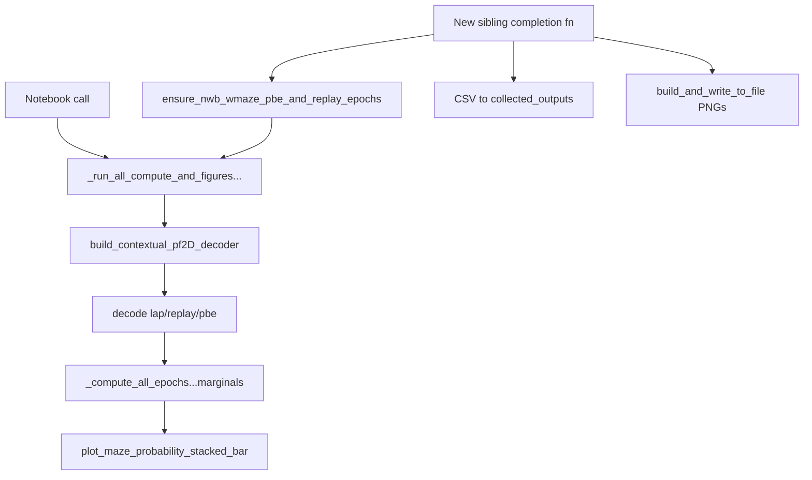

# Maze-context compute/figures batch sibling

## Approach

Add a **new sibling** completion function next to [`figures_plot_nwb_wmaze_pbe_replay_decode_posteriors_completion_function`](h:\TEMP\Spike3DEnv_ExploreUpgrade\Spike3DWorkEnv\pyPhoPlaceCellAnalysis\src\pyphoplacecellanalysis\General\Batch\BatchJobCompletion\UserCompletionHelpers\batch_user_completion_helpers.py) (does not modify that function’s export path). First make [`_run_all_compute_and_figures_for_all_epochs_all_maze_by_maze_context`](h:\TEMP\Spike3DEnv_ExploreUpgrade\Spike3DWorkEnv\pyPhoPlaceCellAnalysis\src\pyphoplacecellanalysis\SpecificResults\PendingNotebookCode.py) fully runnable for the notebook usage:

```python
decoding_time_bin_size: float = 0.060
output_dict = _run_all_compute_and_figures_for_all_epochs_all_maze_by_maze_context(curr_active_pipeline=..., decoding_time_bin_size=decoding_time_bin_size)
```



## 1. Fix `_run_all_compute...` (PendingNotebookCode.py ~361–498)

Minimal edits so the function is correct end-to-end:

- **Decoder source (critical):** stop reusing/overwriting `DirectionalDecodersDecoded` (that key holds continuous *directional* decode after `recompute_nwb_wmaze...`). Always build a contextual maze decoder via `_resolve_maze_epoch_names_for_multi_context_eval` + `build_contextual_pf2D_decoder`, and keep the decoder on `output_dict` only.
- **Restore imports / local refs:** ensure `_compute_all_epochs_all_maze_by_maze_context_marginals` and `plot_maze_probability_stacked_bar` are available (same-module; drop the commented broken re-imports).
- **Fix save payload:** use `decoded_results_dict['lap'|'replay'|'pbe']` (or bind those names) instead of undefined `laps_decoding_result` / etc.
- **Epochs:** if `sess.pbe` / `sess.replay` missing (or kwarg `ensure_pbe_replay_epochs=True`), call `ensure_nwb_wmaze_pbe_and_replay_epochs`. Default batch path will pass `True`.
- **Return contract** (keep keys notebook already expects): `decoded_results_dict`, `context_probability_df_dict`, `decoded_results_context_probability_performance_df_dict`, `figs_plot_maze_probability_stacked_bar_dict`, plus save paths / `maze_prob_col_names` / `contextual_pf2D_Decoder`.
- Keep signature compatible: `decoding_time_bin_size: float = 0.050` (notebook passes `0.060`).

## 2. New sibling completion function (batch_user_completion_helpers.py)

Insert **immediately before or after** line ~3771 in the NWB W-maze section:

`compute_and_figures_nwb_wmaze_maze_context_probabilities_completion_function`

Mirror patterns from [`compute_and_export_bapun_train_test_decoder_error_distance_completion_function`](h:\TEMP\Spike3DEnv_ExploreUpgrade\Spike3DWorkEnv\pyPhoPlaceCellAnalysis\src\pyphoplacecellanalysis\General\Batch\BatchJobCompletion\UserCompletionHelpers\batch_user_completion_helpers.py) and the Bapun figures helper:

- Gate: `format_name == 'dandi_nwb'` (same as the posterior-export sibling).
- Params: `decoding_time_bin_size: float = 0.060`, `overwrite_pbe_replay_epochs: bool = False`, `save_csv: bool = True`, `write_png: bool = True`, `write_vector_format: bool = False`, `debug_print: bool = False`.
- Body:
  1. `ensure_nwb_wmaze_pbe_and_replay_epochs(...)`
  2. `output_dict = _run_all_compute_and_figures_...(..., decoding_time_bin_size=..., ensure_pbe_replay_epochs=False)`
  3. Export each `context_probability_df` / performance df to `self.collected_outputs_path` with prefix `{BATCH_DATE}-{session}_maze_context_{epoch_name}_*.csv`
  4. Export each returned matplotlib fig via `FileOutputManager` + `build_and_write_to_file` (same as Bapun figure completion)
  5. Wrap in `try/except` → `CapturedException`; re-raise only if `self.fail_on_exception`
- Store under `across_session_results_extended_dict['compute_and_figures_nwb_wmaze_maze_context_probabilities_completion_function']` with paths + light summary (not full giant decode objects unless needed).

**Safety:** no changes to `figures_plot_nwb_wmaze_pbe_replay_decode_posteriors_completion_function` logic; no writes into `DirectionalDecodersDecoded`.

## 3. Register in default batch map

In `MAIN_get_template_string` (~4898–4900), add the new function **after** `figures_plot_nwb_wmaze_pbe_replay_decode_posteriors_completion_function` so it can reuse PBE/replay epochs created by prior NWB stages when those already ran.

## Out of scope

- Extending or calling into the posterior PNG/GIF exporter
- Changing notebook cells (existing 4-line call remains valid once `_run_all` is fixed)
- Parallel ThreadPool decode (keep sequential)