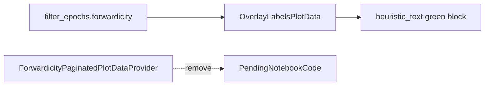

# Merge forwardicity into OverlayLabels display

## Approach

Use the existing DF-backed overlay path in [`DecoderPredictionError.py`](h:/TEMP/Spike3DEnv_ExploreUpgrade/Spike3DWorkEnv/pyPhoPlaceCellAnalysis/src/pyphoplacecellanalysis/General/Pipeline/Stages/DisplayFunctions/DecoderPredictionError.py): `OverlayLabelsPlotData` loads score columns from `active_filter_epochs` and `OverlayLabelsPaginatedPlotDataProvider` renders them in the green heuristic block. No on-the-fly `forwardicity_score(...)` in the display callback.

Display only `forwardicity` (short label `fwdicty`), matching the current live text. The ratio columns stay on the DF for analysis but are not shown in the overlay.

## 1. Extend OverlayLabelsPlotData

In `OverlayLabelsPlotData` (~L1968–2054):

- Append `'forwardicity'` to `HEURISTIC_LABEL_KEYS` (after `mseq_dtrav`).
- Add formatting entry:
  `'forwardicity': default_smart_formatting_fn_factory(short_name='fwdicty')`

`init_batch_from_epochs_df` already keeps only columns present on the DF, so old sessions without `forwardicity` simply omit that line. `get_column_names()` / `add_data_overlays` pick it up automatically when overlay labels are enabled.

No changes needed inside `OverlayLabelsPaginatedPlotDataProvider._callback_update_curr_single_epoch_slice_plot` — it already builds heuristic text from `HEURISTIC_LABEL_KEYS`.

## 2. Remove ForwardicityPaginatedPlotDataProvider

In [`PendingNotebookCode.py`](h:/TEMP/Spike3DEnv_ExploreUpgrade/Spike3DWorkEnv/pyPhoPlaceCellAnalysis/src/pyphoplacecellanalysis/SpecificResults/PendingNotebookCode.py) (~L135–199):

- Delete `ForwardicityPaginatedPlotDataProvider` and its unused imports (`PaginatedPlotDataProvider`, `add_inner_title`, `DECODER_DIRECTION_MAP` if unused).
- Keep re-exports of `forwardicity_score` and `main_sequence_positions` for notebook/API compatibility.

## 3. Small related cleanup

In [`heuristic_replay_scoring.py`](h:/TEMP/Spike3DEnv_ExploreUpgrade/Spike3DWorkEnv/pyPhoPlaceCellAnalysis/src/pyphoplacecellanalysis/Analysis/Decoder/heuristic_replay_scoring.py), drop `ForwardicityPaginatedPlotDataProvider` from `main_sequence_positions` `used_by` metadata.

## Out of scope

- No notebook edits (`ReviewOfWork_2026-04-01.ipynb` still calls the removed class). After this lands, drop those `ForwardicityPaginatedPlotDataProvider.add_data_to_pagination_controller(...)` calls; overlay labels already come from `add_data_overlays` when `enable_overlay_labels_info` is on.
- Do not show `ratio_major_aligned_bins` / `ratio_decoder_aligned_bins` in the overlay.
