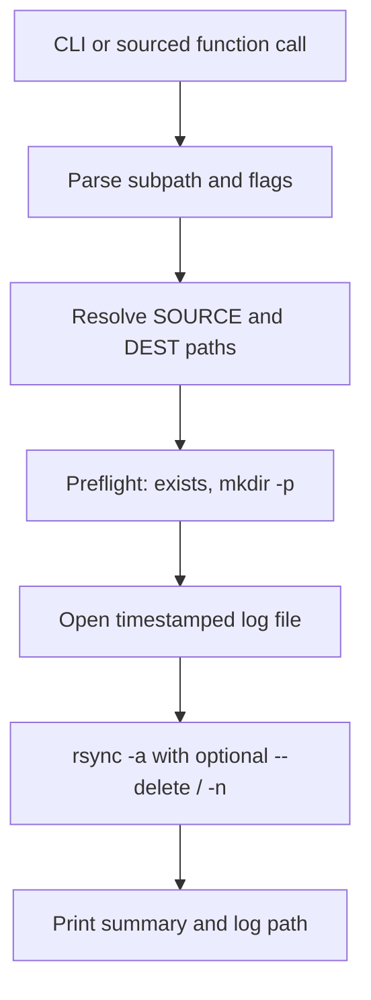

# Mirror Turbo Data to Scratch Helper

## Goal

Create [`mirror_data_to_scratch.sh`](file:///home/halechr/repos/PhoLinuxHelpers/sources/greatlakes_Helpers/mirror_data_to_scratch.sh) in [`greatlakes_Helpers`](file:///home/halechr/repos/PhoLinuxHelpers/sources/greatlakes_Helpers/) following the same conventions as existing scripts like [`backup_repos.sh`](file:///home/halechr/repos/PhoLinuxHelpers/sources/greatlakes_Helpers/backup_repos.sh):

- Sourceable library of bash functions (not auto-run on `source`)
- Runnable directly from the CLI
- Header comments with example usage

## Design

### Paths (defaults)

| Role | Path |
|------|------|
| NFS source root | `/nfs/turbo/umms-kdiba/Data` |
| Scratch dest root | `/scratch/kdiba_root/kdiba99/halechr/Data` |
| Log directory | `/scratch/kdiba_root/kdiba99/halechr/logs` |

Note: [`backup_repos.sh`](file:///home/halechr/repos/PhoLinuxHelpers/sources/greatlakes_Helpers/backup_repos.sh) uses `kdiba0` scratch; this script uses `kdiba99` per your request (also consistent with Spike3D scratch paths in `pythonScriptTemplating.py`).

### Core function

```bash
mirror_turbo_data_to_scratch [subpath] [--dry-run] [--delete]
```

- **`subpath`** (optional): relative path under `Data`, e.g. `KDIBA/gor01/one`. Empty = full `Data` tree.
- **`--dry-run`**: pass `rsync -n` for preview.
- **`--delete`** (opt-in, default off): pass `rsync --delete` so scratch matches NFS removals.

### rsync invocation

Mirror the established pattern from `backup_repos.sh` (`rsync -av`) with additions suited to large data transfers:

```bash
rsync -a --info=progress2 --partial \
  ${DELETE_FLAG} ${DRY_RUN_FLAG} \
  "${SOURCE}/" "${DEST}/"
```

- Trailing slashes on both sides so subpath sync copies *contents* into the matching dest folder.
- `--partial` allows resuming interrupted transfers.
- No default exclude list (this is raw lab data, not git repos). Optional `.DS_Store` / `__pycache__` excludes can be added later if needed.

### Preflight checks

Before rsync:

1. Verify NFS source path exists and is readable.
2. `mkdir -p` destination and log directory.
3. Print a summary: source, dest, subpath scope, dry-run/delete flags.
4. Write a timestamped log file under the scratch logs dir (capture rsync stdout/stderr via `tee`).

### CLI vs sourceable

```bash
# Source and call manually
source "$HOME/repos/PhoLinuxHelpers/sources/greatlakes_Helpers/mirror_data_to_scratch.sh"
mirror_turbo_data_to_scratch KDIBA/gor01/one --dry-run

# Or run directly
"$HOME/repos/PhoLinuxHelpers/sources/greatlakes_Helpers/mirror_data_to_scratch.sh" --delete
```

Use `[[ "${BASH_SOURCE[0]}" == "${0}" ]]` guard so sourcing only defines functions; executing runs `main "$@"`.

### Argument parsing

Simple loop (no `getopts` needed for 2 flags):

- Collect positional args into `subpath` (first non-flag token only).
- Recognize `--dry-run` and `--delete` anywhere in argv.

## File to create

**[`PhoLinuxHelpers/sources/greatlakes_Helpers/mirror_data_to_scratch.sh`](file:///home/halechr/repos/PhoLinuxHelpers/sources/greatlakes_Helpers/mirror_data_to_scratch.sh)**

Approximate structure:



## Out of scope (kept minimal)

- No SLURM/sbatch wrapper (can be added later as a one-liner in comments if full-tree sync is slow on login nodes).
- No README update (not requested).
- No changes to existing scripts.

## Verification (on Great Lakes)

After implementation, test in this order:

1. `mirror_data_to_scratch.sh some/small/subpath --dry-run` — confirm file list looks correct.
2. Same subpath without `--dry-run` — confirm files land under scratch.
3. Re-run without flags — confirm rsync skips unchanged files.
4. Optional: `--delete` on a test subpath with a deliberately removed NFS file.
