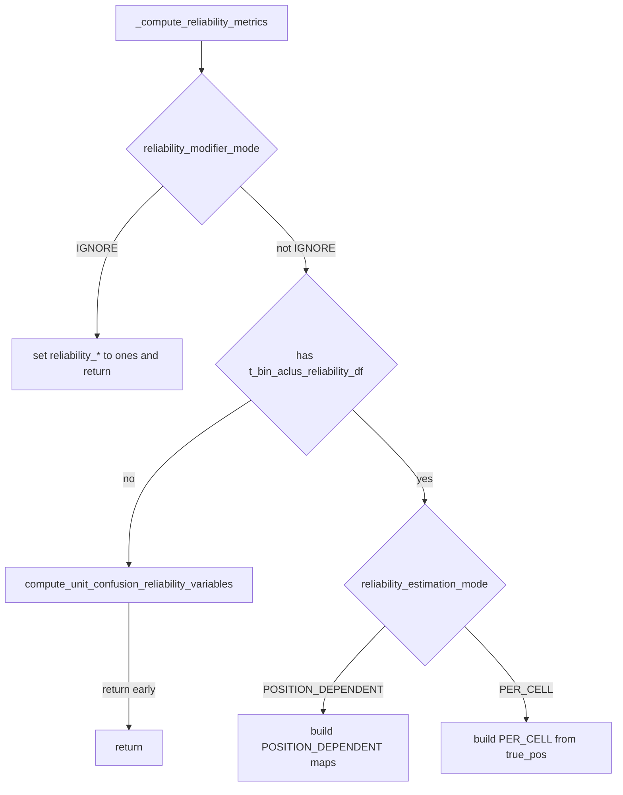

# Mode-gated confusion compute on reliability metrics

## Goal

Centralize reliability array construction in `_compute_reliability_metrics()` so DST / Bayesian callers just invoke that method.

## Done: `_compute_reliability_metrics` core gating ([reliability.py](h:/TEMP/Spike3DEnv_ExploreUpgrade/Spike3DWorkEnv/pyPhoPlaceCellAnalysis/src/pyphoplacecellanalysis/Analysis/reliability.py))

Current accepted behavior:

1. **`reliability_modifier_mode == IGNORE`** → skip expensive confusion (still must set ones — see remaining fix below).
2. Else if **`t_bin_aclus_reliability_df` missing** → run `compute_unit_confusion_reliability_variables()` for **both** `PER_CELL` and `POSITION_DEPENDENT`.
3. Then branch on **`reliability_estimation_mode`**:
   - **`POSITION_DEPENDENT`**: visit-conditioned maps (or rates × masks fallback).
   - **`PER_CELL`**: `(n_neurons,)` from `true_pos`.



## Remaining

### 1. Fix infinite recursion on decode (`IGNORE` path)

DST `compute_posterior` does `if self.reliability_active is None: self._compute_reliability_metrics()`. Today `IGNORE` returns without setting arrays → still `None` → recurse forever.

In `_compute_reliability_metrics`, uncomment/restore:

```python
if is_ignore_mode:
    R_ones = np.ones(n_neurons, dtype=float)
    self.reliability_active = R_ones
    self.reliability_silent = np.ones_like(R_ones)
    return
```

Update the method docstring to match (IGNORE → ones; missing df → auto-run confusion for both modes).

### 2. Fix double-build after nested confusion

`compute_unit_confusion_reliability_variables()` already ends with `_compute_reliability_metrics()`. After the `should_compute` call, return immediately:

```python
if should_compute:
    print(...)
    _ = self.compute_unit_confusion_reliability_variables(**kwargs)
    print(...)
    if self.t_bin_aclus_reliability_df is None:
        raise ValueError(...)
    return  # nested call already refreshed reliability_*
```

Keep existing `.value` enum compares and direct `self.reliability_modifier_mode` access as-is.

### 3. Simplify DST `setup()` in [`reconstruction_dst.py`](h:/TEMP/Spike3DEnv_ExploreUpgrade/Spike3DWorkEnv/pyPhoPlaceCellAnalysis/src/pyphoplacecellanalysis/Analysis/Decoder/reconstruction_dst.py)

Replace:

```python
_ = self.compute_unit_confusion_reliability_variables()
self._compute_reliability_metrics()
```

with:

```python
self._compute_reliability_metrics()
```

### 4. Leave explicit factory / manual calls alone

`init_from_stateful_decoder` / `init_from_placefields` that call confusion when prominence is passed stay as explicit opt-in precompute. No change to Bayesian `setup()`.

## Out of scope (do not change)

- `getattr(self, 'reliability_modifier_mode', ...)` wrappers
- Preferring `estimation_mode == ReliabilityEstimationMode.POSITION_DEPENDENT` over `.value` compares
- Cleaning redundant `and (not is_ignore_mode)` in `should_compute`
- Changing default `reliability_estimation_mode` / `reliability_modifier_mode`
- Merging visit-conditioned vs fallback map builders
- Making Bayesian `decode` / `compute_all` auto-call metrics
