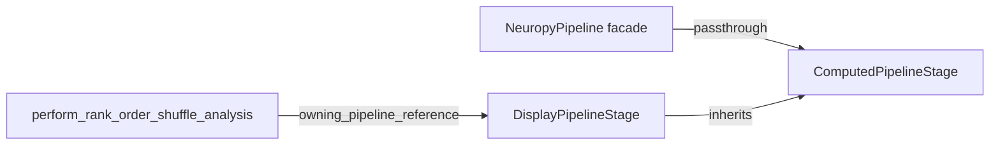

# Move parameter methods onto the stage

The methods live on [`PipelineWithComputedPipelineStageMixin`](h:\TEMP\Spike3DEnv_ExploreUpgrade\Spike3DWorkEnv\pyPhoPlaceCellAnalysis\src\pyphoplacecellanalysis\General\Pipeline\Stages\Computation.py) (lines 3226–3627). Global computation functions receive the stage, not `NeuropyPipeline`, via `owning_pipeline_reference=self` in `perform_specific_computation`. After `prepare_for_display()`, that object is a `DisplayPipelineStage`, which subclasses `ComputedPipelineStage` and does not mix in the facade.



Only [`Computation.py`](h:\TEMP\Spike3DEnv_ExploreUpgrade\Spike3DWorkEnv\pyPhoPlaceCellAnalysis\src\pyphoplacecellanalysis\General\Pipeline\Stages\Computation.py) changes. Leave `find_first_and_last_valid_position_times` (line 3629) where it is; it is already a passthrough, and the stage already implements it.

## Move these implementations onto `ComputedPipelineStage`

Insert them at the end of `ComputedPipelineStage` (just before the mixin at line 1946), bodies unchanged except the two adjustments below:

- `get_all_parameters`
- `update_parameters`
- `get_session_additional_parameters_context`
- `get_custom_pipeline_filenames_from_parameters`
- `get_complete_session_identifier_string`
- `build_complete_session_identifier_filename_string`
- `get_complete_session_context`

`DisplayPipelineStage.init_from_previous_stage` does not need changes; methods come from the class.

Stage attributes these methods already use are present on `ComputedPipelineStage` / `LoadableSessionInput`: `active_sess_config`, `sess`, `global_computation_results`, `computation_results`, `filtered_sessions`, `get_session_context`, `registered_merged_computation_function_dict` (needed by `ComputationKWargParameters.init_from_pipeline`).

## Two behavior-preserving adjustments inside the moved bodies

- `update_parameters` calls `self.is_computed`, which exists only on the mixin. On the stage, replace that with the same condition the mixin uses: `computation_results` is not `None` and non-empty (`can_compute` is always `True` on `ComputedPipelineStage`). Guard the lookup so a missing attribute is treated as not computed. Update the warning string that currently names `PipelineWithComputedPipelineStageMixin.update_parameters`.
- `_export_filename_extra_suffix_parts` is set on the `NeuropyPipeline` instance (see `apply_export_filename_extra_suffix_parts_to_pipeline`). `get_custom_pipeline_filenames_from_parameters` reads it from `self`. Facade entry points that reach that method must copy the attribute onto the stage before delegating: `get_custom_pipeline_filenames_from_parameters`, `get_complete_session_identifier_string`, and `build_complete_session_identifier_filename_string`.

## Facade passthroughs

Replace the mixin bodies with direct delegations, same signatures, matching the existing style of `get_failed_computations`:

```python
def get_all_parameters(self, allow_update_global_computation_config:bool=True, get_panel_gui_widget:bool=False):
    return self.stage.get_all_parameters(allow_update_global_computation_config=allow_update_global_computation_config, get_panel_gui_widget=get_panel_gui_widget)
```

`update_parameters` is also called before filtering, when `self.stage` is still a `LoadedPipelineStage` ([`NeuropyPipeline.try_init_from_saved_pickle_or_reload_if_needed`](h:\TEMP\Spike3DEnv_ExploreUpgrade\Spike3DWorkEnv\pyPhoPlaceCellAnalysis\src\pyphoplacecellanalysis\General\Pipeline\NeuropyPipeline.py) around line 550). That path only applies preprocessing keypaths. Keep it working without a second copy of the method:

```python
def update_parameters(self, override_parameters_flat_keypaths_dict=None):
    if isinstance(self.stage, ComputedPipelineStage):
        return self.stage.update_parameters(override_parameters_flat_keypaths_dict=override_parameters_flat_keypaths_dict)
    return ComputedPipelineStage.update_parameters(self, override_parameters_flat_keypaths_dict=override_parameters_flat_keypaths_dict)
```

The unbound call uses the pipeline as `self`, so `active_sess_config` still updates, and the not-computed branch still skips computation keypaths.

Keep docstrings and `@function_attributes` on the stage implementations. Facade wrappers stay one-line passthroughs.
