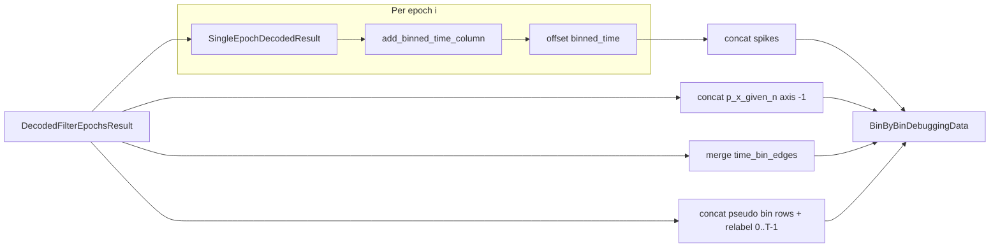

# Multi-epoch `BinByBinDebuggingData` factory

## Context

- `[DecodedFilterEpochsResult](h:\TEMP\Spike3DEnv_ExploreUpgrade\Spike3DWorkEnv\pyPhoPlaceCellAnalysis\src\pyphoplacecellanalysis\Analysis\Decoder\reconstruction.py)` holds per-epoch lists (`time_bin_edges`, `p_x_given_n_list`, `nbins`, …) and exposes `[get_result_for_epoch(i) -> SingleEpochDecodedResult](h:\TEMP\Spike3DEnv_ExploreUpgrade\Spike3DWorkEnv\pyPhoPlaceCellAnalysis\src\pyphoplacecellanalysis\Analysis\Decoder\reconstruction.py)` (lines 967–998).
- `[BinByBinDebuggingData.init_from_single_continuous_result](h:\TEMP\Spike3DEnv_ExploreUpgrade\Spike3DWorkEnv\pyPhoPlaceCellAnalysis\src\pyphoplacecellanalysis\GUI\PyQtPlot\Widgets\ContainerBased\BinByBinDecodingDebugger.py)` builds one continuous timeline: pseudo bin rows from `build_pseudo_epochs_df_from_decoding_bins()`, `p_x_given_n`, `time_bin_edges`, and a spike dataframe with **0-based `binned_time`** aligned to those rows.
- **Gap problem:** You cannot bin spikes once with one giant `time_bin_edges` array that “bridges” non-adjacent filter epochs—gaps would create bogus bins. The safe approach is **per-epoch binning** (same as today), then **remap** `binned_time` with a cumulative offset `sum(nbins[:epoch_idx])`, and concatenate spike subsets.

## Consumer bug (why this matters)

`[BinByBinDecodingDebugger.plot_attached_BinByBinDecodingDebugger](h:\TEMP\Spike3DEnv_ExploreUpgrade\Spike3DWorkEnv\pyPhoPlaceCellAnalysis\src\pyphoplacecellanalysis\GUI\PyQtPlot\Widgets\ContainerBased\BinByBinDecodingDebugger.py)` (lines 824–834) treats `DecodedFilterEpochsResult` by calling `**get_result_for_epoch(0)` only**, so multi-epoch results silently drop everything after the first epoch. The new factory directly addresses that.

## Implementation plan (single file: `BinByBinDecodingDebugger.py`)

1. **Add** `@classmethod` `init_from_decoded_filter_epochs_result` on `BinByBinDebuggingData` with signature along the lines of:
  - `a_decoder`, `global_spikes_df`, `a_decoded_result: DecodedFilterEpochsResult`
  - `decoding_time_bin_size: Optional[float] = None` — if `None`, use `a_decoded_result.decoding_time_bin_size`
  - `epoch_indices: Optional[Sequence[int]] = None` — if `None`, include `range(a_decoded_result.n_epochs)`; allows debugging a subset of laps/ripples
  - `n_max_debugged_time_bins` unchanged optional kw (same as existing factory)
2. **Early exit / delegation:** if exactly one epoch index is selected, **delegate** to `init_from_single_continuous_result` with `get_result_for_epoch(idx)` so behavior matches the current path and avoids duplicate edge cases.
3. **Multi-epoch merge loop** (for each selected `epoch_idx` in order):
  - `single = a_decoded_result.get_result_for_epoch(epoch_idx)`
  - `edges = deepcopy(single.time_bin_edges)` (same as single-epoch path; optional: apply the same one-bin `time_bin_edges` workaround documented on `DecodedFilterEpochsResult` if you hit real bad data—only if needed after review)
  - Spike branch: `df = deepcopy(global_spikes_df).spikes.add_binned_time_column(time_window_edges=edges, time_window_edges_binning_info=single.time_bin_container.edge_info)`, `dropna` on `binned_time`, `binned_time = int - 1`, then `binned_time += cumulative_bin_offset`
  - Accumulate `cumulative_bin_offset += single.nbins` after each epoch
  - Pseudo epochs: `single.build_pseudo_epochs_df_from_decoding_bins()`, then assign `**label = np.arange(global_label_cursor, global_label_cursor + len(df))`** (and bump cursor); **reset dataframe index** with `ignore_index=True` when concatenating so rows are 0..T-1 (helps the implicit alignment used when attaching `active_aclus`).
  - Posterior: `append(deepcopy(single.p_x_given_n))`; after loop `np.concatenate(..., axis=-1)` (works for 2D and 3D).
  - Merged edges: start with first epoch’s `edges`; for each next epoch append `edges_next[1:]` (same pattern as other “flattened” timelines in the codebase).
4. **After concatenating spikes:** recompute `unique_aclus_per_bin` via `groupby('binned_time')['aclu'].unique()` and assign into the **merged** `decoding_bins_epochs_df['active_aclus']` with the same NaN→`[]` `apply` as in `init_from_single_continuous_result`.
5. **Validation:** assert posteriors share the same leading shape across epochs before `concatenate`; assert `len(decoding_bins_epochs_df) == cumulative_bin_offset` equals total time steps; optionally soft-check `decoding_time_bin_size` against `a_decoded_result.decoding_time_bin_size` when both provided.
6. **Optional follow-up (same PR or later):** In `plot_attached_BinByBinDecodingDebugger`, when `isinstance(a_decoded_result, DecodedFilterEpochsResult)` and `a_decoded_result.n_epochs > 1`, call `init_from_decoded_filter_epochs_result` instead of `get_result_for_epoch(0)` + `init_from_single_continuous_result`.

## Files

- Primary: [BinByBinDecodingDebugger.py](h:\TEMP\Spike3DEnv_ExploreUpgrade\Spike3DWorkEnv\pyPhoPlaceCellAnalysis\src\pyphoplacecellanalysis\GUI\PyQtPlot\Widgets\ContainerBased\BinByBinDecodingDebugger.py) — add imports for `DecodedFilterEpochsResult` if needed for type hints (`Sequence` from `typing` if not already).

## Testing (manual / notebook)

- One multi-epoch `DecodedFilterEpochsResult` (e.g. multiple laps): build `BinByBinDebuggingData`, confirm `len(decoding_bins_epochs_df) == sum(selected nbins)`, `p_x_given_n` time dimension matches, and `sliced_to_current_window` returns spike counts / posteriors for a window spanning two epochs without bin-index collisions.

