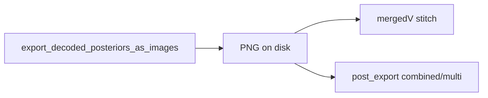

# Fix MultiColor posterior-export OOM

## Root cause (confirmed)

[`_display_decoded_trackID_weighted_position_posterior_withMultiColorOverlay`](h:/TEMP/Spike3DEnv_ExploreUpgrade/Spike3DWorkEnv/pyPhoPlaceCellAnalysis/src/pyphoplacecellanalysis/General/Pipeline/Stages/ComputationFunctions/EpochComputationFunctions.py) → [`PosteriorExporting.export_decoded_posteriors_as_images`](h:/TEMP/Spike3DEnv_ExploreUpgrade/Spike3DWorkEnv/pyPhoPlaceCellAnalysis/src/pyphoplacecellanalysis/Pho2D/data_exporting.py) keeps **every** epoch’s PIL in `HeatmapExportConfig.posterior_saved_image`, plus deepcopies `SingleEpochDecodedResult` / `raw_RGBA_only_parameters` (incl. `spikes_df`) into `posterior_epoch_info` for each epoch. Two full export passes (raw_rgba + greyscale×4) then `post_export_build_combined_images` deepcopies those PILs again. High-PBE sessions (e.g. `2006-6-09_1-22-43`) blow past Slurm ~82 GB.

GL batch only needs on-disk PNGs (`ripple/...`, `combined/multi`); live image galleries are not required.



## Approach (path-first, clear PIL)

Default: never rely on long-lived `posterior_saved_image`. Keep `posterior_saved_path`; load with `Image.open` only for the current epoch’s stitch, then close/discard.

### 1. `HeatmapExportConfig.get_posterior_image()` in [`data_exporting.py`](h:/TEMP/Spike3DEnv_ExploreUpgrade/Spike3DWorkEnv/pyPhoPlaceCellAnalysis/src/pyphoplacecellanalysis/Pho2D/data_exporting.py)

```python
def get_posterior_image(self) -> Image.Image:
    if self.posterior_saved_image is not None:
        return self.posterior_saved_image
    assert self.posterior_saved_path is not None
    return Image.open(self.posterior_saved_path).convert('RGBA')
```

### 2. Slim `export_decoded_posteriors_as_images` (~L631–643)

- Set `posterior_saved_path`; **do not** assign `posterior_saved_image` (prefer never assign).
- Replace heavy `posterior_epoch_info` with lightweight metadata only (no `spikes_df`, no `SingleEpochDecodedResult`, no full export kwargs):

```python
posterior_epoch_info = dict(
    epoch_info_dict=curr_epoch_info_dict,  # shallow/small
    epoch_id_identifier_str=epoch_id_identifier_str,
    active_epoch_id=active_epoch_id,
    complete_epoch_identifier_str=complete_epoch_identifier_str,
)
```

### 2b. `spikes_df` isolation (do not corrupt pipeline)

Today the MultiColor display already does **one** protective copy when building the `raw_rgba` template:

`spikes_df=deepcopy(get_proper_global_spikes_df(...))` inside `raw_RGBA_only_parameters`.

The OOM amplifier is then **re-deepcopying that same df once per epoch** via:
- `HeatmapExportConfig.to_dict()` → `asdict(deepcopy(self), …)` on every epoch (~L628)
- `deepcopy(raw_RGBA_only_parameters)` into every `posterior_epoch_info` (~L641)

**Rules for this fix:**

1. **Never** pass the live pipeline/session `spikes_df` into export without an isolation copy. Keep the existing single `deepcopy(get_proper_global_spikes_df(...))` (or equivalent) when constructing `custom_export_formats` / `raw_RGBA_only_parameters`.
2. **Do not** store `spikes_df` (or `raw_RGBA_only_parameters`) in per-epoch `posterior_epoch_info`.
3. For the per-epoch `save_posterior_as_image` call: reuse the export-template’s already-isolated `spikes_df` **by reference** for RAW_RGBA rendering. Avoid calling `to_dict()`’s full-config `deepcopy(self)` every epoch for that field — build save kwargs without re-copying `spikes_df` (e.g. exclude it from the per-epoch deepcopy, or pass `raw_RGBA_only_parameters` from the template directly).
4. `MultiDecoderColorOverlayedPosteriors.compute_all` for the RGBA image path only uses `p_x_given_n` (not `spikes_df`); `spikes_df` is held for other raster helpers. Still treat the export-template df as **read-only shared across epochs** (same isolated object). Do not mutate it in place in export/post-render code. If a future overlay path needs mutation, deepcopy **inside that mutator**, not N times into every epoch’s metadata.

Net effect: **1** spikes_df copy for the whole MultiColor export, not **N_epochs** copies — without aliasing the pipeline’s live frame.

### 3. `_subfn_build_combined_output_images` (~L670–702)

Stop building `out_all_decoders_epochs_list` of all PILs up front. Per epoch `i`, open the 4 decoder images via `get_posterior_image()` / path, stack, save `mergedV_…`, then close those 4 images. Peak = 4 images + 1 merged.

### 4. `post_export_build_combined_images` (~L1473, ~L1549)

Replace `deepcopy(a_config.posterior_saved_image)` and raw_rgba appends with `a_config.get_posterior_image()`. Close opened images after each epoch’s multi composite is saved. Paths for output naming already use `posterior_saved_path` (~L1654).

### 5. MultiColor display: skip all-epoch mega-stack

In [`EpochComputationFunctions.py`](h:/TEMP/Spike3DEnv_ExploreUpgrade/Spike3DWorkEnv/pyPhoPlaceCellAnalysis/src/pyphoplacecellanalysis/General/Pipeline/Stages/ComputationFunctions/EpochComputationFunctions.py) (~L3208–3261), gate the `vertical_image_stack(flat_imgs of ALL epochs)` block behind new kwarg:

`enable_flat_merged_across_epochs_export: bool = False`

Default **False** (GL / batch safe). When False: set empty `flat_merged_images` / `flat_imgs_dict` / `flat_merged_image_paths` and skip stacking. Notebook callers that want the mega-strip can pass `True`.

Also avoid `deepcopy(out_custom_formats_dict)` / `deepcopy(out_paths)` when assigning to `graphics_output_dict` if those still hold configs — after PIL clearing, shallow assign is enough; keep a shallow copy of the dict structure only if mutation safety is needed.

### 6. Slurm-safe progress / stage tracing (for GL testing)

Fold in the useful parts of the tracing plan so a hard OOM kill leaves a flushed last checkpoint in `*.log` / Slurm `.out`.

**Allowed (safe on GL Linux / Slurm):**

- `print(..., flush=True)` only (stdout → batch log / Slurm capture)
- Local `_trace(msg)` gated by existing `debug_print` (default True)
- Optional RSS via `try: import psutil; ... except Exception: pass` — never required
- Epoch counts / stage ids as plain strings
- Mid-export `progress_print=True` from MultiColor into both `perform_export_all_decoded_posteriors_as_images` calls; print every epoch if `N <= 50`, else every `max(1, N // 20)` plus first/last

**Do not add (risky / fragile on Slurm):**

- Writing sidecar log files, `tee`, or assuming writable paths beyond existing outputs
- `/proc` parsing, `resource.setrlimit`, cgroup APIs, or fancy memory maps
- GUI / Qt / matplotlib interactive backends for diagnostics
- Windows-only APIs or path assumptions
- Progress that loads or stringifies all PIL images / full arrays (could itself spike memory)
- Uncaught imports that abort the job if a package is missing

#### Stage markers in MultiColor display

| Stage id | Where | Extra info |
|----------|-------|------------|
| `01_prereq_compute` | before/after `resolve_and_execute_full_required_computation_plan` | `force_recompute`, `time_bin_size` |
| `02_unpack_generic` | after loading `a_new_fully_generic_result` | |
| `03_build_laps_dict` | after laps dict build | `n_laps` per key |
| `04_build_pbe_dict` | after PBE/ripple dict build | `n_pbe` / `num_filter_epochs` |
| `05_filter_pbe` | after optional filter | filtered count or "no filter" |
| `06_stage1_raw_rgba_export` | before/after first export | formats, `desired_height` |
| `07_split_1d` | before/after 1D split | laps/ripple enabled |
| `08_stage2_greyscale_export` | before/after second export | greyscale formats |
| `09_flat_merge_stack` | skip path when disabled (default) or enter/exit if enabled | |
| `10_done` | just before return | |

Also `flush=True` on existing nearby prints in this function.

#### Mid-export progress

In `export_decoded_posteriors_as_images`, when `progress_print` is True:

```python
print(f'\t[PosteriorExport] epoch {i+1}/{num_filter_epochs} ...', flush=True)
```

Pass `progress_print=True` from both MultiColor `perform_export_...` calls (requires `**kwargs` plumbing through `perform_export_all_decoded_posteriors_as_images` if not already).

### 7. Out of scope

- Full decode / `force_recompute` / non-PBE MemoryError path (batch already uses `force_recompute=False`)
- Slurm `--mem` / largemem changes
- Notebook edits

## Verification

- Local or small session: MultiColor + `post_export_build_combined_images` still writes `greyscale_shared_norm`, `mergedV_ripple[i].png`, and `combined/multi/p_x_given_n[…].png`.
- Spot-check that `HeatmapExportConfig.posterior_saved_image` is `None` after export while `posterior_saved_path` exists.
- Confirm export uses an isolated `spikes_df` (`id` differs from live pipeline spikes) and session spikes are unchanged after export.
- On GL: log shows flushed `[MultiColorOverlay] 01…10` sequence and `[PosteriorExport] epoch k/N` lines; on kill, last line identifies the stage. High-PBE session completes without OOM.
