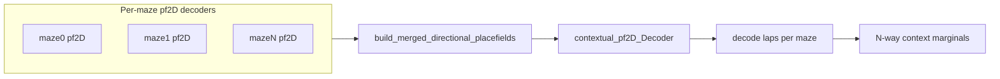

# Generalize Multi-Maze Context Decoder Evaluation

## Problem

[`evaluate_bapun_context_decoder_performance`](h:/TEMP/Spike3DEnv_ExploreUpgrade/Spike3DWorkEnv/pyPhoPlaceCellAnalysis/src/pyphoplacecellanalysis/SpecificResults/PendingNotebookCode.py) is structurally correct but **hardcoded for exactly two contexts**:

| Location | Two-maze assumption |
|---|---|
| L358–359 | `assert len(maze_epoch_names) == 2` |
| L355–356 | default `['maze1', 'maze2']` |
| `_build_bapun_context_marginals_df` | unpacks `ctx_name_0, ctx_name_1`; loops over 2 probability columns; binary `>=` tie-break |
| `_check_bapun_context_correctness` | compares against first context only via boolean negation |
| L495 | `true_context_is_maze0` column |
| L416–447 | ad-hoc lap fallback with `maze_id == maze_name` + integer remapping |

Meanwhile, the **merge path already supports N contexts**:

- [`build_contextual_pf2D_decoder`](h:/TEMP/Spike3DEnv_ExploreUpgrade/Spike3DWorkEnv/pyPhoPlaceCellAnalysis/src/pyphoplacecellanalysis/SpecificResults/PendingNotebookCode.py) (L5926+) accepts arbitrary `epochs_to_create_global_from_names`
- [`PfND.build_merged_directional_placefields`](h:/TEMP/Spike3DEnv_ExploreUpgrade/Spike3DWorkEnv/NeuroPy/neuropy/analyses/placefields.py) stacks an arbitrary dict of pfNDs along the context axis
- [`NWBDataSessionFormatRegisteredClass._get_session_specific_parameters`](h:/TEMP/Spike3DEnv_ExploreUpgrade/Spike3DWorkEnv/NeuroPy/neuropy/core/session/Formats/Specific/NWBDataSessionFormat.py) defines 8 maze epochs (`maze0`–`maze7`) via `non_global_activity_session_names`



## Approach

### 1. Add shared maze-epoch resolver (new helper near L133)

Add `_resolve_maze_epoch_names_for_multi_context_eval(curr_active_pipeline, maze_epoch_names=None) -> List[str]`:

**Resolution order** (when `maze_epoch_names` is None):
1. `sess.active_maze_epochs_df['label']` if present (already used elsewhere, e.g. [`EpochComputationFunctions.py` L179](h:/TEMP/Spike3DEnv_ExploreUpgrade/Spike3DWorkEnv/pyPhoPlaceCellAnalysis/src/pyphoplacecellanalysis/General/Pipeline/Stages/ComputationFunctions/EpochComputationFunctions.py))
2. Else format-registered class via registry:
   ```python
   DataSessionFormatRegistryHolder.get_registry_data_session_type_class_name_dict()[format_name]._get_session_specific_parameters(...)
   ```
   This covers **both** `BapunDataSessionFormatRegisteredClass` and `NWBDataSessionFormatRegisteredClass` without format-specific imports.
3. Fallback: `NWBDataSessionFormatRegisteredClass._get_activity_epoch_labels(sess)` (maze* labels excluding `maze_GLOBAL`)

**Validation** (always):
- Filter to names present in `computation_results` with a non-None `pf2D_Decoder`
- Require `len(resolved) >= 2` (context discrimination needs ≥2 contexts)
- Optionally warn if names missing from `filtered_sessions` (non-fatal; laps may still resolve via time-slice)

Reuse this helper from `evaluate_*` and from [`compute_train_test_split_epochs_decoders`](h:/TEMP/Spike3DEnv_ExploreUpgrade/Spike3DWorkEnv/pyPhoPlaceCellAnalysis/src/pyphoplacecellanalysis/SpecificResults/PendingNotebookCode.py) (L13486–13489) to replace the Bapun-only default resolution.

### 2. Generalize marginals builder

Rename internally to `_build_context_marginals_df` (keep `_build_bapun_context_marginals_df` as alias).

**Changes:**
- Replace fixed `(2, n_tbins)` handling with `n_contexts = len(maze_epoch_names)`
- Build one probability column per context name dynamically
- Add `decoded_most_likely_context` via `argmax` over probability columns
- **Backward compat (2 contexts):** still emit `is_most_likely_context_<first_name>` using the same binary rule as today

Core loop (conceptual):

```python
marginal_ctx = np.nansum(p_x_given_n, axis=(0, 1))  # (n_contexts, n_tbins)
# normalize per time bin, mean over time bins → (n_contexts,)
```

### 3. Generalize correctness check

Rename to `_check_context_correctness` (alias old name).

Replace maze0-centric boolean logic with:

```python
is_context_correct = (marginals_df['decoded_most_likely_context'] == true_maze_name).to_numpy()
```

Still populate `CompleteDecodedContextCorrectness` with direction fields set to all-True (context-only eval, unchanged).

### 4. Simplify main entry-point

In `evaluate_bapun_context_decoder_performance` (generalize in place; keep name as alias):

- Call `_resolve_maze_epoch_names_for_multi_context_eval(...)` instead of default + `assert len == 2`
- **DRY:** replace inline bin-conform + merge block (L378–406) with existing:
  ```python
  pf2D_Decoder_dict, contextual_pf2D, contextual_pf2D_Decoder = build_contextual_pf2D_decoder(
      curr_active_pipeline, epochs_to_create_global_from_names=maze_epoch_names)
  ```
  then apply optional `included_neuron_IDs` subsetting on `pf2D_Decoder_dict` and rebuild merged decoder if subsetting was applied (same pattern as `_perform_variable_time_bin_lap_groud_truth_performance_testing`)
- **Lap resolution:** replace ad-hoc `maze_id == maze_name` fallback (L423–443) with existing [`_resolve_bapun_train_test_split_laps_df`](h:/TEMP/Spike3DEnv_ExploreUpgrade/Spike3DWorkEnv/pyPhoPlaceCellAnalysis/src/pyphoplacecellanalysis/SpecificResults/PendingNotebookCode.py) (L13299) → `ensure_Epoch(...)`; this time-slices by `filtered_sessions[maze_name]` window and works for NWB W-track sessions
- Remove `maze_name_to_id` integer remapping (Bapun-specific; breaks string maze labels on NWB)
- In combined df: add `decoded_most_likely_context`; replace `true_context_is_maze0` with `true_context` (= `source_maze`) or keep old column as deprecated alias when `len==2`

### 5. Naming and docs

- Add generic public names: `ContextDecoderPerformanceResult`, `evaluate_context_decoder_performance`
- Keep `Bapun*` names as **aliases** pointing to the generalized implementations (batch code and notebooks already import them)
- Update docstrings/tags: remove "two-maze" / "exactly two"; document NWB example (`maze0`–`maze7`) and Bapun examples (`maze1`/`maze2`, `roam`/`sprinkle`)

### 6. Downstream callers (minimal)

[`batch_user_completion_helpers.py`](h:/TEMP/Spike3DEnv_ExploreUpgrade/Spike3DWorkEnv/pyPhoPlaceCellAnalysis/src/pyphoplacecellanalysis/General/Batch/BatchJobCompletion/UserCompletionHelpers/batch_user_completion_helpers.py):
- Remove L3509–3511 guard `len != 2` skip
- Resolve maze epochs via shared helper using `DataSessionFormatRegistryHolder` instead of hardcoded `BapunDataSessionFormatRegisteredClass`
- Optionally relax L3464–3466 non-bapun skip to also allow `dandi_nwb` (or any format whose resolved maze list has ≥2 contexts)

No changes needed to `PfND.build_merged_directional_placefields` or NWB session format itself.

## Files to change

| File | Change |
|---|---|
| [`PendingNotebookCode.py`](h:/TEMP/Spike3DEnv_ExploreUpgrade/Spike3DWorkEnv/pyPhoPlaceCellAnalysis/src/pyphoplacecellanalysis/SpecificResults/PendingNotebookCode.py) | Resolver helper; N-way marginals/correctness; main function refactor; aliases; reuse `build_contextual_pf2D_decoder` + `_resolve_bapun_train_test_split_laps_df`; update `compute_train_test_split_epochs_decoders` default resolution |
| [`batch_user_completion_helpers.py`](h:/TEMP/Spike3DEnv_ExploreUpgrade/Spike3DWorkEnv/pyPhoPlaceCellAnalysis/src/pyphoplacecellanalysis/General/Batch/BatchJobCompletion/UserCompletionHelpers/batch_user_completion_helpers.py) | Remove 2-maze gate; format-agnostic maze resolution; allow NWB |

## Verification

Manual smoke tests (no new unit tests unless requested):

1. **Bapun TwoMaze** (`maze1`, `maze2`): overall accuracy and marginals columns match pre-change behavior
2. **Bapun OpenField** (`roam`, `sprinkle`): 2-context case with non-default names
3. **NWB W-track** (`maze0`–`maze7` or subset with computed pf2Ds): runs without assert; `decoded_most_likely_context` takes values from full maze list; per-maze accuracy sensible

Check that `combined_laps_df` has: `source_maze`, `decoded_most_likely_context`, per-context probability columns, `is_context_correct`.
