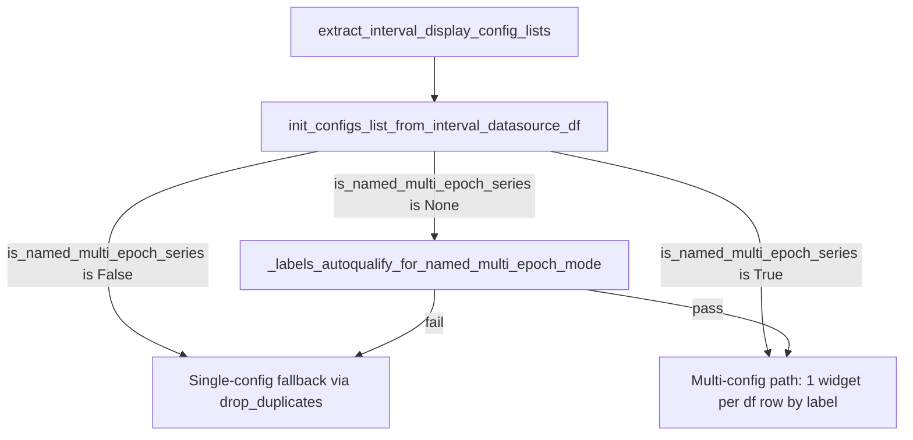

# Named multi-epoch mode gate + explicit override

## Problem

[`init_configs_list_from_interval_datasource_df`](h:/TEMP/Spike3DEnv_ExploreUpgrade/Spike3DWorkEnv/pyPhoPlaceCellAnalysis/src/pyphoplacecellanalysis/PhoPositionalData/plotting/mixins/epochs_plotting_mixins.py) currently treats any series where `len(unique labels) == len(df)` as multi-epoch. Laps satisfy this accidentally because `label = str(lap_id)` (`['1','2','3',...]` in [`neuropy/core/laps.py:547`](h:/TEMP/Spike3DEnv_ExploreUpgrade/Spike3DWorkEnv/NeuroPy/neuropy/core/laps.py)), producing one sidebar widget per lap.

## Approach

Replace the naive uniqueness assertion with an **auto-qualify helper** plus an **explicit tri-state override** (`is_named_multi_epoch_series`).



### Tri-state semantics (chosen kwarg: `is_named_multi_epoch_series`)

| Value | Behavior |
|-------|----------|
| `None` (default) | Use auto-qualify only |
| `True` | Force multi-config path (skip auto-qualify rejection; still requires unique labels == row count for per-row configs) |
| `False` | Force single-config fallback (skip good path entirely) |

## File changes (minimal)

### 1. [`epochs_plotting_mixins.py`](h:/TEMP/Spike3DEnv_ExploreUpgrade/Spike3DWorkEnv/pyPhoPlaceCellAnalysis/src/pyphoplacecellanalysis/PhoPositionalData/plotting/mixins/epochs_plotting_mixins.py)

Add static helper on `EpochDisplayConfig`:

```python
@staticmethod
def _labels_autoqualify_for_named_multi_epoch_mode(label_names: List[str], series_name: str, a_df, max_rows: int = 20) -> bool:
```

Auto-qualify returns `False` when:
- `n_rows == 0` or `n_rows > max_rows`
- labels are not 1:1 unique (`len(unique) != n_rows`) — covers PBEs / uniform `"Laps"`
- `'lap_id' in a_df` and `label.astype(str) == lap_id.astype(str)` for all rows — Laps accident
- all unique labels are purely numeric strings (`'1'`, `'2'`, …) — index labels, not named epochs

Update signature:

```python
def init_configs_list_from_interval_datasource_df(cls, name: str, a_ds, is_named_multi_epoch_series: Optional[bool] = None) -> List["EpochDisplayConfig"]:
```

Resolution order inside the method:
1. If `is_named_multi_epoch_series is None`: read `getattr(a_ds, 'is_named_multi_epoch_series', None)`
2. If `False`: jump directly to existing single-config fallback (extract fallback body into a small private helper to avoid duplication, ~5 lines moved)
3. If `True` or auto-qualify passes: run existing good path (QPen/brush serialization + per-row `init_from_visualization_dataframe_row` using `df['label']`)
4. Replace line-196 assertion with:

```python
if is_named_multi_epoch_series is not True and not cls._labels_autoqualify_for_named_multi_epoch_mode(label_names, name, a_serializable_df):
    raise ValueError(...)
```

Keep existing `try/except` + fallback for structural failures (missing viz columns, non-unique labels when forced, QPen errors, etc.).

### 2. [`IntervalDatasource.py`](h:/TEMP/Spike3DEnv_ExploreUpgrade/Spike3DWorkEnv/pyPhoPlaceCellAnalysis/src/pyphoplacecellanalysis/General/Model/Datasources/IntervalDatasource.py)

Add optional instance attribute in `__init__`:

```python
self.is_named_multi_epoch_series: Optional[bool] = None
```

(No constructor param needed — set via `add_rendered_intervals` or direct assignment on the datasource object.)

### 3. [`EpochRenderingMixin.py`](h:/TEMP/Spike3DEnv_ExploreUpgrade/Spike3DWorkEnv/pyPhoPlaceCellAnalysis/src/pyphoplacecellanalysis/GUI/PyQtPlot/Widgets/Mixins/RenderTimeEpochs/EpochRenderingMixin.py)

**`add_rendered_intervals`**: add explicit parameter before `**vis_kwargs`:

```python
def add_rendered_intervals(..., is_named_multi_epoch_series: Optional[bool] = None, **vis_kwargs):
```

After resolving `name`, persist on the stored datasource:

```python
self.interval_datasources[name].is_named_multi_epoch_series = is_named_multi_epoch_series
```

**`extract_interval_display_config_lists`**: pass override through:

```python
result = EpochDisplayConfig.init_configs_list_from_interval_datasource_df(a_name, a_ds, is_named_multi_epoch_series=getattr(a_ds, 'is_named_multi_epoch_series', None))
```

## Expected behavior after change

| Series | Labels | Default (`None`) | Notes |
|--------|--------|------------------|-------|
| `custom_paradigm` | `pre`, `maze1`, `post1`, `maze2`, `post2` | **5 widgets** | Auto-qualify passes |
| `Laps` | `1`, `2`, `3`, … | **1 widget** | Rejected by lap_id + all-digit checks |
| `PBEs` | all `"PBEs"` | **1 widget** | Not 1:1 unique |
| Any series | any | `is_named_multi_epoch_series=True` | Force multi if structurally unique |
| Any series | any | `is_named_multi_epoch_series=False` | Force single widget |

## Usage examples (no notebook edits required for default case)

Auto (paradigm qualifies, laps do not):

```python
active_2d_plot.add_rendered_intervals(an_interval_ds, name='custom_paradigm')
```

Explicit force (edge cases / debugging):

```python
active_2d_plot.add_rendered_intervals(an_interval_ds, name='custom_paradigm', is_named_multi_epoch_series=True)
an_interval_ds.is_named_multi_epoch_series = True  # equivalent if set before add
```

Direct call:

```python
EpochDisplayConfig.init_configs_list_from_interval_datasource_df('custom_paradigm', ds, is_named_multi_epoch_series=True)
```

## Out of scope (kept minimal)

- No changes to [`EpochRenderConfigWidget.py`](h:/TEMP/Spike3DEnv_ExploreUpgrade/Spike3DWorkEnv/pyPhoPlaceCellAnalysis/src/pyphoplacecellanalysis/GUI/Qt/Widgets/EpochRenderConfigWidget/EpochRenderConfigWidget.py) (popup/`self.show()` fixes remain separate)
- No changes to [`PendingNotebookCode.py`](h:/TEMP/Spike3DEnv_ExploreUpgrade/Spike3DWorkEnv/pyPhoPlaceCellAnalysis/src/pyphoplacecellanalysis/SpecificResults/PendingNotebookCode.py) — `custom_paradigm` should auto-qualify without explicit kwarg
- Label-keyed apply in `_update_df_visualization_columns` (separate fix for toggle misalignment) not included unless you want it in the same pass

## Verification

After implementation, on RatK D3 TwoNovel:
1. Laps sidebar: exactly **one** widget under the Laps header
2. `custom_paradigm`: **5** named widgets (`pre`, `maze1`, …)
3. `add_rendered_intervals(..., is_named_multi_epoch_series=False)` on any series → single widget even if labels look paradigm-like
4. `add_rendered_intervals(..., is_named_multi_epoch_series=True)` on a 5-row paradigm df → 5 widgets even if auto-qualify would fail (sanity test only)
