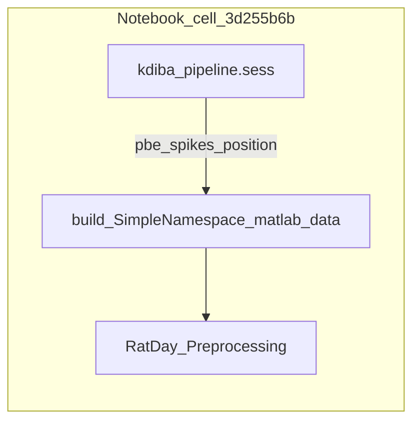

# Notebook cell: NeuropyPipeline → RatDay_Preprocessing

## Scope (per your request)

- **Only edit** the code cell with id `3d255b6b` at the end of [`ReviewOfWork_2026-04-01.ipynb`](h:\TEMP\Spike3DEnv_ExploreUpgrade\Spike3DWorkEnv\Spike3D\ReviewOfWork_2026-04-01.ipynb) (the cell that currently ends with `RatDay_Preprocessing(` and duplicates imports from the prior cell `687a1627`).
- **Do not** change other notebook cells, repo Python modules, or HippocampalSWRDynamics scripts.

## Context from referenced files

- [`ratday_preprocessing.py`](h:\TEMP\Spike3DEnv_ExploreUpgrade\Spike3DWorkEnv\HippocampalSWRDynamics\replay_structure\ratday_preprocessing.py) `reformat_data` expects `matlab_data` with **attributes** (not dict keys): `SignificantRipples`, `RippleTimes`, `InhibitoryNeurons`, `ExcitatoryNeurons`, `WellLocations`, `WellSequence`, `SpikeData` (`[:,0]` time s, `[:,1]` **1-based** neuron id), `PositionData` where `[:,0]` is time and **`[:,1:-1]`** is XY — so the array must be **`[t, x, y, dummy]`** (4+ columns) so the slice yields both `x` and `y`.
- [`preprocess_ratday_data.py`](h:\TEMP\Spike3DEnv_ExploreUpgrade\Spike3DWorkEnv\HippocampalSWRDynamics\scripts\local\preprocess_ratday_data.py) shows the intended call shape: `RatDay_Preprocessing(session_data, RatDay_Preprocessing_Parameters(bin_size_cm=..., rotate_placefields=...))`.
- [`preprocess_spikemat_data.py`](h:\TEMP\Spike3DEnv_ExploreUpgrade\Spike3DWorkEnv\HippocampalSWRDynamics\scripts\local\preprocess_spikemat_data.py) confirms downstream steps consume a **`RatDay_Preprocessing`** instance (e.g. `Ripple_Preprocessing(ratday_data, ...)` after `load_ratday_data`); your notebook goal is to **construct that object in memory** without requiring Pfeiffer–Foster `Session_Name` disk layout.
- [`README.md`](h:\TEMP\Spike3DEnv_ExploreUpgrade\Spike3DWorkEnv\HippocampalSWRDynamics\README.md) states the package is built around the Pfeiffer & Foster pipeline; **KDIBA geometry, sampling, and ripple definitions will not match paper defaults** — the cell should document that and keep knobs explicit.

## Ripple / “RippleTimes” source (your choice)

- Use **`kdiba_pipeline.sess.pbe`** as the interval source for `RippleTimes`.
- In NeuroPy, `sess.pbe` is typically an **`Epoch`** (see [`dataSession.py`](h:\TEMP\Spike3DEnv_ExploreUpgrade\Spike3DWorkEnv\NeuroPy\neuropy\core\session\dataSession.py) and KDIBA format loaders). The cell should normalize to a **`numpy.ndarray`** `ripple_times` with shape `(n, 2+)` where **columns 0–1** are start/stop seconds (matching `ripple_times_s = ripple_info[:, :2]` in `reformat_data`).
- If `pbe` is missing or has zero intervals: **raise a clear `ValueError`** with a message to compute/load PBEs for the session (so the cell fails loudly instead of producing empty ripple machinery).

## Data extraction mapping (KDIBA `DataSession` → MATLAB-like struct)

| `matlab_data` field | Planned construction |
|---------------------|----------------------|
| `RippleTimes` | From `sess.pbe.starts` / `sess.pbe.stops` (or equivalent `start`/`stop` columns if converted via `ensure_dataframe` from `neuropy.core.epoch`). Optionally pad with a third column of zeros if you want a fixed 3-column MATLAB-like shape; `reformat_data` only needs `[:, :2]` for times. |
| `SignificantRipples` | `np.arange(1, n_ripples + 1, dtype=int)` (all PBEs “significant”), matching the MATLAB 1-based convention before `reformat_data` subtracts 1. |
| `SpikeData` | `np.column_stack([spike_times_s, dense_neuron_id_1_based])`. **Dense remapping is required**: `RatDay_Preprocessing` iterates `range(n_cells)` in spike histograms; non-contiguous `aclu` values would leave empty rows. Map unique sorted aclus → `0..N-1`, then store `+1` in column 1. |
| `PositionData` | From `sess.position.to_dataframe()`: use the position time column (typically `'t'`) and `x`,`y` in **cm** if that is what your KDIBA dataframe stores; append a **dummy last column** so `PositionData[:, 1:-1]` is `(x, y)`. |
| `ExcitatoryNeurons` / `InhibitoryNeurons` | Default: `ExcitatoryNeurons = np.arange(1, n_neurons+1)` and `InhibitoryNeurons = np.array([], dtype=int)` unless you later wire session metadata. Document that this is a placeholder vs. P&F cell-type labels. |
| `WellLocations` / `WellSequence` | Provide **minimal placeholders** (e.g. empty `(0, 2)` array and empty 1D array) so attributes exist; note in a short comment that open-field KDIBA may not have maze wells (P&F-specific). |

Implementation detail: build the struct with **`types.SimpleNamespace(**kwargs)`** so attribute access in `reformat_data` works without defining a new class.

## Parameters

- Instantiate `RatDay_Preprocessing_Parameters(bin_size_cm=..., rotate_placefields=...)` with **notebook-local variables** at the top of the cell (e.g. `bin_size_cm = 4`, `rotate_placefields = False`) so you match the spirit of [`preprocess_ratday_data.py`](h:\TEMP\Spike3DEnv_ExploreUpgrade\Spike3DWorkEnv\HippocampalSWRDynamics\scripts\local\preprocess_ratday_data.py).

## Outputs / side effects

- Assign the result to a name like **`ratday_from_kdiba`** (or keep your naming) and display it (replace the bare `kdiba_pipeline` trailing expression with something informative, e.g. `ratday_from_kdiba` or a one-line summary).
- **Do not call** `save_ratday_data(..., session_indicator=Session_Name(...))` in this cell unless you add a user-defined `Session_Name` — [`save_ratday_data`](h:\TEMP\Spike3DEnv_ExploreUpgrade\Spike3DWorkEnv\HippocampalSWRDynamics\replay_structure\read_write.py) writes under HippocampalSWRDynamics `DATA_PATH` with P&F session keys. If you keep `save_ratday_data` imported, add a **commented** example only.

## Caveats to embed as short comments in the cell

- **Arena / bin grid**: `RatDay_Preprocessing_Parameters` assumes a **200×200 cm** arena for bin counts ([`config.py`](h:\TEMP\Spike3DEnv_ExploreUpgrade\Spike3DWorkEnv\HippocampalSWRDynamics\replay_structure\config.py)); KDIBA coordinates may need scaling/transformation — out of scope for this single cell unless you add explicit transforms later.
- **Position sampling**: `POSITION_RECORDING_RESOLUTION_FRAMES_PER_S` is fixed at **1/30 s** in `RatDay_Preprocessing_Parameters`; KDIBA position sampling may differ, affecting velocity/run detection — note only (changing it cleanly would require library edits, not this notebook-only constraint).

## Verification (manual, after edit)

- Run the cell with a loaded `curr_active_pipeline` where `sess.pbe` is non-empty.
- Confirm `ratday_from_kdiba.data["ripple_times_s"].shape[0] == len(sess.pbe)` (or matches after any filtering you document).
- Optionally run a follow-up cell (outside this plan’s edit scope) to wrap `Ripple_Preprocessing(ratday_from_kdiba, Ripple_Preprocessing_Parameters(...))` mirroring [`preprocess_spikemat_data.py`](h:\TEMP\Spike3DEnv_ExploreUpgrade\Spike3DWorkEnv\HippocampalSWRDynamics\scripts\local\preprocess_spikemat_data.py).

