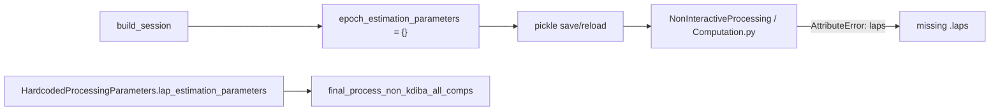
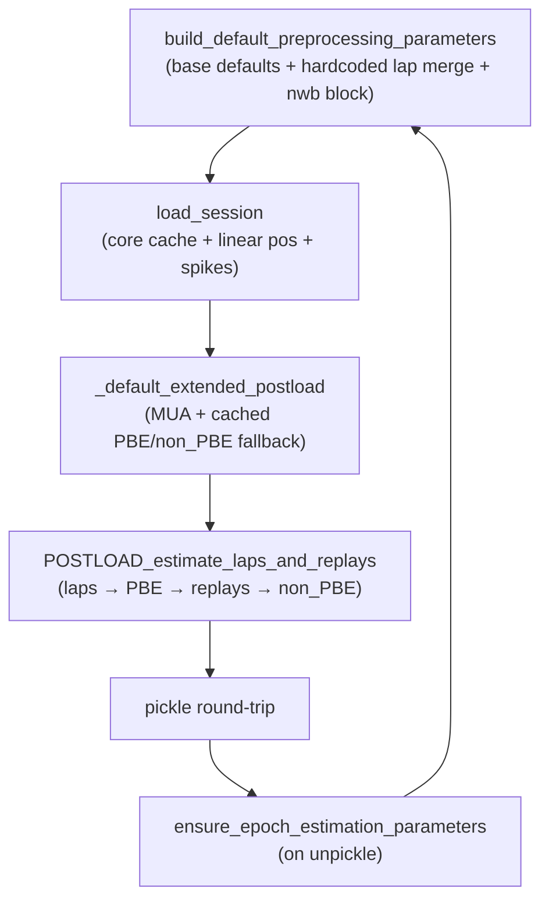

# NWB epoch estimation parameters and computation fix

## Problem summary

NWB sessions have a **split parameter model** today:



- [`NWBDataSessionFormat.build_default_preprocessing_parameters`](h:/TEMP/Spike3DEnv_ExploreUpgrade/Spike3DWorkEnv/NeuroPy/neuropy/core/session/Formats/Specific/NWBDataSessionFormat.py) creates an **empty** `epoch_estimation_parameters`.
- Lap computation in [`final_process_non_kdiba_all_comps`](h:/TEMP/Spike3DEnv_ExploreUpgrade/Spike3DWorkEnv/pyPhoPlaceCellAnalysis/src/pyphoplacecellanalysis/SpecificResults/PendingNotebookCode.py) reads **`HardcodedProcessingParameters` only** — never writes back to config.
- NWB [`load_session`](h:/TEMP/Spike3DEnv_ExploreUpgrade/Spike3DWorkEnv/NeuroPy/neuropy/core/session/Formats/Specific/NWBDataSessionFormat.py) does **not** call [`_default_extended_postload`](h:/TEMP/Spike3DEnv_ExploreUpgrade/Spike3DWorkEnv/NeuroPy/neuropy/core/session/Formats/BaseDataSessionFormats.py) (Bapun/Rachel/KDiba do), so **MUA/PBE/non_PBE** are never computed.
- Reload repair in [`_update_pipeline_missing_preprocessing_parameters`](h:/TEMP/Spike3DEnv_ExploreUpgrade/Spike3DWorkEnv/pyPhoPlaceCellAnalysis/src/pyphoplacecellanalysis/General/Batch/BatchJobCompletion/BatchCompletionHandler.py) only runs when `preprocessing_parameters is None`, not when sub-keys are missing.

## Target architecture



Single source of truth: **`sess.config.preprocessing_parameters.epoch_estimation_parameters.{laps,PBEs,replays}`**, populated at session build and preserved across pickle reload.

---

## 1. Populate preprocessing defaults (NeuroPy)

**File:** [`NWBDataSessionFormat.py`](h:/TEMP/Spike3DEnv_ExploreUpgrade/Spike3DWorkEnv/NeuroPy/neuropy/core/session/Formats/Specific/NWBDataSessionFormat.py)

Refactor `build_default_preprocessing_parameters`:

1. **Delegate to base** via `super().build_default_preprocessing_parameters(...)` to get standard `laps`, `PBEs`, `replays` containers (same as Bapun/KDiba).
2. **Merge hardcoded lap params** when `session_context` is available (user confirmed this approach):
   - Add optional `session_context` kwarg.
   - Call `_get_session_specific_parameters(session_context)` and `.override(...)` the hardcoded `lap_estimation_parameters` dict onto `epoch_estimation_parameters.laps` (keys: `minimum_run_speed`, `minimum_epoch_duration`, `merging_adjacent_max_separation_sec`, `use_full_2D_lap_estimation`, `custom_lap_estimation_fn`, `reward_zones`).
3. **NWB non-KDiba convention:** set `use_direction_dependent_laps=False` on `laps` (matches [`NonInteractiveProcessing.py`](h:/TEMP/Spike3DEnv_ExploreUpgrade/Spike3DWorkEnv/pyPhoPlaceCellAnalysis/src/pyphoplacecellanalysis/General/Batch/NonInteractiveProcessing.py) Bapun override).
4. **Preserve** existing `preprocessing_parameters.nwb` block unchanged.

**File:** [`BaseDataSessionFormats.py`](h:/TEMP/Spike3DEnv_ExploreUpgrade/Spike3DWorkEnv/NeuroPy/neuropy/core/session/Formats/BaseDataSessionFormats.py)

Thread context into build (minimal one-line change in `build_session`):

```python
preprocessing_parameters = cls.build_default_preprocessing_parameters(
    override_parameters_flat_keypaths_dict=override_parameters_flat_keypaths_dict,
    session_context=session_context)
```

Other formats ignore the extra kwarg; no behavior change for them.

Add a reusable backfill helper on NWB class:

```python
@classmethod
def ensure_preprocessing_epoch_estimation_parameters(cls, sess) -> bool:
    """Merge missing laps/PBEs/replays sub-keys; return True if config changed."""
```

Implementation: if any of `laps`, `PBEs`, `replays` missing under `epoch_estimation_parameters`, rebuild defaults via `build_default_preprocessing_parameters(session_context=sess.get_context())` and merge into existing container (do **not** wipe `preprocessing_parameters.nwb`).

Update class docstring line 201 to remove "laps and replay loading are not implemented" once POSTLOAD is wired.

---

## 2. Compute epochs on load (NeuroPy)

**File:** [`NWBDataSessionFormat.py`](h:/TEMP/Spike3DEnv_ExploreUpgrade/Spike3DWorkEnv/NeuroPy/neuropy/core/session/Formats/Specific/NWBDataSessionFormat.py)

### 2a. Extended postload in `load_session`

After spike interpolation (end of current `load_session`, ~line 461), add:

```python
session = cls._default_extended_postload(session.filePrefix, session)
```

This computes **MUA** from `session.neurons` (no LFP required) and loads/computes **PBE/non_PBE** from `.pbe.npy`/`.non_pbe.npy` cache using config params — same path as Bapun.

### 2b. POSTLOAD orchestration (modeled on KDiba)

Add `POSTLOAD_estimate_laps_and_replays(cls, sess)` following [`KDibaOldDataSessionFormat.POSTLOAD_estimate_laps_and_replays`](h:/TEMP/Spike3DEnv_ExploreUpgrade/Spike3DWorkEnv/NeuroPy/neuropy/core/session/Formats/Specific/KDibaOldDataSessionFormat.py) with NWB-specific lap path:

| Step | Action | Notes |
|------|--------|-------|
| 1 | Estimate laps | Use `estimate_session_laps` (not KDiba `replace_session_laps_with_estimates`) with kwargs from `preprocessing_parameters.epoch_estimation_parameters.laps`, excluding `use_direction_dependent_laps`, `should_backup_extant_laps_obj`, `custom_lap_estimation_fn`, `reward_zones` |
| 1b | Enrich laps | Call `adding_maze_id_if_needed` + `LapsAccessor.non_kdiba_laps_determine_directions` (same as [`final_process_non_kdiba_all_comps`](h:/TEMP/Spike3DEnv_ExploreUpgrade/Spike3DWorkEnv/pyPhoPlaceCellAnalysis/src/pyphoplacecellanalysis/SpecificResults/PendingNotebookCode.py) ~5295–5300) |
| 2 | `non_running_periods` | Complement of laps (`Epoch.from_PortionInterval(...)`) |
| 3 | PBE | Set `PBEs.require_intersecting_epoch = non_running_periods`, call `sess.compute_pbe_epochs`, assign `sess.pbe`, `sess.compute_spikes_PBEs()` |
| 4 | Replays | Set `replays.require_intersecting_epoch = non_running_periods`, tune session-specific thresholds (`min_inclusion_fr_active_thresh=1.0`, `min_num_unique_aclu_inclusions=5` per KDiba), call `sess.replace_session_replays_with_estimates` |
| 5 | non_PBE | `sess.compute_non_PBE_epochs(..., save_on_compute=True)` |

Extract lap-estimation body into a small `@classmethod` helper (e.g. `_estimate_and_enrich_laps_from_preprocessing_config`) so POSTLOAD and future callers share one implementation.

### 2c. Register post-load hook

Override `get_known_data_session_type_properties` (currently inherited with `post_load_functions=None`):

```python
post_load_functions=[lambda s: cls.POSTLOAD_estimate_laps_and_replays(s)]
```

This ensures the Loading stage runs epoch estimation after raw session load, matching KDiba.

---

## 3. Pickle reload backfill (pyPhoPlaceCellAnalysis + NeuroPy)

**File:** [`NeuropyPipeline.py`](h:/TEMP/Spike3DEnv_ExploreUpgrade/Spike3DWorkEnv/pyPhoPlaceCellAnalysis/src/pyphoplacecellanalysis/General/Pipeline/NeuropyPipeline.py)

In `_ensure_unpickled_pipeline_up_to_date`, inside the existing `dandi_nwb` branch (~line 429), call:

```python
did_add_property = NWBDataSessionFormatRegisteredClass.ensure_preprocessing_epoch_estimation_parameters(curr_active_pipeline.sess) or did_add_property
```

Apply to all `filtered_sessions` values as well.

**File:** [`BatchCompletionHandler.py`](h:/TEMP/Spike3DEnv_ExploreUpgrade/Spike3DWorkEnv/pyPhoPlaceCellAnalysis/src/pyphoplacecellanalysis/General/Batch/BatchJobCompletion/BatchCompletionHandler.py)

Extend `_subfn_update_session_missing_preprocessing_parameters` else-branch: when `preprocessing_parameters` exists but `epoch_estimation_parameters.laps` (or `PBEs`/`replays`) is missing, call format-specific backfill (dispatch via `format_name` → registered class `ensure_preprocessing_epoch_estimation_parameters`) instead of returning `False`.

---

## 4. Align pipeline preprocessing with config (optional but recommended)

**File:** [`PendingNotebookCode.py`](h:/TEMP/Spike3DEnv_ExploreUpgrade/Spike3DWorkEnv/pyPhoPlaceCellAnalysis/src/pyphoplacecellanalysis/SpecificResults/PendingNotebookCode.py)

In `final_process_non_kdiba_all_comps` (~5278), change lap source to prefer config:

```python
lap_estimation_parameters = dict(
    curr_active_pipeline.sess.config.preprocessing_parameters.epoch_estimation_parameters.laps.to_dict()
)
# fall back to hardcoded only if config key absent (legacy pickles pre-backfill)
```

This keeps notebook/batch preprocessing consistent with POSTLOAD and prevents future drift.

---

## 5. Tests

**File:** [`tests/test_nwb_data_session_format.py`](h:/TEMP/Spike3DEnv_ExploreUpgrade/Spike3DWorkEnv/NeuroPy/tests/test_nwb_data_session_format.py)

Add unit tests (no full NWB file required):

- `test_build_default_preprocessing_parameters_includes_epoch_estimation_keys` — assert `laps`, `PBEs`, `replays` present; `laps.minimum_run_speed == 10.0` for ER1 context; `use_direction_dependent_laps is False`.
- `test_ensure_preprocessing_epoch_estimation_parameters_backfills_empty_container` — start with empty `epoch_estimation_parameters`, call backfill, assert keys populated and `nwb` block preserved.
- `test_postload_estimate_laps_and_replays_on_synthetic_session` — minimal mock session with position, linear pos, epochs, neurons, MUA; verify `sess.laps`, `sess.pbe`, `sess.replay` are populated after POSTLOAD (can skip if MUA/lap estimation deps too heavy — at minimum test the helper preconditions).

Run: `uv run pytest tests/test_nwb_data_session_format.py` in NeuroPy.

---

## Migration note for existing pickles

After deploying, reload an NWB pickle once with `try_init_from_saved_pickle_or_reload_if_needed` — backfill will patch config and trigger `pipeline_needs_resave` (NWB already auto-saves on load at [`NeuropyPipeline.py:511`](h:/TEMP/Spike3DEnv_ExploreUpgrade/Spike3DWorkEnv/pyPhoPlaceCellAnalysis/src/pyphoplacecellanalysis/General/Pipeline/NeuropyPipeline.py)). Epoch **objects** (`sess.laps`, `sess.pbe`, `sess.replay`) in old pickles remain valid if already computed via `final_process_non_kdiba`; only missing config keys are backfilled. If epoch objects are also missing, re-run `final_process_bapun_all_comps(..., overwrite_extant=True)` or `force_reload=True` once.

---

## Files touched (summary)

| File | Change |
|------|--------|
| [`NWBDataSessionFormat.py`](h:/TEMP/Spike3DEnv_ExploreUpgrade/Spike3DWorkEnv/NeuroPy/neuropy/core/session/Formats/Specific/NWBDataSessionFormat.py) | Main fix: defaults, POSTLOAD, backfill, extended postload, known properties |
| [`BaseDataSessionFormats.py`](h:/TEMP/Spike3DEnv_ExploreUpgrade/Spike3DWorkEnv/NeuroPy/neuropy/core/session/Formats/BaseDataSessionFormats.py) | Pass `session_context` to `build_default_preprocessing_parameters` |
| [`NeuropyPipeline.py`](h:/TEMP/Spike3DEnv_ExploreUpgrade/Spike3DWorkEnv/pyPhoPlaceCellAnalysis/src/pyphoplacecellanalysis/General/Pipeline/NeuropyPipeline.py) | NWB unpickle backfill |
| [`BatchCompletionHandler.py`](h:/TEMP/Spike3DEnv_ExploreUpgrade/Spike3DWorkEnv/pyPhoPlaceCellAnalysis/src/pyphoplacecellanalysis/General/Batch/BatchJobCompletion/BatchCompletionHandler.py) | Partial-params backfill |
| [`PendingNotebookCode.py`](h:/TEMP/Spike3DEnv_ExploreUpgrade/Spike3DWorkEnv/pyPhoPlaceCellAnalysis/src/pyphoplacecellanalysis/SpecificResults/PendingNotebookCode.py) | Read laps from config in `final_process_non_kdiba_all_comps` |
| [`test_nwb_data_session_format.py`](h:/TEMP/Spike3DEnv_ExploreUpgrade/Spike3DWorkEnv/NeuroPy/tests/test_nwb_data_session_format.py) | New assertions |
