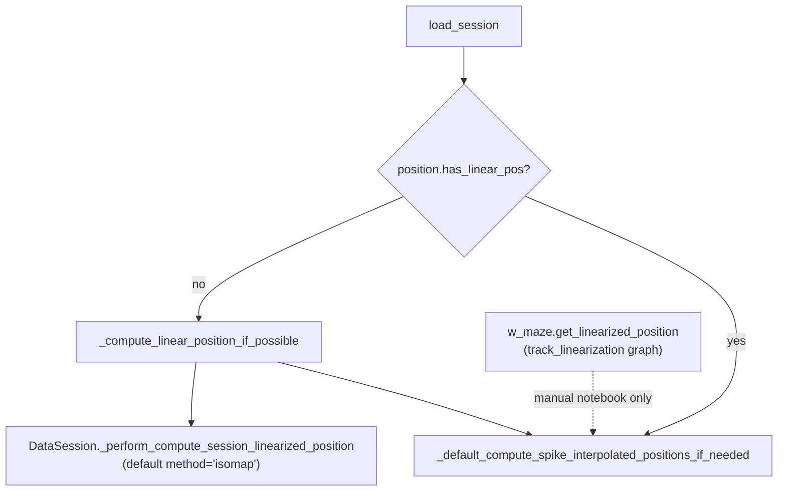

# Integrate W-track graph linearization into NWB session loader

## Current state (gap)

There are **two unrelated linearization paths** today:



- [`TrackDefinition.get_linearized_position`](h:/TEMP/Spike3DEnv_ExploreUpgrade/Spike3DWorkEnv/NeuroPy/neuropy/core/session/Formats/Specific/NWBDataSessionFormat.py) (lines 71–124) is the **correct** method for the ER1 W-track: it projects `(x, y)` onto the predefined graph (`w_maze`) and writes `lin_pos`, `track_segment_id`, and projected coordinates.
- [`_compute_linear_position_if_possible`](h:/TEMP/Spike3DEnv_ExploreUpgrade/Spike3DWorkEnv/NeuroPy/neuropy/core/session/Formats/Specific/NWBDataSessionFormat.py) (lines 646–659) currently calls `DataSession._perform_compute_session_linearized_position`, which uses **isomap** by default — not the hardcoded `linearization_parameters=dict(method='umap', ...)` in `_get_session_specific_parameters`.
- Cached `.position.npy` files with old isomap/umap `lin_pos` are **never recomputed** because `load_session` skips when `has_linear_pos` is true (line 469).

Your notebook workflow (`pos_df = w_maze.get_linearized_position(position=pos_df)`) already validates the graph method on ER1 bounds `x∈[41,158], y∈[10,123]` vs `w_maze` node layout.

## Target behavior

On `NWBDataSessionFormatRegisteredClass.load_session`:

1. Resolve a `TrackDefinition` for the session context (default: module-level `w_maze` for ER1 / dandi `000978`).
2. For each maze epoch label (`maze0`…`maze7` via `_get_activity_epoch_labels`), slice position rows, require valid `x`/`y`, call `track_definition.get_linearized_position(...)`.
3. Leave **sleep epochs as NaN** in `lin_pos` (same pattern as Bapun loader).
4. Persist optional track columns (`track_segment_id`, `track_projected_x_position`, `track_projected_y_position`) on `session.position.df`.
5. Save `.position.npy` and trigger spike position interpolation refresh when linearization was (re)computed.

## Implementation plan

### 1. Add dependency

[`NeuroPy/pyproject.toml`](h:/TEMP/Spike3DEnv_ExploreUpgrade/Spike3DWorkEnv/NeuroPy/pyproject.toml) is missing `track_linearization` even though `NWBDataSessionFormat.py` imports it. Add:

- `track_linearization>=2.3.1` (same pin as [`replay_trajectory_classification/pyproject.toml`](h:/TEMP/Spike3DEnv_ExploreUpgrade/Spike3DWorkEnv/replay_trajectory_classification/pyproject.toml))

Run `uv sync --all-extras` in NeuroPy after adding.

### 2. Update hardcoded linearization config

In [`NWBDataSessionFormat.py`](h:/TEMP/Spike3DEnv_ExploreUpgrade/Spike3DWorkEnv/NeuroPy/neuropy/core/session/Formats/Specific/NWBDataSessionFormat.py) `_get_session_specific_parameters`:

- Change `linearization_parameters` from `method='umap'` to `method='track_graph'` (and optionally `track_definition='w_maze'` as a string key for future sessions).
- Update class docstring limitation line 219 to reflect that W-track linearization is supported for ER1 when `track_linearization` is installed.

### 3. Add session → track resolver

New classmethod on `NWBDataSessionFormatRegisteredClass`:

```python
@classmethod
def _resolve_track_definition_for_session(cls, session) -> Optional[TrackDefinition]:
    hardcoded_params = cls._get_session_specific_parameters(session_context=session.get_context())
    linearization_params = hardcoded_params.linearization_parameters or {}
    if linearization_params.get('method', 'track_graph') != 'track_graph':
        return None
    track_key = linearization_params.get('track_definition', 'w_maze')
    if track_key == 'w_maze':
        return w_maze
    raise ValueError(f"Unsupported track_definition {track_key!r} for session {session.get_context()}")
```

This keeps ER1 on the existing `w_maze` singleton without over-engineering a registry yet.

### 4. Replace `_compute_linear_position_if_possible`

Rewrite the method (minimal edit, Bapun-style epoch loop) to:

| Step | Action |
|------|--------|
| Resolve track | Call `_resolve_track_definition_for_session`; if `None`, fall back to existing isomap path (for unknown future sessions) |
| Init | `session.position.linear_pos = np.full_like(session.position.time, np.nan)` |
| Epoch loop | For each label in `_get_activity_epoch_labels(session)` |
| Slice | `epoch_indices = session.position.time_slice_indicies(start, stop)`; build epoch `pos_df` with `x`,`y`; skip empty / all-NaN slices |
| Linearize | `linearized_df = track_definition.get_linearized_position(position=epoch_pos_df.copy())` |
| Write back | Assign `lin_pos` and track columns into `session.position.df.loc[epoch_indices, ...]` |
| Metadata | Set `session.position.df['linearization_method'] = 'track_graph'` (helps cache invalidation) |
| Persist | Save to `session.filePrefix.with_suffix('.position.npy')` |

Keep per-epoch `try/except` + `warnings.warn` so one bad epoch does not abort the whole session.

### 5. Fix load_session cache / recompute logic

In `load_session` (lines 469–471):

```python
needs_linear_pos = (not session.position.has_linear_pos) or cls._position_needs_track_graph_recompute(session)
if needs_linear_pos:
    session = cls._compute_linear_position_if_possible(session)
    force_spike_interp_recompute = True
else:
    force_spike_interp_recompute = False
session, _spikes_df = cls._default_compute_spike_interpolated_positions_if_needed(..., force_recompute=force_spike_interp_recompute)
```

Add `_position_needs_track_graph_recompute(session)`:

- Returns `True` when hardcoded method is `track_graph` AND either `linearization_method` column is missing/not `'track_graph'`, OR `track_segment_id` column is missing.
- Also honor an override flag, e.g. preprocessing flat key `nwb.force_recompute_linear_position=True`.

This addresses stale isomap caches without requiring manual deletion of `.position.npy` in the common migration case.

### 6. Optional small hardening on `TrackDefinition`

Low-risk tweaks in the same file (optional but recommended):

- Remove or gate the `print(...)` in `TrackDefinition.__attrs_post_init__` ( noisy on every import/instantiation during load ).
- Add `(5, 0)` to `w_maze.edges` **or** normalize `edge_order` to use `(0, 5)` consistently — graph is undirected today, but explicit edges reduce ambiguity for `track_linearization`.

### 7. Tests

Extend [`NeuroPy/tests/test_nwb_data_session_format.py`](h:/TEMP/Spike3DEnv_ExploreUpgrade/Spike3DWorkEnv/NeuroPy/tests/test_nwb_data_session_format.py) with a unit test that does **not** need real NWB data:

- Build a minimal `DataSession`-like object with synthetic `(x, y)` on a W-track arm (e.g. center vertical `(100, 28)` → `(100, 100)`).
- Mock epochs with one `maze0` label covering those samples.
- Call `_compute_linear_position_if_possible` (or a package-visible helper).
- Assert: `lin_pos` is finite for maze samples, NaN outside maze; `track_segment_id` column exists; `linearization_method == 'track_graph'`.

Skip test gracefully if `track_linearization` import fails (should not happen after dependency add).

## Manual validation after integration (ER1 session)

After loader changes, on a real ER1 session:

```python
from neuropy.core.session.Formats.Specific.NWBDataSessionFormat import w_maze
pos_df = sess.position.to_dataframe()
assert pos_df['lin_pos'].notna().any()
assert 'track_segment_id' in pos_df.columns
w_maze.plot_2D()  # overlay sanity check
```

Compare maze-only `lin_pos` smoothness vs raw `x`/`y` (your existing notebook validation helper).

## Files to change

- [`NeuroPy/neuropy/core/session/Formats/Specific/NWBDataSessionFormat.py`](h:/TEMP/Spike3DEnv_ExploreUpgrade/Spike3DWorkEnv/NeuroPy/neuropy/core/session/Formats/Specific/NWBDataSessionFormat.py) — main integration
- [`NeuroPy/pyproject.toml`](h:/TEMP/Spike3DEnv_ExploreUpgrade/Spike3DWorkEnv/NeuroPy/pyproject.toml) — declare dependency
- [`NeuroPy/tests/test_nwb_data_session_format.py`](h:/TEMP/Spike3DEnv_ExploreUpgrade/Spike3DWorkEnv/NeuroPy/tests/test_nwb_data_session_format.py) — synthetic linearization test

## Out of scope (future)

- Per-animal `TrackDefinition` registry for non-ER1 DANDI subjects
- Adding `track_graph` as a method inside [`position_util.linearize_position_df`](h:/TEMP/Spike3DEnv_ExploreUpgrade/Spike3DWorkEnv/NeuroPy/neuropy/utils/position_util.py) (not required if NWB format owns the integration)
