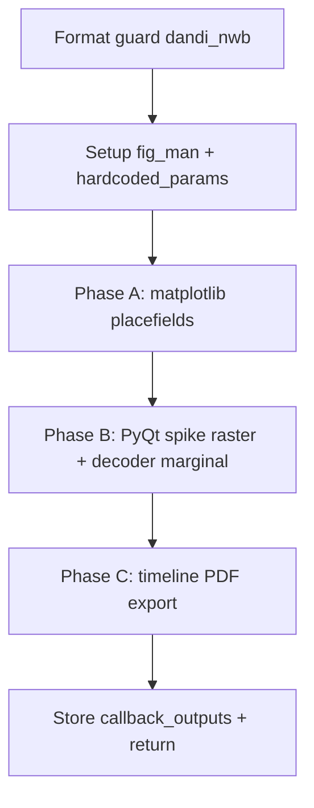

# NWB WMaze Display/Figures Batch Completion Function

## Goal

Port the **DISPLAY PORTION** of [`scratch_extracted_notebook_code_for_batch.py`](Spike3D/SingleDayWTrackLearning/scratch_extracted_notebook_code_for_batch.py) (lines 30–214) into a reusable batch callback in [`batch_user_completion_helpers.py`](pyPhoPlaceCellAnalysis/src/pyphoplacecellanalysis/General/Batch/BatchJobCompletion/UserCompletionHelpers/batch_user_completion_helpers.py), modeled on [`figures_plot_bapun_train_test_decoder_error_distance_completion_function`](pyPhoPlaceCellAnalysis/src/pyphoplacecellanalysis/General/Batch/BatchJobCompletion/UserCompletionHelpers/batch_user_completion_helpers.py) (lines 3563–3625).

**Out of scope:** the computation cells above line 30 (`directional_decoders_decode_continuous`, etc.) — those remain in batch compute phases.

## New function

**Name:** `figures_export_nwb_wmaze_display_completion_function`

**Location:** insert after the Bapun figures function (~line 3625), under a new section header:

```python
# ==================================================================================================================== #
# NWB W-maze Display/Figures Export                                                                                    #
# ==================================================================================================================== #
```

**Signature** (match existing completion-function conventions):

```python
def figures_export_nwb_wmaze_display_completion_function(
    self, global_data_root_parent_path, curr_session_context, curr_session_basedir,
    curr_active_pipeline, across_session_results_extended_dict: dict,
    write_png: bool = True, write_vector_format: bool = True,
    laps_decoding_time_bin_size: float = 0.250,
    included_track_dock_identifiers: Optional[List[str]] = None,
    debug_print: bool = False, fail_on_exception_for_debugging: bool = False,
) -> dict:
```

**Format guard:** skip with `WARN` when `curr_session_context.format_name != 'dandi_nwb'` (same pattern as Bapun guard at line 3570).

**Output root:** `self.collected_outputs_path` via `FileOutputManager(figure_output_location=FigureOutputLocation.CUSTOM, context_to_path_mode=ContextToPathMode.GLOBAL_UNIQUE, override_output_parent_path=custom_figure_output_path)` — same as Bapun/generalized figure functions.

**Callback outputs** stored at key `figures_export_nwb_wmaze_display_completion_function`:

```python
callback_outputs = {
    'figure_output_paths': [],           # placefield PNG/PDF paths
    'timeline_pdf_path': None,           # stacked timeline tracks PDF
    'export_all_tracks_result': None,    # return dict from export_all_tracks_to_image
    'subset_includelist': None,
    'included_track_dock_identifiers': None,
}
```

## Implementation phases (inside the function)



### Phase A — Matplotlib placefield exports

Mirror notebook lines 36–80:

1. `curr_active_pipeline.reload_default_display_functions()` + `prepare_for_display()`
2. Load session params:
   ```python
   hardcoded_params = NWBDataSessionFormatRegisteredClass._get_session_specific_parameters(
       session_context=curr_active_pipeline.get_session_context())
   subset_includelist = hardcoded_params.decoder_building_session_names
   ```
3. `display_fn_kwargs = dict(subplots=(None, 9), fig_column_width=None, fig_row_height=1.0, resolution_multiplier=1.0)`
4. Call `programmatic_render_to_file(...)` three times with `override_fig_man=custom_fig_man`:
   - `_display_2d_placefield_result_plot_ratemaps_2D` (+ `display_fn_kwargs`)
   - `_display_2d_placefield_occupancy`
   - `_display_1d_placefields` (+ `display_fn_kwargs`)
5. Wrap each call in its own `try/except`; extend `figure_output_paths` on success; respect `self.fail_on_exception`.

### Phase B — Spike raster window + context-decoder marginal

Consolidate notebook’s duplicate window creation (lines 95–97 and 125–130) into one flow:

1. `import pyphoplacecellanalysis.External.pyqtgraph as pg` + `pg.mkQApp(...)` (same as [`figures_plot_generalized_decode_epochs_dict_and_export_results_completion_function`](pyPhoPlaceCellAnalysis/src/pyphoplacecellanalysis/General/Batch/BatchJobCompletion/UserCompletionHelpers/batch_user_completion_helpers.py) ~3937)
2. Resolve global context: `global_context = curr_active_pipeline.filtered_contexts['maze_GLOBAL']`
3. `Spike3DRasterWindowWidget.find_or_create_if_needed(curr_active_pipeline, force_create_new=True, allow_replace_hardcoded_main_plots_with_tracks=True, active_session_configuration_context=global_context)` — use canonical import from `pyphoplacecellanalysis.GUI.Qt.SpikeRasterWindows.Spike3DRasterWindowWidget`
4. `build_proper_epoch_intervals(curr_active_pipeline=..., active_2d_plot=..., height=1.5)` — already NWB-aware via `build_NWB_all_epochs_df` in [`PendingNotebookCode.py`](pyPhoPlaceCellAnalysis/src/pyphoplacecellanalysis/SpecificResults/PendingNotebookCode.py)
5. Configure marginal params on `active_2d_plot.params`:
   - `enable_non_marginalized_raw_result = False`
   - `enable_marginal_over_direction = False`
   - `enable_marginal_over_track_ID = True`
6. Add decoder marginal via `AddNewDecodedEpochMarginal_MatplotlibPlotCommand`:
   ```python
   cache_key = decoding_continuous_cache_key(laps_decoding_time_bin_size, None)
   cmd = AddNewDecodedEpochMarginal_MatplotlibPlotCommand(
       spike_raster_window, curr_active_pipeline,
       active_time_bin_sizes_whitelist=[cache_key])
   cmd.execute()
   ```
   - **Do not** duplicate the manual `prepare_and_perform_add_pseudo2D_decoder_decoded_epoch_marginals` call unless `cmd.execute()` fails (notebook redundancy removed)
   - Optionally set dock fixed height (~130px) if marginal dock is found
7. `block_until_render_complete()` before export

**Prerequisite:** `curr_active_pipeline.global_computation_results.computed_data['DirectionalDecodersDecoded']` must contain `cache_key`. If missing, log `WARN` and skip Phase B/C (do not crash unless `self.fail_on_exception`).

### Phase C — Timeline track PDF export

Replace notebook’s dual export (direct `FigureToImageHelpers.export_wrapped_tracks_to_paged_df` to pipeline folder **and** `export_all_tracks_to_image(out_path=None)`) with a single batch-friendly path:

```python
default_included_track_dock_identifiers = [
    'intervals',
    'rasters[raster_window]',
    'new_curves_separate_plot',
    f'marginal_over_track_ID_ContinuousDecode - t_bin_size: {cache_key}',
]
included_track_dock_identifiers = list(reversed(included_track_dock_identifiers or default_included_track_dock_identifiers))

export_result = active_2d_plot.export_all_tracks_to_image(
    custom_figure_output_path=self.collected_outputs_path,
    curr_active_pipeline=curr_active_pipeline,
    included_track_dock_identifiers=included_track_dock_identifiers,
    fail_on_exception_for_debugging=fail_on_exception_for_debugging,
)
```

This reuses the maintained API in [`Spike2DRaster.export_all_tracks_to_image`](pyPhoPlaceCellAnalysis/src/pyphoplacecellanalysis/GUI/PyQtPlot/Widgets/SpikeRasterWidgets/Spike2DRaster.py) (lines 2171+) which already handles `FileOutputManager`, `block_until_render_complete`, and PDF naming.

## Batch driver wiring

Update [`ProcessBatchOutputs_NWB_WMaze_Batch.ipy`](Spike3D/ProcessBatchOutputs_NWB_WMaze_Batch.ipy):

1. Add import alongside existing figure completion imports (~line 79):
   ```python
   from ...batch_user_completion_helpers import figures_export_nwb_wmaze_display_completion_function
   ```
2. Register in `nwb_wmaze_figure_custom_user_completion_functions_dict` (~line 609):
   ```python
   nwb_wmaze_figure_custom_user_completion_functions_dict = {
       'figures_export_nwb_wmaze_display_completion_function': figures_export_nwb_wmaze_display_completion_function,
       'figures_plot_bapun_train_test_decoder_error_distance_completion_function': figures_plot_bapun_train_test_decoder_error_distance_completion_function,
   }
   ```

No change to `MAIN_get_template_string` default dict — NWB batch passes an explicit override dict (same pattern as existing WMaze config).

## Code style / conventions

- `@function_attributes` with tags: `['dandi_nwb', 'nwb', 'wmaze', 'figure', 'batch', 'timeline']`
- Standard banner prints (`<<<<<<<<` / `>>>>>>>>`) and `CURR_BATCH_OUTPUT_PREFIX`
- Lazy imports inside function body (matches neighboring completion functions)
- Single-line signatures/calls per user rules
- Two blank lines between logical blocks inside the function

## Testing checklist (manual)

1. Run figure phase on one NWB session (e.g. `JS14`) with pipeline pickle that already has `DirectionalDecodersDecoded` at 250ms
2. Verify in `collected_outputs_path`:
   - ratemap / occupancy / 1D placefield PNG+PDF files per maze context
   - timeline stacked-tracks PDF
3. Confirm non-NWB sessions skip cleanly with WARN
4. Confirm missing decoder cache skips PyQt export without breaking placefield exports
