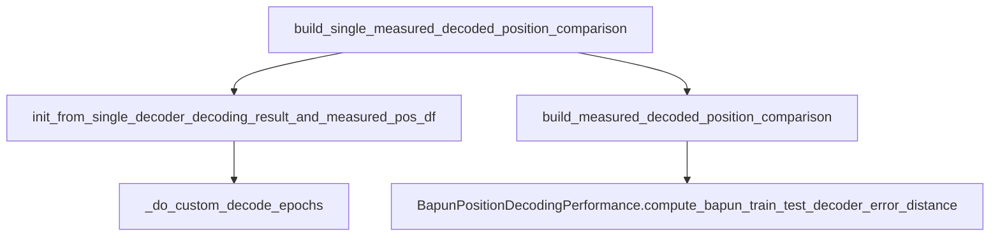

# Optional 1D lin_pos comparison through call hierarchy

## Call flow (unchanged signatures)

All comparison logic lives in one leaf method; wrappers already delegate to it:



**Only two methods need edits**, both in [`DirectionalPlacefieldGlobalComputationFunctions.py`](h:\TEMP\Spike3DEnv_ExploreUpgrade\Spike3DWorkEnv\pyPhoPlaceCellAnalysis\src\pyphoplacecellanalysis\General\Pipeline\Stages\ComputationFunctions\MultiContextComputationFunctions\DirectionalPlacefieldGlobalComputationFunctions.py):

| Method | Line | Change |
|--------|------|--------|
| `TrainTestLapsSplitting.interpolate_positions` | ~6093 | Optionally interpolate extra columns (e.g. `lin_pos`) |
| `CustomDecodeEpochsResult.build_single_measured_decoded_position_comparison` | ~5208 | Compute 1D errors when `lin_pos` is available; append columns to existing diff df |

No changes to `MeasuredDecodedPositionComparison`, `build_measured_decoded_position_comparison`, `init_from_single_decoder_decoding_result_and_measured_pos_df`, `_do_custom_decode_epochs`, or notebook code — they all receive the enriched `decoded_measured_diff_df` automatically.

---

## 1. Extend `interpolate_positions` (minimal)

Add one optional kwarg with default `None` (backward compatible):

```python
def interpolate_positions(cls, df, sample_times, time_column_name='t', additional_interp_column_names: Optional[List[str]] = None) -> pd.DataFrame:
```

After building the existing `{t, x, y}` frame, loop `additional_interp_column_names`:
- Skip if column not in `df`
- `dropna(subset=[time_column_name, col])`, build `interp1d`, assign to output
- If no valid rows, fill column with `np.nan`

This keeps x/y behavior identical and puts `lin_pos` on `measured_positions_dfs_list` entries as a free side effect.

---

## 2. Extend `build_single_measured_decoded_position_comparison`

### Availability gate (once, before epoch loop)

```python
should_compute_1D_lin_pos_comparison = (
    'lin_pos' in global_measured_position_df.columns
    and global_measured_position_df['lin_pos'].notna().any()
)
```

Pass `additional_interp_column_names=['lin_pos']` to `interpolate_positions` only when this is `True`.

### Per-epoch logic (inside existing loop, after x-error block)

Reuse the **same** `decoded_positions` already extracted (1D decoder → `most_likely_positions_list`; 2D → `marginal_x_list[..]['most_likely_positions_1D']`).

When `should_compute_1D_lin_pos_comparison`:
- `interpolated_measured_lin_pos = interpolated_measured_df['lin_pos'].to_numpy()`
- Valid mask: `np.isfinite(decoded_positions) & np.isfinite(interpolated_measured_lin_pos)`
- Same MSE / sqrt pattern as x comparison → `sq_err_1D`, `err_cm_1D` (NaN when zero valid bins)

### Output df construction

Switch from tuple list to dict rows (small local refactor only):

```python
row = {'t': center_epoch_time, 'sq_err': ..., 'err_cm': ...}
if should_compute_1D_lin_pos_comparison:
    row['sq_err_1D'] = ...
    row['err_cm_1D'] = ...
decoded_measured_diff_rows.append(row)
decoded_measured_diff_df = pd.DataFrame(decoded_measured_diff_rows)
```

**When `lin_pos` is absent:** output columns remain exactly `['t', 'sq_err', 'err_cm']` — no new columns, no warnings.

**When present:** output columns become `['t', 'sq_err', 'err_cm', 'sq_err_1D', 'err_cm_1D']`.

Existing x-based `sq_err` / `err_cm` logic is untouched.

---

## 3. Downstream impact (no edits required)

- [`PendingNotebookCode.py`](h:\TEMP\Spike3DEnv_ExploreUpgrade\Spike3DWorkEnv\pyPhoPlaceCellAnalysis\src\pyphoplacecellanalysis\SpecificResults\PendingNotebookCode.py) `BapunPositionDecodingPerformance`: `pd.concat` of err dfs will carry new columns; existing `groupby` on `sq_err`/`err_cm` still works.
- [`batch_user_completion_helpers.py`](h:\TEMP\Spike3DEnv_ExploreUpgrade\Spike3DWorkEnv\pyPhoPlaceCellAnalysis\src\pyphoplacecellanalysis\General\Batch\BatchJobCompletion\UserCompletionHelpers\batch_user_completion_helpers.py) plot helper asserts `y_col_name in ['sq_err', 'err_cm']` — unchanged unless you later want to plot `err_cm_1D` (out of scope).

---

## 4. Verification

Manual smoke check (no new test file required for minimal scope):

```python
global_measured_position_df = pipeline.sess.position.to_dataframe().dropna(subset=['lap'])
comparison = CustomDecodeEpochsResult.build_single_measured_decoded_position_comparison(
    decoder_result, global_measured_position_df)
comparison.decoded_measured_diff_df.columns
# expect ['t','sq_err','err_cm'] or with lin_pos also 'sq_err_1D','err_cm_1D'
```

Ensure sessions without `lin_pos` produce identical column sets to today.

---

## Design notes

- **No new kwargs on public wrappers** — auto-detect keeps the call hierarchy unchanged.
- **No `MeasuredDecodedPositionComparison` schema change** — new metrics live as extra columns on the existing df field.
- **Coordinate-space caveat** (document in method docstring): `sq_err_1D` compares decoded 1D positions to measured `lin_pos`; most meaningful for 1D decoders trained on `linear_pos_obj`, but computed whenever `lin_pos` data exists.
