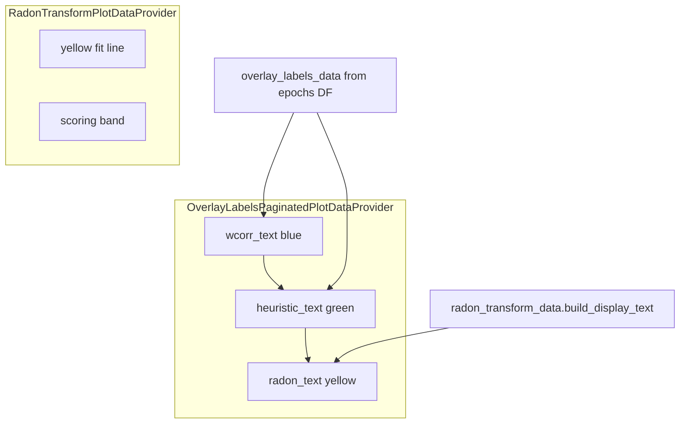

# OverlayLabels provider rename + radon text ownership

## Decisions (locked)

- Rename **both** classes with **no aliases**:
  - `WeightedCorrelationPlotData` → `OverlayLabelsPlotData`
  - `WeightedCorrelationPaginatedPlotDataProvider` → `OverlayLabelsPaginatedPlotDataProvider`
- Also rename runtime keys/params to match (no aliases):
  - `plots['weighted_corr']` → `plots['overlay_labels']`
  - `plots_data.weighted_corr_data` → `plots_data.overlay_labels_data`
  - `enable_weighted_correlation_info` → `enable_overlay_labels_info`
  - `enable_weighted_corr_data_provider_modify_axes_rect` → `enable_overlay_labels_modify_axes_rect`
  - related `weighted_corr_text_*` params → `overlay_labels_text_*`
  - `decoder_build_single_weighted_correlation_data` → `decoder_build_single_overlay_labels_data`
- Move **radon corner text** into `OverlayLabelsPaginatedPlotDataProvider`; leave radon **line + scoring band** on `RadonTransformPlotDataProvider`.
- Do **not** edit Jupyter notebooks unless asked; note that notebook imports/kwargs using old names will break.
- Put a **History:** section in each renamed class docstring listing former names/keys/params.

## Target architecture

Stacking becomes one sequential upsert in the overlay callback (measure last TextArea → next `bbox_to_anchor` y). Delete cross-provider `_reposition_radon_text_below_wcorr` / `_overlay_stack_anchor_artist` / `_resolve_radon_label_bbox_y` from radon once unused.

## Data dependency / non-breakage (locked)

Today `PaginatedFigureController.add_data_overlays` ([stacked_epoch_slices.py](h:/TEMP/Spike3DEnv_ExploreUpgrade/Spike3DWorkEnv/pyPhoPlaceCellAnalysis/src/pyphoplacecellanalysis/Pho2D/stacked_epoch_slices.py) ~1777) always **tries** radon then wcorr, but only registers a provider when its builder returns non-`None`:

| `included_columns` | Radon provider | Wcorr/overlay provider today | After naive text move |
|---|---|---|---|
| `['radon','wcorr',…]` | registered (data has `radon_text` strings) | registered | OK if overlay reads `radon_transform_data` |
| `['wcorr']` only | `None` (no radon cols) | registered | OK — no radon text |
| `['radon']` only | registered (line/band + text today) | **`None`** (`init_batch_from_epochs_df` empty after intersecting wcorr keys) | **BREAKS** — radon text disappears |
| empty + enable flags | columns extended from enable flags (**multi-window only today**) | both when both flags true | must keep both paths |
| `plot_decoded_epoch_slices_paginated` (~3588) | often radon-only intent (`enable_overlay_labels_info`/old wcorr **False**) | calls single-controller `add_data_overlays` | must still get radon text via OverlayLabels |

Findings from [Trace overlay data deps](2746c92c-4df0-4cab-8d5c-ec9c1ab647ea): providers register **independently**; callback dict order is radon then overlay; no external `.py` readers of `plots['weighted_corr']` beyond `PaginationMixins` schema; radon geometry keys by `data_idx`, overlay labels by `curr_ax` (keep that split).

**Footgun to fix while renaming:** single-controller `add_data_overlays` normalizes `included_columns=None` → `[]` and does **not** expand from `enable_radon_transform_info` / enable-overlay flags (only the multi-decoder wrapper does ~2347–2355). So `plot_decoded_epoch_slices_paginated` → `add_data_overlays(curr_results_obj)` currently builds **neither** radon nor wcorr data. Align single-controller with multi: when caller does not pass a non-empty `included_columns`, extend load columns from those enable flags before building.

`add_data_to_pagination_controller` ([PaginationMixins.py](h:/TEMP/Spike3DEnv_ExploreUpgrade/Spike3DWorkEnv/pyPhoPlaceCellAnalysis/src/pyphoplacecellanalysis/GUI/Qt/Mixins/PaginationMixins.py) ~166) attaches `provided_plots_data` keys and registers callbacks in call order → radon callback id first, then overlay. After the move, overlay must not hard-require DF rows when only drawing radon.

**Required safeguards (implement these, not optional):**

1. **Single-controller column defaults from enable flags** (same lists as multi-window: radon → `['radon','velocity','intercept','speed']`; overlay → wcorr/pearson/heuristic defaults as today).
2. **Register OverlayLabels whenever corner labels are needed**, including radon-only. If radon builder returns data, still call `OverlayLabelsPaginatedPlotDataProvider.add_data_to_pagination_controller` even when DF overlay build is `None` — pass `{}` so the label callback is registered.
3. **Overlay callback soft-deps:**
   - DF labels: look up `plots_data.overlay_labels_data` only if present; if missing/empty for this epoch, skip wcorr/heuristic (no assert).
   - Radon text: read `plots_data.radon_transform_data` only if present; index by `data_idx`; gate with `enable_radon_transform_info` + `visible_overlay_label_keys`.
4. **Keep build order:** radon data attached **before** overlay provider registration.
5. **Radon geometry callback** must not create/remove `radon_text`; store only `{'line','band'}` under `plots['radon_transform'][data_idx]`. Overlay artists stay under `plots['overlay_labels'][curr_ax]`.
6. **Multi-decoder** wrapper + `plot_decoded_epoch_slices_paginated` kwargs: rename enable flags; radon-only path must still register OverlayLabels via (1)+(2).
7. **Do not** fold radon strings into DF-only `OverlayLabelsPlotData` — keep on `RadonTransformPlotData.build_display_text`.

## File changes

### 1. [DecoderPredictionError.py](h:/TEMP/Spike3DEnv_ExploreUpgrade/Spike3DWorkEnv/pyPhoPlaceCellAnalysis/src/pyphoplacecellanalysis/General/Pipeline/Stages/DisplayFunctions/DecoderPredictionError.py)

**`OverlayLabelsPlotData`** (was `WeightedCorrelationPlotData`):
- Rename class + return annotations.
- Docstring **History:** former `WeightedCorrelationPlotData`.

**`OverlayLabelsPaginatedPlotDataProvider`** (was `WeightedCorrelation…`):
- Update `plots_group_identifier_key`, `provided_plots_data`, `provided_params`, method names, debug print strings.
- Docstring **History:** former class name, `weighted_corr` / `weighted_corr_data`, old enable/modify param names.
- In `_callback_update_curr_single_epoch_slice_plot`:
  - Keep blue `wcorr_text` + green `heuristic_text`.
  - Add yellow `radon_text` via existing `_subfn_upsert_overlay_label`, reading `plots_data.radon_transform_data[data_idx].build_display_text(included_keys=…)` when `radon_transform_data` exists and `params.enable_radon_transform_info` (and `visible_overlay_label_keys` includes radon keys).
  - Anchor radon under heuristic (else wcorr) using `_axes_y_below_anchored_artist` (move that helper onto this class, or keep as small shared classmethod here).
  - Store `{'wcorr_text', 'heuristic_text', 'radon_text'}` under `plots['overlay_labels'][curr_ax]`.
- Remove callback clears all three artists.
- Stop calling `RadonTransformPlotDataProvider._reposition_radon_text_below_wcorr`.

**`RadonTransformPlotDataProvider`**:
- Stop create/update/remove of `radon_text` in its plot callback; `plots[…][data_idx]` becomes `{'line', 'band'}` only.
- Keep building `RadonTransformPlotData.radon_text` / `speed_text` / `intercept_text` strings in `_subfn_build_radon_transform_plotting_data` (data still lives on radon plot-data objects).
- Remove obsolete stacking helpers once nothing calls them.
- Docstring note: corner label ownership moved to `OverlayLabelsPaginatedPlotDataProvider`.

Preserve style rules: single-line `def` when ≤400 chars, two blank lines between methods, `## END for …` on new/edited loops, do not strip unrelated comments/imports.

### 2. [stacked_epoch_slices.py](h:/TEMP/Spike3DEnv_ExploreUpgrade/Spike3DWorkEnv/pyPhoPlaceCellAnalysis/src/pyphoplacecellanalysis/Pho2D/stacked_epoch_slices.py)

Update `add_data_overlays` / `remove_data_overlays` / `included_columns` defaults and any `enable_weighted_correlation_info` / provider imports to the new names.

In single-controller `add_data_overlays` (~1777–1813): (a) expand empty `included_columns` from enable flags; (b) after adding radon when non-`None`, **always register OverlayLabels** if overlay DF data is non-`None` **or** radon data was registered. Multi-decoder wrapper (~2345–2355): rename enable flag; keep column defaults. Also update `plot_decoded_epoch_slices_paginated` (~3627) kwargs to `enable_overlay_labels_info`.

### 3. Other `.py` call sites (from [Find overlay rename sites](a9c4834d-d60a-4003-a2ee-2a2a785be0ee))

All pagination overlay API hits are in **pyPhoPlaceCellAnalysis** only:

- [PaginationMixins.py](h:/TEMP/Spike3DEnv_ExploreUpgrade/Spike3DWorkEnv/pyPhoPlaceCellAnalysis/src/pyphoplacecellanalysis/GUI/Qt/Mixins/PaginationMixins.py) — base `PaginatedPlotDataProvider` docs/defaults using `weighted_corr` / `weighted_corr_data` / `enable_weighted_correlation_info`.
- [LongShortTrackComparingDisplayFunctions.py](h:/TEMP/Spike3DEnv_ExploreUpgrade/Spike3DWorkEnv/pyPhoPlaceCellAnalysis/src/pyphoplacecellanalysis/General/Pipeline/Stages/DisplayFunctions/MultiContextComparingDisplayFunctions/LongShortTrackComparingDisplayFunctions.py) — kwargs `enable_weighted_correlation_info`.
- [PendingNotebookCode.py](h:/TEMP/Spike3DEnv_ExploreUpgrade/Spike3DWorkEnv/pyPhoPlaceCellAnalysis/src/pyphoplacecellanalysis/SpecificResults/PendingNotebookCode.py) — kwargs `enable_weighted_correlation_info` / `enable_weighted_corr_data_provider_modify_axes_rect`.

**Do not rename:** local `weighted_corr_data` / `weighted_corr_data_dict` inside `compute_weighted_correlations` in `DirectionalPlacefieldGlobalComputationFunctions.py` (epoch metrics DataFrames, not `plots_data` overlay API). Same for `ripple_weighted_corr_merged_df`-style field names.

Skip `.ipynb` unless user requests (Spike3D notebooks only use the old enable_* kwargs). After edits, grep `WeightedCorrelationPaginatedPlotDataProvider|WeightedCorrelationPlotData|enable_weighted_correlation_info|plots_group_identifier_key.*weighted_corr|weighted_corr_data` under pyPhoPlaceCellAnalysis `.py` and fix remaining overlay-API hits (History docstring lines exempt).

## Verification

- Grep confirms zero remaining old class/key/param names in `.py` (except History docstring lines and unrelated `compute_weighted_correlations` locals).
- Scenarios: (a) radon+wcorr+heuristic → blue/green/yellow stack; (b) `included_columns=['radon']` → yellow label + line/band, no crash; (c) `included_columns=['wcorr']` → blue only, no radon assert; (d) `enable_radon_transform_info` off → no radon text, DF labels unchanged; (e) `enable_overlay_labels_info` off → no wcorr/heuristic, radon text still if radon data+flag on.
