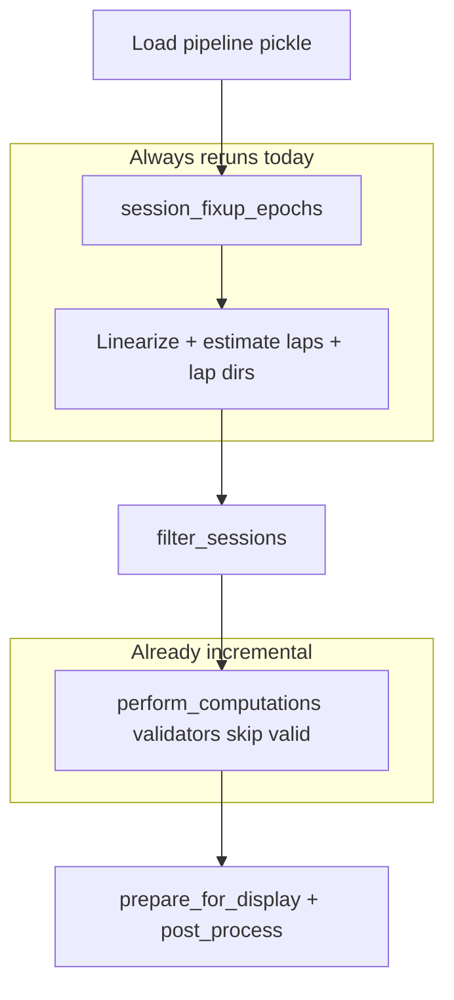

# Honor `overwrite_extant` in Bapun session processing

## Problem

[`final_process_non_kdiba_all_comps`](h:/TEMP/Spike3DEnv_ExploreUpgrade/Spike3DWorkEnv/pyPhoPlaceCellAnalysis/src/pyphoplacecellanalysis/SpecificResults/PendingNotebookCode.py) (lines 5146–5475) accepts `overwrite_extant: bool=False` but never uses it. On every call it:

1. **Always re-fixes epochs** via `session_fixup_epochs(..., override_extant=True)` (line 5197)
2. **Always recomputes linearization + laps** (lines 5214–5229), overwriting `sess.position` and `sess.laps`
3. **Always reruns lap direction / maze_id enrichment** via `non_kdiba_laps_determine_directions`
4. **Always recomputes linearized position on filtered sessions** (lines 5344–5346)
5. **Always reruns head-dir postprocessing** via `post_process_non_kdiba`

Meanwhile, `perform_computations` already uses `overwrite_extant_results=False` and the pipeline's validator system in [`Computation.py`](h:/TEMP/Spike3DEnv_ExploreUpgrade/Spike3DWorkEnv/pyPhoPlaceCellAnalysis/src/pyphoplacecellanalysis/General/Pipeline/Stages/Computation.py) (lines 917–998) skips valid PF/decoding results. That part is already incremental.

The expensive clobbering happens **before** compute, especially on resumed pickle loads.



## Intended behavior (per your confirmation)

| `overwrite_extant` | Preprocessing (epochs, linearization, laps, head-dir) | `perform_computations` |
|---|---|---|
| `False` | Skip steps whose outputs already exist | `overwrite_extant_results=False` (unchanged) |
| `True` | Run exactly as today (always redo) | `overwrite_extant_results=False` (unchanged) |

## Implementation plan

All edits in [`PendingNotebookCode.py`](h:/TEMP/Spike3DEnv_ExploreUpgrade/Spike3DWorkEnv/pyPhoPlaceCellAnalysis/src/pyphoplacecellanalysis/SpecificResults/PendingNotebookCode.py) unless noted.

### 1. Add a small preprocessing completeness helper (nested or module-local)

Add a minimal helper near the function (keep it inline/nested to avoid scope creep):

```python
def _non_kdiba_session_preprocessing_is_complete(sess, active_maze_epoch_names) -> bool:
    if not sess.position.has_linear_pos:
        return False
    if sess.laps is None or len(sess.laps) == 0:
        return False
    laps_df = sess.laps.to_dataframe()
    if not all(c in laps_df.columns for c in ['maze_id', 'lap_dir']):
        return False
    pos_df = sess.position.to_dataframe()
    if 'approx_head_dir_degrees' not in pos_df.columns:
        return False
    return True
```

This mirrors existing patterns in NeuroPy (`Position.has_linear_pos`, `LapsAccessor._perform_compute_lap_dir_from_net_displacement` with `replace_existing=False`).

### 2. Wire `overwrite_extant` to epoch fixup

Change line 5197 from hardcoded `override_extant=True` to:

```python
session_epochs = BapunDataSessionFormatRegisteredClass.session_fixup_epochs(sess=curr_active_pipeline.sess, override_extant=overwrite_extant)
```

[`session_fixup_epochs`](h:/TEMP/Spike3DEnv_ExploreUpgrade/Spike3DWorkEnv/NeuroPy/neuropy/core/session/Formats/Specific/BapunDataSessionFormat.py) already respects `override_extant=False` by leaving prior fixup in place when `epochs_bak` exists.

### 3. Guard the preprocessing block (lines 5214–5229)

Wrap linearization, lap estimation, maze_id, and direction determination:

```python
if overwrite_extant or not _non_kdiba_session_preprocessing_is_complete(curr_active_pipeline.sess, active_maze_epoch_names):
    # existing linearization + lap estimation block ...
    laps_df = laps_df.epochs.adding_maze_id_if_needed(active_maze_epochs_df=active_maze_epochs_df, replace_existing=overwrite_extant)
    # non_kdiba_laps_determine_directions ...
else:
    print('INFO: skipping session preprocessing — existing linearization/laps/lap-dir data look complete.')
```

Use `replace_existing=overwrite_extant` on `adding_maze_id_if_needed` (supported in [`epoch.py`](h:/TEMP/Spike3DEnv_ExploreUpgrade/Spike3DWorkEnv/NeuroPy/neuropy/core/epoch.py)).

### 4. Guard filtered-session linearization (lines 5344–5346)

```python
for an_epoch_name, a_sess in curr_active_pipeline.filtered_sessions.items():
    if overwrite_extant or not a_sess.position.has_linear_pos:
        a_sess.position.compute_linearized_position(**linearization_kwargs)
```

### 5. Guard sess metadata assignments (optional but safe)

When `overwrite_extant=False`, only set these if missing (avoids overwriting pickled metadata):

- `sess.active_maze_epochs_df`
- `sess.activity_only_epochs`
- `sess.global_activity_only_epoch`

Config building, `filter_sessions`, and computation-config assembly still run every time (cheap; `filter_sessions` already reuses unchanged filters per [`Filtering.py`](h:/TEMP/Spike3DEnv_ExploreUpgrade/Spike3DWorkEnv/pyPhoPlaceCellAnalysis/src/pyphoplacecellanalysis/General/Pipeline/Stages/Filtering.py)).

### 6. Leave `perform_computations` unchanged

Keep:

```python
curr_active_pipeline.perform_computations(..., overwrite_extant_results=False, ...)
```

Validators already skip valid `pf_computation`, `pfdt_computation`, and `position_decoding` results when resuming.

### 7. Guard `post_process_non_kdiba`

Add optional `overwrite_extant: bool=False` to [`post_process_non_kdiba`](h:/TEMP/Spike3DEnv_ExploreUpgrade/Spike3DWorkEnv/pyPhoPlaceCellAnalysis/src/pyphoplacecellanalysis/SpecificResults/PendingNotebookCode.py) (line 5604):

- When `False`, skip `_subfn_add_approx_head_dir_columns` if `approx_head_dir_degrees` already exists on global + filtered session position frames.
- Call site: `post_process_non_kdiba(curr_active_pipeline, overwrite_extant=overwrite_extant)`.

Global-epoch addition (lines 5402–5416) already skips when `"maze_GLOBAL"` exists — no change needed.

### 8. Pass parameter through wrapper + batch entry point

- [`final_process_bapun_all_comps`](h:/TEMP/Spike3DEnv_ExploreUpgrade/Spike3DWorkEnv/pyPhoPlaceCellAnalysis/src/pyphoplacecellanalysis/SpecificResults/PendingNotebookCode.py) (line 5121): add `overwrite_extant: bool=False` and forward to `final_process_non_kdiba_all_comps`.
- [`BapunBatchHelpers.run_all_computations`](h:/TEMP/Spike3DEnv_ExploreUpgrade/Spike3DWorkEnv/pyPhoPlaceCellAnalysis/src/pyphoplacecellanalysis/SpecificResults/PendingNotebookCode.py) (line 730): add `overwrite_extant: bool=False` and pass to `final_process_bapun_all_comps` — resolves the existing TODO comment ("currently forces recompute no matter what") for the default resume path.

### 9. Update docstring

Document the two modes in `final_process_non_kdiba_all_comps` docstring with a short usage example for resume vs full preprocessing refresh.

## Testing checklist

1. **Resume path (`overwrite_extant=False`)** on a fully processed Bapun pickle:
   - Log should show preprocessing skipped
   - `perform_computations` should log validator skips for existing epochs
   - No change to `sess.laps._df` / linear position columns
   - Pipeline still returns with display prep complete

2. **Fresh / forced preprocessing (`overwrite_extant=True`)** on same session:
   - Preprocessing steps run (same logs as today)
   - Computations still use validator skip unless results invalid

3. **Partial session** (pickle loaded but no linear pos): `overwrite_extant=False` should run only missing preprocessing, then compute missing results

4. **Batch path**: `BapunBatchHelpers.run_all_computations(..., overwrite_extant=False)` should no longer redo linearization/laps on reruns

## Files touched

- [`PendingNotebookCode.py`](h:/TEMP/Spike3DEnv_ExploreUpgrade/Spike3DWorkEnv/pyPhoPlaceCellAnalysis/src/pyphoplacecellanalysis/SpecificResults/PendingNotebookCode.py) — main logic + wrapper + batch helper
- No NeuroPy or Computation.py changes required (existing APIs already support the guards)
