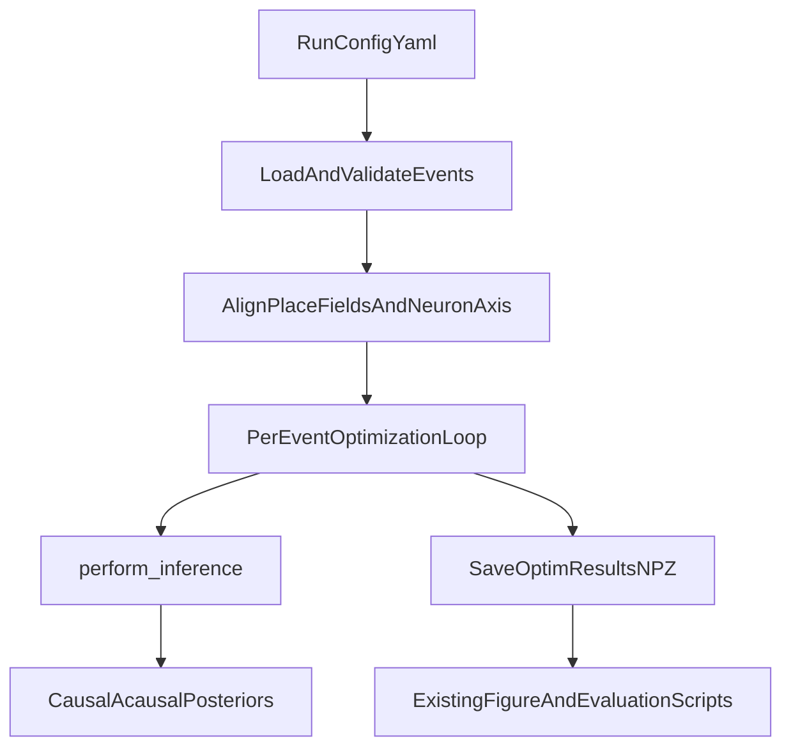

# Integrate PBE Events into ReplaySwitchingHMM

## Goal
Apply the existing drift-diffusion switching-HMM inference stack to your segmented PBE/replay events by adding a reusable input adapter and configurable run script, without rewriting the core model (`ssm/*`).

## Current Constraints Identified
- Inference already accepts per-event spike rasters via `perform_inference(params, place_fields, spike_raster, dt, model_type)` in [H:/TEMP/Spike3DEnv_ExploreUpgrade/Spike3DWorkEnv/ReplaySwitchingHMM/ssm/optimization.py](H:/TEMP/Spike3DEnv_ExploreUpgrade/Spike3DWorkEnv/ReplaySwitchingHMM/ssm/optimization.py).
- Training is tightly coupled to Pfeiffer paths and file names in [H:/TEMP/Spike3DEnv_ExploreUpgrade/Spike3DWorkEnv/ReplaySwitchingHMM/train_Pfeiffer1D.py](H:/TEMP/Spike3DEnv_ExploreUpgrade/Spike3DWorkEnv/ReplaySwitchingHMM/train_Pfeiffer1D.py).
- Event loading expects `ripples.npz` fields (`ripples`, `time_bin_centers_replay`, `start_ids`, `end_ids`, `start_times`, `end_times`) and converts to `dtype=object` event arrays.
- Preprocessing script is dataset-specific (`.mat` schema and session knobs) in [H:/TEMP/Spike3DEnv_ExploreUpgrade/Spike3DWorkEnv/ReplaySwitchingHMM/preprocessing_Pfeiffer1D.py](H:/TEMP/Spike3DEnv_ExploreUpgrade/Spike3DWorkEnv/ReplaySwitchingHMM/preprocessing_Pfeiffer1D.py).

## Proposed Changes
- Add a dataset adapter module (new file) to standardize your segmented PBEs into the exact in-memory structures expected by the current optimization loop.
- Add a config-driven runner (new script) that replaces hardcoded session blocks and centralizes:
  - data paths
  - `dt`/position bin metadata
  - event filtering thresholds
  - model family + bounds/initialization
- Refactor existing `train_Pfeiffer1D.py` logic into reusable functions while keeping backward-compatible defaults for Pfeiffer data.
- Keep `ssm/` unchanged except optional tiny API additions for cleaner batching/reporting.
- Add one lightweight validation script to sanity-check schema compatibility and dimensions before optimization.

## Target File Set
- **New**: [H:/TEMP/Spike3DEnv_ExploreUpgrade/Spike3DWorkEnv/ReplaySwitchingHMM/io/event_adapter.py](H:/TEMP/Spike3DEnv_ExploreUpgrade/Spike3DWorkEnv/ReplaySwitchingHMM/io/event_adapter.py)
- **New**: [H:/TEMP/Spike3DEnv_ExploreUpgrade/Spike3DWorkEnv/ReplaySwitchingHMM/configs/pbe_run.example.yaml](H:/TEMP/Spike3DEnv_ExploreUpgrade/Spike3DWorkEnv/ReplaySwitchingHMM/configs/pbe_run.example.yaml)
- **New**: [H:/TEMP/Spike3DEnv_ExploreUpgrade/Spike3DWorkEnv/ReplaySwitchingHMM/run_inference.py](H:/TEMP/Spike3DEnv_ExploreUpgrade/Spike3DWorkEnv/ReplaySwitchingHMM/run_inference.py)
- **Update**: [H:/TEMP/Spike3DEnv_ExploreUpgrade/Spike3DWorkEnv/ReplaySwitchingHMM/train_Pfeiffer1D.py](H:/TEMP/Spike3DEnv_ExploreUpgrade/Spike3DWorkEnv/ReplaySwitchingHMM/train_Pfeiffer1D.py)
- **Optional small update**: [H:/TEMP/Spike3DEnv_ExploreUpgrade/Spike3DWorkEnv/ReplaySwitchingHMM/ssm/optimization.py](H:/TEMP/Spike3DEnv_ExploreUpgrade/Spike3DWorkEnv/ReplaySwitchingHMM/ssm/optimization.py)
- **Update**: [H:/TEMP/Spike3DEnv_ExploreUpgrade/Spike3DWorkEnv/ReplaySwitchingHMM/README.md](H:/TEMP/Spike3DEnv_ExploreUpgrade/Spike3DWorkEnv/ReplaySwitchingHMM/README.md)

## Data Contract to Support Your PBEs
- Required inputs for each run:
  - `place_fields`: `(n_pos_bins, n_neurons)`
  - `events`: list/object-array of spike rasters, each `(n_time_event, n_neurons)`
  - `time_bin_size_replay` (`dt`)
  - `pos_bin_size` (for physical-unit interpretation)
  - optional event timing metadata (start/end times, centers)
- Adapter responsibilities:
  - enforce neuron-axis alignment between place fields and events
  - coerce to numeric dtype and `dtype=object` event container
  - validate nonnegative counts and minimum event duration/bin count
  - optionally apply existing `FIRE_THRE` / `TIME_LEN_THRE` logic

## Execution Flow After Changes

## Verification Plan
- Schema check on one small event subset (shape/dtype, dt consistency, no NaNs).
- Dry-run inference on 2-5 events with fixed initial params.
- Full optimization run and confirm `optim_results.npz` matches expected fields (`optim_results`, `place_fields`, `ripple_spike_trains`, windows).
- Reuse one existing figure/eval script that consumes `optim_results.npz` to confirm compatibility.

## Risks and Mitigations
- **Neuron-order mismatch** between your event matrices and place fields -> strict adapter assertion + optional reindex mapping input.
- **Different bin widths** than repo defaults (5/10 ms assumptions) -> make `dt` explicit in config and validate against metadata.
- **Hardcoded downstream session splits** in `submission/Figure*.py` -> keep out of first integration scope; document as optional follow-up adaptation.