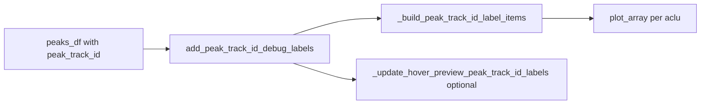

# Peak track ID debug labels on vertical markers

## Context

Peak vertical ticks are drawn in [`TrialByTrialActivityWindow.py`](h:\TEMP\Spike3DEnv_ExploreUpgrade\Spike3DWorkEnv\pyPhoPlaceCellAnalysis\src\pyphoplacecellanalysis\GUI\PyQtPlot\Widgets\ContainerBased\TrialByTrialActivityWindow.py) via:

- `_build_peak_marker_scatter_items` / `add_peak_center_vertical_markers` — batched `ScatterPlotItem` ticks at `(peak_center_x, trial_idx)`
- `_build_hover_preview_y_row_label_items` — existing pattern for tiny white `pg.TextItem` labels (`font-size:6pt`)

`peak_track_id` is **not yet in the repo**; it is expected on the input peaks dataframe (from cross-trial tracking). This debug overlay is independent of marker drawing and only requires `peak_track_id` plus the same spatial columns.

## Design

Add three small methods near the existing peak-marker block (~line 800–1080):



### 1. `_clear_peak_track_id_debug_labels(self)`

- Remove items from `self.plots.peak_track_id_debug_labels` (dict `aclu → List[pg.TextItem]`) on each aclu subplot
- Remove hover-preview labels from `self.plots.hover_preview_peak_track_id_debug_labels` if present
- Set both plot keys to `None`

Mirror the removal logic in `_clear_hover_preview_peak_markers` (handle list vs single item).

### 2. `_build_peak_track_id_label_items` (classmethod)

Build one `pg.TextItem` per peak row:

- Inputs: `peak_center_x`, `trial_idx`, `peak_track_id`, `trial_half_height`, `label_alpha=0.5`, `font_size_pt=6`
- Filter finite `(x, y, id)` rows
- For each row:
  - `label_text = pg.TextItem(html=f"<span style='color:white; font-size:{font_size_pt}pt;'>{int(peak_track_id)}</span>", anchor=(0.5, 1.0))`
  - `label_text.setOpacity(label_alpha)` (0.5)
  - Position at top of tick: `setPos(peak_center_x, trial_idx + trial_half_height + 0.05)` (small y offset above tick)
  - `setZValue(101)` (above scatter z=100)
- Return `List[pg.TextItem]`

Reuse the same tiny-label style as `_build_hover_preview_y_row_label_items` (line ~395).

### 3. `add_peak_track_id_debug_labels(self, peaks_df=None, ...)`

Public debug entry point (tagged `debug` in `@function_attributes`):

**Parameters:**
- `peaks_df`: optional; if `None`, use `self.plots_data.peak_center_markers_df`
- `label_alpha=0.5`, `font_size_pt=6`, `trial_half_height=None` (default from `self.params.peak_center_marker_trial_half_height` or 0.45)
- `clear_existing=True`, `include_hover_preview=True`

**Required columns:** `aclu`, `trial_idx`, `peak_center_x`, `peak_track_id`

**Trial-index transform:** apply the same y-mapping as `add_peak_center_vertical_markers` before plotting:

```python
peaks_df['trial_idx'] = peaks_df['trial_idx'] - 1
peaks_df['trial_idx'] = peaks_df['trial_idx'] * 2
```

**Plotting loop:** reuse `aclu_to_plot_idx` map from `plot_data_array` (same as lines 1023–1028), group by `aclu`, add labels to matching subplot.

**Storage:**
- `self.plots.peak_track_id_debug_labels = {aclu: [TextItem, ...]}`
- `self.plots_data.peak_track_id_labels_df = deepcopy(active_df)` (for hover refresh)
- `self.params.peak_track_id_label_alpha`, `font_size_pt`, `trial_half_height`

**Hover preview (optional):** add `_update_hover_preview_peak_track_id_labels(neuron_aclu)` — filter stored df to hovered aclu, draw on `hover_preview_plot`, called at end of `add_peak_track_id_debug_labels` and when hover changes (wire into `update_hover_preview` after `_update_hover_preview_peak_markers`).

### 4. No changes to `add_peak_center_vertical_markers`

Keep marker API unchanged. Debug labels are opt-in and cleared independently via `clear_existing=True` on the debug method.

## Usage (after tracking peaks)

```python
tracked_df = ...  # columns: aclu, trial_idx, peak_center_x, summit_idx, peak_track_id

a_TbyT_activity_win.add_peak_center_vertical_markers(
    tracked_df[['aclu', 'trial_idx', 'peak_center_x', 'summit_idx']]
)
a_TbyT_activity_win.add_peak_track_id_debug_labels(tracked_df)
```

Or pass only the tracked subset:

```python
a_TbyT_activity_win.add_peak_track_id_debug_labels(
    tracked_df[['aclu', 'trial_idx', 'peak_center_x', 'peak_track_id']],
    label_alpha=0.5,
)
```

## File scope

Single-file edit: [`TrialByTrialActivityWindow.py`](h:\TEMP\Spike3DEnv_ExploreUpgrade\Spike3DWorkEnv\pyPhoPlaceCellAnalysis\src\pyphoplacecellanalysis\GUI\PyQtPlot\Widgets\ContainerBased\TrialByTrialActivityWindow.py) only (~80 lines added).

## Verification

- Call on a window with multi-peak tracked data; confirm each vertical tick shows its numeric `peak_track_id` above the tick
- Confirm labels are faint (opacity 0.5) and small (6pt)
- Hover a subplot: hover-preview labels appear/disappear with the cell
- Re-call with `clear_existing=True` removes old labels cleanly

## Out of scope

- Implementing `track_peaks_across_trials` / `peak_track_id` computation (separate task)
- Notebook edits
- Unit tests (no existing widget tests for this class)
