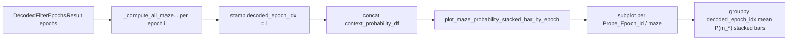

# Per-epoch Maze Probability Stacked Bars

**Goal:** Plot stacked maze-context probabilities for every decoded epoch (lap/PBE/replay), with one subplot per maze and many bars per subplot.

**Architecture:** Keep `plot_maze_probability_stacked_bar` unchanged. Enrich `context_probability_df` with `decoded_epoch_idx` in compute, add `plot_maze_probability_stacked_bar_by_epoch`, and call it from the same pipeline plot block using `context_probability_df_dict` (not `decoded_results_context_probability_performance_df_dict`, which only has correctness aggregates).

**Tech stack:** matplotlib stacked `ax.bar`, pandas `groupby` mean, existing flexitext/`FormattedFigureText` header/footer pattern.

## Locked decisions

- Enrich `context_probability_df` with `decoded_epoch_idx` during per-epoch compute/concat
- Layout: one subplot column per maze; multiple per-epoch stacked bars inside each
- Highlight: black outline on the true-maze stack segment (`j == maze_i`), same as existing plotter
- New dedicated function (do not add a mode flag to the existing one)

## Data flow



## Changes

### 1. Stamp epoch id in compute

File: [`PendingNotebookCode.py`](h:/TEMP/Spike3DEnv_ExploreUpgrade/Spike3DWorkEnv/pyPhoPlaceCellAnalysis/src/pyphoplacecellanalysis/SpecificResults/PendingNotebookCode.py) — `_compute_all_epochs_all_maze_by_maze_context_marginals` (~599–608)

In the per-epoch loop, after computing each epoch’s `context_probability_df`:

```python
context_probability_df['decoded_epoch_idx'] = i
context_probability_df_list.append(context_probability_df)
```

No change to the aggregated `context_probability_performance_df` schema.

### 2. New plot function (after existing stacked-bar plotter ~810)

Signature (same header/footer kwargs as existing):

```python
def plot_maze_probability_stacked_bar_by_epoch(context_probability_df: pd.DataFrame, maze_prob_col_names: list[str], active_context: Optional[IdentifyingContext] = None, title_string: Optional[str] = 'Maze Context Decoded Probabilities', subtitle_string: Optional[str] = None) -> tuple[plt.Figure, np.ndarray, dict]:
```

Behavior:

- Require `decoded_epoch_idx` column (clear error if missing)
- `fig, axes = plt.subplots(nrows=1, ncols=n_mazes, sharey=True)` (handle `n_mazes==1` so `axes` is always an array)
- Colors: `tab10`, same as existing
- For maze `i`: `curr = df[df['Probe_Epoch_id'] == i]`; `epoch_means = curr.groupby('decoded_epoch_idx')[maze_prob_col_names].mean().sort_index()`
- For each epoch row at bar x-position `k`: stack `ax.bar(x=k, height=val, bottom=bottom, ...)` over `maze_prob_col_names`; outline segment where `j == i` (`edgecolor='black'`, `linewidth=2.5`)
- Subplot title = `maze_prob_col_names[i]`; sparse x ticks/labels from `decoded_epoch_idx` (avoid labeling every bar when many epochs)
- Legend + flexitext title/footer copied from existing plotter pattern
- Return `(fig, axes, artist_objects)` with `bars` nested per maze then per epoch

### 3. Wire call site (~562–571)

Parallel loop using `context_probability_df_dict`:

```python
figs_plot_maze_probability_stacked_bar_by_epoch_dict = {}
for k, a_context_probability_df in context_probability_df_dict.items():
    title_string = f'Maze Context Decoded Probabilities'
    subtitle_string = f'{k.title()}s (per-epoch)'
    active_context = curr_active_pipeline.build_display_context_for_session(f'maze_context_decoded_probabilities_by_epoch[{k}]')
    figs_plot_maze_probability_stacked_bar_by_epoch_dict[k] = plot_maze_probability_stacked_bar_by_epoch(context_probability_df=a_context_probability_df, maze_prob_col_names=maze_prob_col_names, active_context=active_context, title_string=title_string, subtitle_string=subtitle_string)
## END for k, a_context_probability_df in context_probability_df_dict.items()...
output_dict['figs_plot_maze_probability_stacked_bar_by_epoch_dict'] = figs_plot_maze_probability_stacked_bar_by_epoch_dict
```

Keep the existing mean-bar loop and output key as-is.

## Out of scope

- Changing `decoded_results_context_probability_performance_df_dict` contents
- Single-axes brace layout from the sketch (using subplot-per-maze instead, per your choice)
- Notebook cell updates beyond what the pipeline function already returns
