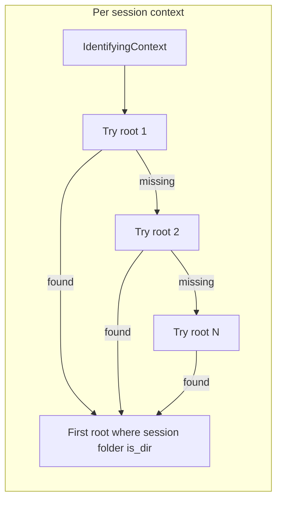

# Per-session global data root resolution (Bapun batch)

## Problem

Today [`ProcessBatchOutputs_Bapun_Batch.ipy`](h:/TEMP/Spike3DEnv_ExploreUpgrade/Spike3DWorkEnv/Spike3D/ProcessBatchOutputs_Bapun_Batch.ipy) picks **one** root for the whole batch:

```274:285:h:/TEMP/Spike3DEnv_ExploreUpgrade/Spike3DWorkEnv/Spike3D/ProcessBatchOutputs_Bapun_Batch.ipy
    known_global_data_root_parent_paths = [
        Path(r'W:/Data'), 
        Path(r'/nfs/turbo/umms-kdiba/Data'),
    ]
    global_data_root_parent_path = find_first_extant_path(known_global_data_root_parent_paths)
```

That root is passed to [`ConcreteSessionFolder.build_concrete_session_folders`](h:/TEMP/Spike3DEnv_ExploreUpgrade/Spike3DWorkEnv/pyPhoPlaceCellAnalysis/src/pyphoplacecellanalysis/General/Batch/runBatch.py) and to [`generate_batch_single_session_scripts`](h:/TEMP/Spike3DEnv_ExploreUpgrade/Spike3DWorkEnv/pyPhoPlaceCellAnalysis/src/pyphoplacecellanalysis/General/Batch/pythonScriptTemplating.py). If session A lives on turbo and session B only on slower storage, a single “first extant root” can point all sessions at the wrong tier (or cause valid sessions to be skipped when their folder is missing under that root).

Bapun’s [`build_session_basedirs_dict`](h:/TEMP/Spike3DEnv_ExploreUpgrade/Spike3DWorkEnv/NeuroPy/neuropy/core/session/Formats/Specific/BapunDataSessionFormat.py) already maps each context to `{root}/Bapun/{animal}/{session}` (with flat-layout fallback) and checks `is_dir()` **within one root** — we need an outer loop over roots.



## Approach

### 1. Add resolver helpers in `.ipy` (primary change)

Add two small functions near `filter_bapun_session_paths`:

- **`resolve_bapun_session_folder_and_root(curr_session_context, known_global_data_root_parent_paths, debug_print=False) -> tuple[Optional[Path], Optional[Path]]`**
  - For each candidate root **in list order** (preserves your existing Windows vs Great Lakes commented blocks — no reordering):
    - Skip if `candidate_root.exists()` is false
    - Call `BapunDataSessionFormatRegisteredClass.build_session_basedirs_dict(candidate_root)`
    - If `basedirs_dict.get(context)` is a directory, return `(candidate_root.resolve(), basedir.resolve())`
  - Otherwise return `(None, None)`

- **`build_bapun_concrete_session_folders_per_root(included_session_contexts, known_global_data_root_parent_paths, debug_print=False) -> tuple[List[ConcreteSessionFolder], Dict[IdentifyingContext, Path]]`**
  - Loop `included_session_contexts`, call resolver per context
  - Build `ConcreteSessionFolder(context, basedir)` and `session_global_data_root_parent_paths[context] = root`
  - Print a concise per-session summary, e.g. `bapun_RatS_Day4OpenField -> /nfs/turbo/.../Data (W:/Data skipped: folder missing)`
  - Do **not** assert a single global root exists; only assert at least one session resolved (otherwise `filter_bapun_session_paths` will raise anyway)

Import `BapunDataSessionFormatRegisteredClass` is already present in the file.

### 2. Update `process_all_phases` path setup

Replace the block at lines 274–300:

| Before | After |
|--------|-------|
| `global_data_root_parent_path = find_first_extant_path(...)` | Keep `known_global_data_root_parent_paths` list as-is (separate commented blocks per machine) |
| `build_concrete_session_folders(global_data_root_parent_path, ...)` | `good_session_concrete_folders, session_global_data_root_parent_paths = build_bapun_concrete_session_folders_per_root(...)` |
| Single print of global root | Print resolved mapping table; keep a fallback `global_data_root_parent_path = find_first_extant_path(...)` only for backward-compatible API default |

Existing `filter_bapun_session_paths` stays unchanged — it still validates `.xml` presence and drops bad sessions.

### 3. Minimal library change: per-session root in generated scripts (required)

Generated run/figures scripts bake in `global_data_root_parent_path` via [`python_template.py.j2`](h:/TEMP/Spike3DEnv_ExploreUpgrade/Spike3DWorkEnv/pyPhoPlaceCellAnalysis/src/pyphoplacecellanalysis/Resources/Templates/python_template.py.j2). A session resolved on turbo must not run with `W:/Data` hardcoded.

**Small change in [`pythonScriptTemplating.py`](h:/TEMP/Spike3DEnv_ExploreUpgrade/Spike3DWorkEnv/pyPhoPlaceCellAnalysis/src/pyphoplacecellanalysis/General/Batch/pythonScriptTemplating.py):**

- Add optional parameter: `session_global_data_root_parent_paths: Optional[Dict[IdentifyingContext, Path]] = None`
- Inside the per-session loop (lines 443+), before each `python_template.render(...)`:

```python
curr_global_data_root_parent_path = (session_global_data_root_parent_paths or {}).get(curr_session_context, global_data_root_parent_path)
```

- Pass `curr_global_data_root_parent_path` to all four `render(...)` calls (run script, figures script, temp notebook script)

**Update the call in `.ipy`:**

```python
batch_scripts_collection = generate_batch_single_session_scripts(
    global_data_root_parent_path,  # fallback only
    session_batch_basedirs=session_basedirs_dict,
    included_session_contexts=included_session_contexts,
    session_global_data_root_parent_paths=session_global_data_root_parent_paths,
    ...
)
```

No template (`.j2`) changes needed.

### 4. Path list documentation (no reorder)

Add a short comment above `known_global_data_root_parent_paths` clarifying:

- List order = storage priority (fast → slow)
- Comment/uncomment blocks per machine as today
- Per-session resolution tries each **existing** root in order until the session folder is found

## Pre-existing limitation (unchanged)

[`build_session_basedirs_dict`](h:/TEMP/Spike3DEnv_ExploreUpgrade/Spike3DWorkEnv/NeuroPy/neuropy/core/session/Formats/Specific/BapunDataSessionFormat.py) hardcodes a subset of Bapun sessions (no `RatJ`, no `RatU Day5Openfield`, no `RatU Day3TwoNovel` in `session_specs`). Those contexts will still be skipped with the existing warning — out of scope unless you want them added to NeuroPy separately.

## Verification

1. Run the driver cell with a mixed batch where some sessions exist only under the second listed root.
2. Confirm printed mapping shows different roots per session where expected.
3. Inspect one generated `run_*.py` per storage tier and confirm `Path(r'...')` matches that session’s resolved root.
4. Confirm `filter_bapun_session_paths` still drops sessions with missing folders or missing `.xml`.
