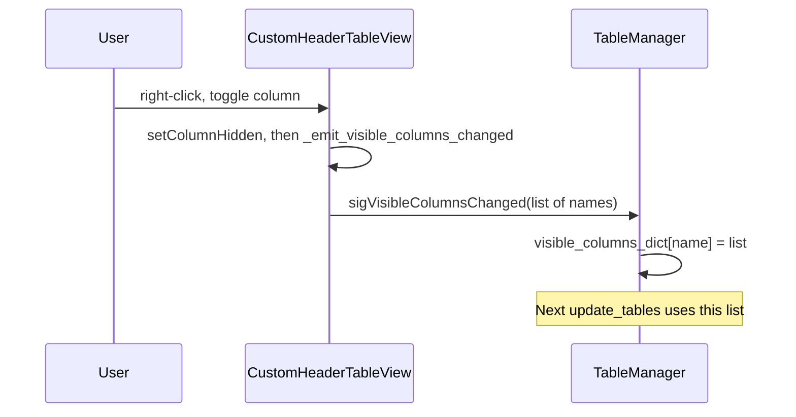

# Persist column visibility into visible_columns_dict and harden the system

## Goal

1. When the user changes columns via the right-click menu, save that choice into `self.visible_columns_dict[table_name]` so it is reused on later `update_tables` and data updates.
2. Keep the whole display/update column flow consistent: one source of truth that is both applied to the table and persisted.

## Current behavior

- **CustomHeaderTableView.toggle_column**: Only calls `setColumnHidden(column, not visible)`; nothing is written to `visible_columns_dict`.
- **TableManager** owns `visible_columns_dict` but has no way to be notified when the user toggles columns in a table.
- **_update_table** already prefers current table visibility over the dict, then falls back to the dict; it does not write back to the dict when it applies visibility.

## Approach

Use a signal from the table to the manager so that any change in visible columns (user or programmatic) is reflected in `visible_columns_dict`. That keeps the dict in sync and makes later updates robust.

## Implementation

### 1. CustomHeaderTableView: signal and emission

**File:** [StackedDynamicTablesWidget.py](h:\TEMP\Spike3DEnv_ExploreUpgrade\Spike3DWorkEnv\pyPhoPlaceCellAnalysis\src\pyphoplacecellanalysis\GUI\Qt\Widgets\Testing\StackedDynamicTablesWidget.py)

- **Import:** Add `Signal` to the Qt import (e.g. `from PyQt5.QtCore import QAbstractTableModel, Qt, Signal`).
- **Signal:** On the class, define a signal that carries the current list of visible column **names** (strings), so the manager can store them by name:
  - `sigVisibleColumnsChanged = Signal(list)`  (PyQt5: `Signal(list)` or `pyqtSignal(list)`).
- **Helper:** Add a method that builds the list of visible column names from the current model and view state and emits the signal:
  - Get `model = self.model()`; if None or `columnCount() == 0`, emit `[]`.
  - Else: `visible_names = [str(model.headerData(col, Qt.Horizontal, Qt.DisplayRole)) for col in range(model.columnCount()) if not self.isColumnHidden(col)]`, then `self.sigVisibleColumnsChanged.emit(visible_names)`.
- **toggle_column:** After `setColumnHidden(column, not visible)`, call that helper so every user toggle is persisted.
- **initCustomHeaders:** At the end of the method (after applying visibility and building the context menu), call the same helper once. That way when the manager sets `table.visible_columns` and replaces the model, the applied visibility is also written back into `visible_columns_dict` via the connected slot, keeping dict and UI in sync.

### 2. TableManager: connect signal and persist

- **add_table_dock:** After storing the table in `self.dock_items` and `self.models`, connect the table’s signal so that when visibility changes, the manager updates the dict for this table by name. Use a closure that captures the table `name` (e.g. `lambda cols, n=name: self._on_table_visible_columns_changed(n, cols)` or a dedicated slot) so the correct key is used.
- **New method:** `_on_table_visible_columns_changed(self, name: str, visible_column_names: List[str])`:
  - Set `self.visible_columns_dict[name] = list(visible_column_names)` so the dict always has a list of strings. If the table is new and `name` was not in the dict, this effectively adds it; if the user hid all columns, store `[]`.

No change to `_update_table` logic: it already prefers current table visibility and falls back to `visible_columns_dict`; once we persist user (and programmatic) changes into the dict, that fallback and later updates will use the saved list.

### 3. Robustness details

- **initCustomHeaders type handling:** The code already supports `visible_columns` as either a list of ints (indices) or list of strings (names). When emitting, we always send **names** so `visible_columns_dict` stays name-based and works across data updates that reorder or add columns.
- **Empty list:** If the user hides all columns, emit `[]` and store it; avoid treating “no visible columns” as “use default” unless that is explicitly desired (current behavior can stay: empty `included_visible_columns` in _update_table already falls back to the dict; if the dict now has `[]`, we’d set `table.visible_columns = None` and initCustomHeaders would show all; if you prefer to keep “all hidden” as a valid state, we can handle empty list in the slot by still storing `[]` and in _update_table treating `[]` as “show none” instead of fallback — specify if you want that).
- **Re-entrancy:** Emitting from initCustomHeaders will call the manager slot and update the dict; that does not trigger another setModel or initCustomHeaders, so no loop.
- **New tables:** add_table_dock creates the table with visibility from `visible_columns_dict`; initCustomHeaders runs and will emit, so the dict gets the same list we just applied (idempotent).

## Summary of edits

| Location                    | Change                                                                                                                                                                                                     |
| --------------------------- | ---------------------------------------------------------------------------------------------------------------------------------------------------------------------------------------------------------- |
| Imports                     | Add `Signal` from PyQt5.QtCore.                                                                                                                                                                            |
| CustomHeaderTableView       | Define `sigVisibleColumnsChanged = Signal(list)`. Add helper that builds visible column names from model + `isColumnHidden` and emits. Call helper from `toggle_column` and at end of `initCustomHeaders`. |
| TableManager.add_table_dock | After storing table/dock/model, connect `table.sigVisibleColumnsChanged` to a slot that receives the list and updates the dict for this table (use `name` in closure).                                     |
| TableManager                | Add `_on_table_visible_columns_changed(self, name, visible_column_names)` setting `self.visible_columns_dict[name] = list(visible_column_names)`.                                                          |

Result: User toggles and programmatic visibility changes both update `visible_columns_dict`; `_update_table` and add_table_dock continue to use the dict (or current table state when present), so the system stays consistent and robust.