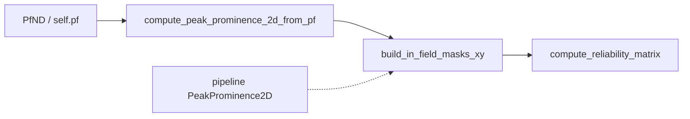

# Compute in-field masks from placefields (Option A)

## Goal

Allow:

```python
a_dst_pseudo2D_decoder.compute_unit_confusion_reliability_variables(
    spikes_df=spikes_df, time_bin_size_seconds=0.050, max_t_idx=None,
)
# active_peak_prominence_2d_results omitted → recompute from self.pf
```

while keeping the existing pipeline-result path unchanged when the arg is passed.

## Approach

Add a **minimal** PeakProminence2D builder from `PfND` (same core as the pipeline stage, without Eloy / filtered peak-count side products), then wire DST to use it when results are `None`.



## Changes

### 1. Helper on `CellIndividualReliabilityMatrix` — [`reliability.py`](h:/TEMP/Spike3DEnv_ExploreUpgrade/Spike3DWorkEnv/pyPhoPlaceCellAnalysis/src/pyphoplacecellanalysis/Analysis/reliability.py)

Add classmethod `compute_peak_prominence_2d_from_pf(cls, pf: PfND, step: float = 0.01, min_considered_promenence: float = 0.2, neuron_ids=None)` next to `build_in_field_masks_xy`.

Mirror the **core** loop from [`_perform_pf_find_ratemap_peaks_peak_prominence2d_computation`](h:/TEMP/Spike3DEnv_ExploreUpgrade/Spike3DWorkEnv/pyPhoPlaceCellAnalysis/src/pyphoplacecellanalysis/General/Pipeline/Stages/ComputationFunctions/PlacefieldDensityAnalysisComputationFunctions.py) (lines ~414–507 only):

- Use `pf.ratemap.unit_max_tuning_curves` with `slab = tuning_curve.T`
- Call `PeakPromenence.compute_prominence_contours(...)` per neuron
- Store `results[neuron_id] = {'peaks': cell_peaks_dict, 'slab': slab, 'id_map': ..., 'prominence_map': ..., 'parent_map': ...}`
- Return `DynamicParameters(xx=pf.xbin_centers, yy=pf.ybin_centers, results=out_results)`

Do **not** rebuild `flat_peaks_df` / `filtered_flat_peaks_df` / `peak_counts` / Eloy boundary distances — `_build_top_peak_90pct_masks` only needs `xx`, `yy`, and per-neuron `peaks` + `slab` (contours recomputed from slab at the requested `slice_level_multiplier`).

Also add thin convenience:

`build_in_field_masks_xy_from_pf(cls, pf, n_top_peaks=3, slice_level_multiplier=0.9, neuron_ids=None)` → `compute_peak_prominence_2d_from_pf` then existing `build_in_field_masks_xy`.

Assert 2D placefields (`pf.ndim >= 2`).

### 2. Wire DST decoder — [`reconstruction_dst.py`](h:/TEMP/Spike3DEnv_ExploreUpgrade/Spike3DWorkEnv/pyPhoPlaceCellAnalysis/src/pyphoplacecellanalysis/Analysis/Decoder/reconstruction_dst.py)

In `compute_unit_confusion_reliability_variables`:

- Change signature so `active_peak_prominence_2d_results=None` is optional
- When `None`: `active_peak_prominence_2d_results = CellIndividualReliabilityMatrix.compute_peak_prominence_2d_from_pf(self.pf, neuron_ids=neuron_ids)`
- Keep existing `build_in_field_masks_xy(...)` call afterward

Update the docstring to note the auto-recompute path. Leave `init_from_stateful_decoder` / `init_from_placefields` behavior as-is (only run confusion reliability when results are explicitly passed); callers who omit the pipeline cache should call `compute_unit_confusion_reliability_variables(...)` without the arg.

### 3. Usage after change

```python
# Old (still works):
a_dst.compute_unit_confusion_reliability_variables(active_peak_prominence_2d_results=..., spikes_df=spikes_df, ...)

# New (Option A):
a_dst.compute_unit_confusion_reliability_variables(spikes_df=spikes_df, time_bin_size_seconds=0.050, max_t_idx=None)
```

## Out of scope

- Threshold-based masks (Option B)
- Refactoring the full pipeline `ratemap_peaks_prominence2d` stage to call the new helper
- Changing DST Skaggs reliability / decode path (already PF-only)
