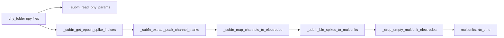

# Implement `build_multiunits_from_phy_folder` in rtc_clusterless_adapters

## Goal

Add a self-contained Phy→RTC adapter in [`rtc_clusterless_adapters.py`](file:///home/halechr/repos/pyPhoPlaceCellAnalysis/src/pyphoplacecellanalysis/Analysis/Decoder/rtc_clusterless_adapters.py) that converts **all detected spikes** (not curated units) into the clusterless decoder input used by `position_decoding_clusterless` via the existing `multiunits=` / `rtc_time=` kwargs.

Target signature (per user request):

```python
def build_multiunits_from_phy_folder(phy_path, t_start, t_end, sampling_frequency_hz, electrode_mode='shank') -> Tuple[np.ndarray, np.ndarray]
```

## Data flow



## Required Phy files (read via `mmap_mode='r'` where large)

| File | Use |
|------|-----|
| `params.py` | `sample_rate` (e.g. 30000 Hz) |
| `spike_times.npy` | Sample indices, sorted → epoch slice via `searchsorted` |
| `spike_templates.npy` | Template index per spike |
| `pc_features.npy` | Shape `(n_spikes, n_pcs, n_template_slots)` |
| `pc_feature_ind.npy` | Shape `(n_templates, n_template_slots)` → probe channel per slot |

Optional for electrode mapping:

| File | Use |
|------|-----|
| `channel_shanks.npy` | Shank ID per channel (often **not** in `*_phy_curated/`; check `phy_path` then `phy_path.parent / "sorter_output"`) |
| `channel_map.npy` | Remap probe channel → contiguous electrode index for `electrode_mode='channel'` |

**Ignore** `spike_clusters.npy` — clusterless decoding must not use unit identity.

## Core algorithm (mirror existing session builder)

Reuse the same RTC conventions as [`build_multiunits_from_session`](file:///home/halechr/repos/pyPhoPlaceCellAnalysis/src/pyphoplacecellanalysis/Analysis/Decoder/rtc_clusterless_adapters.py) (lines 122–176):

1. **Epoch mask first** (memory): convert `[t_start, t_end]` to sample bounds; use `np.searchsorted` on sorted `spike_times` to get `[i0, i1)` without loading full arrays.
2. **RTC clock**: `rtc_time = t_start + (arange(n_time) + 0.5) / sampling_frequency_hz`, clipped to `t_end`.
3. **Per spike** (chunked, default ~100k spikes/chunk):
   - `tmpl = spike_templates[i]`
   - Valid slots: `pc_feature_ind[tmpl, :]` with channel `>= 0`
   - **Peak slot**: argmax of L2 norm of `pc_features[i, :, slot]` across slots (verified on RatJ data)
   - **Marks**: first 4 PCs at peak slot → `pc_features[i, :4, peak_slot]`
   - **Probe channel**: `pc_feature_ind[tmpl, peak_slot]`
4. **Electrode index** (`electrode_mode`):
   - `'channel'`: map probe channel through `channel_map` inversion to contiguous `0..n_channels-1`
   - `'shank'`: `channel_shanks[probe_channel]`; if shanks file missing or degenerate (all same value, as on RatJ), emit `warnings.warn` and **fall back to channel mode** so decoding gets >1 electrode column
5. **Binning**: `time_bin_idx = clip(searchsorted(rtc_time, spike_time_sec), 0, n_time-1)`; assign via existing `_assign_spike_marks_to_multiunits` (last spike wins per bin/electrode, same as session path).
6. **Finalize**: `_drop_empty_multiunit_electrodes(multiunits)` → return `(multiunits, rtc_time)`.

Internal helpers (all in same file, prefixed `_subfn_`):

- `_subfn_read_phy_params(phy_path) -> float` — parse `sample_rate` from `params.py` (same logic as NeuroPy [`_read_phy_params`](file:///home/halechr/repos/NeuroPy/neuropy/core/session/init_from_raw_data.py))
- `_subfn_resolve_channel_shanks(phy_path) -> Optional[np.ndarray]` — phy folder then `sorter_output` parent lookup
- `_subfn_get_epoch_spike_slice(spike_times, fs, t_start, t_end) -> slice`
- `_subfn_extract_peak_channel_marks(pc_features, pc_feature_ind, spike_templates, spike_indices) -> (channels, marks)`
- `_subfn_map_channels_to_electrodes(channels, electrode_mode, channel_map, channel_shanks) -> np.ndarray`
- `_subfn_bin_spikes_to_multiunits(spike_times_sec, marks, electrode_indices, rtc_time, n_mark_dims=4) -> np.ndarray`

Add `n_mark_dims: int = 4` as an optional kwarg on the public function (not in the minimal signature, but consistent with `build_multiunits_from_session`).

## File changes

### 1. [`rtc_clusterless_adapters.py`](file:///home/halechr/repos/pyPhoPlaceCellAnalysis/src/pyphoplacecellanalysis/Analysis/Decoder/rtc_clusterless_adapters.py)

- Add imports: `Path`, `warnings`
- Implement `_subfn_*` helpers + `build_multiunits_from_phy_folder` (~120–150 lines, minimal edits elsewhere)
- No SpikeInterface / PhyIO / pandas dependency for this path

### 2. [`tests/test_rtc_clusterless_decoder.py`](file:///home/halechr/repos/pyPhoPlaceCellAnalysis/tests/test_rtc_clusterless_decoder.py)

Add `test_build_multiunits_from_phy_folder_synthetic_roundtrip`:

- Build a tiny temp Phy folder (5–20 spikes, 2 templates, 3 channels, `params.py` with `sample_rate=30000`)
- Call `build_multiunits_from_phy_folder(..., electrode_mode='channel')`
- Assert output shape `(n_time, 4, n_active_electrodes)`, finite marks present, `rtc_time` length matches dim 0
- Optionally pipe through `build_multiunits_from_array` to confirm compatibility

## Usage (RatJ notebook)

```python
from pyphoplacecellanalysis.Analysis.Decoder.rtc_clusterless_adapters import build_multiunits_from_phy_folder

phy_path = Path("/media/halechr/BETAMAX1/Data/Bapun/RatJ/Day3TwoNovel/SORTING/folder_KS4_v1_phy_curated")
multiunits, rtc_time = build_multiunits_from_phy_folder(phy_path, t_start=11510.0, t_end=14693.0, sampling_frequency_hz=1000.0, electrode_mode="channel")
# Pass to pipeline: perform_specific_computation(..., multiunits=multiunits, rtc_time=rtc_time)
```

**RatJ note:** `channel_shanks.npy` is absent/degenerate for this session; use `electrode_mode='channel'` (or rely on automatic fallback) to avoid collapsing to a single electrode column.

## Memory / performance constraints

- Epoch-first slicing is mandatory (~1.5M spikes / ~3.2M time bins for maze1 → ~6 GB dense float64 if all 60 channels kept; dropping empty electrodes reduces this).
- Use `mmap_mode='r'` + chunked spike processing; never `np.load(...)` full `pc_features` into RAM.
- Document in docstring that full-session clusterless at 1 kHz can OOM (see [memory note](file:///home/halechr/repos/Spike3D/EXTERNAL/DEVELOPER_NOTES/2026-06-30_MemoryAllocationIssue_in_clusterless_decoding.md)).

## Out of scope (follow-up)

- Wiring `phy_folder=` into `_perform_clusterless_position_decoding_computation` automatically
- Notebook cell edits (per user rule: ask before modifying `.ipynb`)
