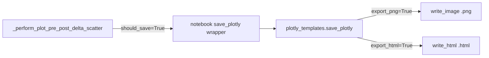

# Shared Plotly save with PNG-only option

## Goal
Save Plotly figures as `.png` without writing `.html`, via a reusable library API (not a one-off notebook hack).

## Approach
Promote the existing commented stub in [`plotly_templates.py`](h:\TEMP\Spike3DEnv_ExploreUpgrade\Spike3DWorkEnv\pyPhoPlaceCellAnalysis\src\pyphoplacecellanalysis\Pho2D\plotly\plotly_templates.py) into a real `save_plotly(...)` that takes explicit save flags. Keep default behavior as today (both formats) so existing call sites stay safe.



## Library change
In [`plotly_templates.py`](h:\TEMP\Spike3DEnv_ExploreUpgrade\Spike3DWorkEnv\pyPhoPlaceCellAnalysis\src\pyphoplacecellanalysis\Pho2D\plotly\plotly_templates.py), replace the commented stub (~L223) with:

```python
def save_plotly(a_fig, a_fig_context, *, figures_folder: Path, date_prefix: str, export_html: bool = True, export_png: bool = True, neptuner_run=None, show_path_widgets: bool = True) -> Dict[str, Path]:
```

Behavior:
- Build basename with `sanitize_filename_for_Windows(a_fig_context.get_description())` (same as notebook today)
- If `export_html`: `write_html` + optional path widget
- If `export_png`: `write_image` + optional path widget
- Neptune upload only when `neptuner_run is not None` **and** the uploaded format exists (prefer `.html` if written, else `.png`)
- Return `figure_out_paths` containing only the formats that were actually written

Also harden [`sanitize_filename_for_Windows`](h:\TEMP\Spike3DEnv_ExploreUpgrade\Spike3DWorkEnv\pyPhoCoreHelpers\src\pyphocorehelpers\Filesystem\path_helpers.py) to replace `|` (and `"`, `*`, `/`, `\`) so Windows save paths stay valid when titles include those chars.

## Notebook wiring
In [`PhoDibaPaper2024_FULL_ARCHIVE_2026-08-31.ipynb`](h:\TEMP\Spike3DEnv_ExploreUpgrade\Spike3DWorkEnv\Spike3D\EXTERNAL\PhoDibaPaper2024Book\PhoDibaPaper2024_FULL_ARCHIVE_2026-08-31.ipynb), replace the local `save_plotly` body with a thin wrapper:

```python
from pyphoplacecellanalysis.Pho2D.plotly.plotly_templates import save_plotly as _library_save_plotly

def save_plotly(a_fig, a_fig_context):
    return _library_save_plotly(
        a_fig, a_fig_context,
        figures_folder=figures_folder,
        date_prefix=TODAY_DAY_DATE,
        export_html=False,  # PNG only for this notebook session
        export_png=True,
        neptuner_run=neptuner_run,
    )
```

No change needed to `_perform_plot_pre_post_delta_scatter` — it already calls the injected `save_plotly` callable when `should_save=True`. Your filtered loop keeps `should_save` on (default) and gets PNG-only via the wrapper.

## Usage for your constraint loop
After re-running the `save_plotly` cell:

```python
new_fig, new_fig_context, *_ = _perform_plot_pre_post_delta_scatter(
    data_context=IdentifyingContext(...),
    concatenated_ripple_df=active,
    # should_save remains True (default)
)
```

## Out of scope
- Changing every other notebook that still inlines its own `save_plotly`
- Adding new kwargs on `_perform_plot_pre_post_delta_scatter` itself