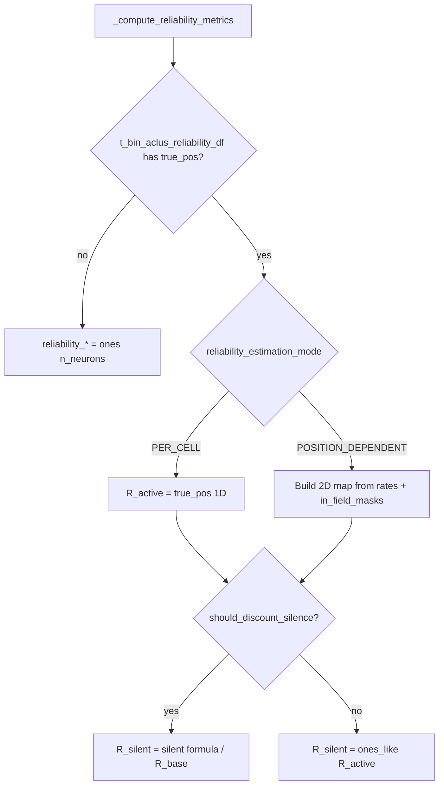

# Position-dependent reliability estimation mode

## Goal

Extend [`_compute_reliability_metrics`](h:/TEMP/Spike3DEnv_ExploreUpgrade/Spike3DWorkEnv/pyPhoPlaceCellAnalysis/src/pyphoplacecellanalysis/Analysis/Decoder/reconstruction.py) (~4062–4100) so callers can choose:

- **`PER_CELL` (default):** existing position-independent `(n_neurons,)` from confusion rates (`true_pos`)
- **`POSITION_DEPENDENT` (opt-in):** `(n_flat_position_bins, n_neurons)` maps from confusion rates conditioned on each cell’s in-field mask at hypothesized position `x`

Decode already accepts both shapes via [`_resolve_cell_reliability`](h:/TEMP/Spike3DEnv_ExploreUpgrade/Spike3DWorkEnv/pyPhoPlaceCellAnalysis/src/pyphoplacecellanalysis/Analysis/Decoder/reconstruction.py) (~2600–2622). No changes needed there.

## Formula (POSITION_DEPENDENT)

For each cell `i` and flat position bin `x`, using rates from `t_bin_aclus_reliability_df` and `in_field_masks[aclu]` flattened with the same order as `self.F` / occupancy (`ravel` / `C` order):

| hypothesized `x` | `reliability_active[x, i]` | `reliability_silent[x, i]` |
|---|---|---|
| in-field | `true_pos[i]` | `1 - false_neg[i]` |
| out-of-field | `1 - false_pos[i]` | `true_neg[i]` |

If `should_discount_silence` is `False`, set `reliability_silent = ones_like(reliability_active)` (same as today).

NaNs from missing rates → `0.0` via `nan_to_num` before assignment.

## No Skaggs

Remove the `CellIndividualReliabilityMatrix.compute_skaggs_alpha` fallback entirely.

If `t_bin_aclus_reliability_df` (with `true_pos`) is missing when metrics are requested: set both arrays to `np.ones(n_neurons)` so DST decode still works without discounting, and do not invent Skaggs alphas. Position-dependent mode additionally requires `in_field_masks`; if missing, raise a clear error telling the caller to run `compute_unit_confusion_reliability_variables` first.

## Concrete edits

### 1. New enum + field on Bayesian decoder

In [`reconstruction.py`](h:/TEMP/Spike3DEnv_ExploreUpgrade/Spike3DWorkEnv/pyPhoPlaceCellAnalysis/src/pyphoplacecellanalysis/Analysis/Decoder/reconstruction.py), near `ReliabilityDecoderModifierMode`:

```python
class ReliabilityEstimationMode(Enum):
    PER_CELL = auto()              # (n_neurons,) from confusion rates
    POSITION_DEPENDENT = auto()    # (n_flat_position_bins, n_neurons) from rates × in_field
```

Add on `BayesianPlacemapPositionDecoder` (estimation owner):

```python
reliability_estimation_mode: ReliabilityEstimationMode = non_serialized_field(default=ReliabilityEstimationMode.PER_CELL)
```

Propagate in `get_by_id` / DST `get_by_id` / factories like other reliability config fields. Default stays `PER_CELL` so position-dependent is opt-in for all decoders.

### 2. Rewrite `_compute_reliability_metrics`

Replace Skaggs branch with mode dispatch:



Helper (private method or local block) to build the 2D maps:

- Stack `in_field_masks[nid].ravel()` columns for `neuron_IDs` → `(n_flat, n_neurons)` bool
- Assert `n_flat == self.flat_position_size` (or `np.prod(original_position_data_shape)`)
- Broadcast rates with `np.where(mask, in_rate, out_rate)`

Keep `PER_CELL` silent behavior identical to today (`R_silent = R_base` when discounting).

### 3. DST setup / lazy path

[`reconstruction_dst.py`](h:/TEMP/Spike3DEnv_ExploreUpgrade/Spike3DWorkEnv/pyPhoPlaceCellAnalysis/src/pyphoplacecellanalysis/Analysis/Decoder/reconstruction_dst.py) can keep calling `_compute_reliability_metrics()` in `setup` / lazy `compute_posterior`; without confusion it now gets ones instead of Skaggs. Document that real reliability requires `compute_unit_confusion_reliability_variables(...)` then `_compute_reliability_metrics()` (or re-call after setting `reliability_estimation_mode`).

Copy `reliability_estimation_mode` in DST `get_by_id` / factories.

### 4. Usage (opt-in)

```python
decoder.compute_unit_confusion_reliability_variables(...)
decoder.reliability_estimation_mode = ReliabilityEstimationMode.POSITION_DEPENDENT
decoder._compute_reliability_metrics()
# → reliability_active.shape == (n_flat_position_bins, n_neurons)
```

## Out of scope

- No Zhang `decode()` formula changes
- No debugger / PendingNotebookCode UI for the new estimation mode
- No new per-spatial-bin confusion aggregation (still uses existing per-cell rates × masks)
- No notebook edits
