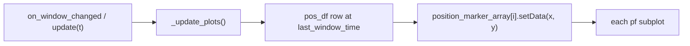

# Add measured position dot to each placefield axis

## Context

[`TimeSynchronizedPlacefieldActivityDebugPlotter.py`](h:\TEMP\Spike3DEnv_ExploreUpgrade\Spike3DWorkEnv\pyPhoPlaceCellAnalysis\src\pyphoplacecellanalysis\Pho2D\PyQtPlots\TimeSynchronizedPlotters\TimeSynchronizedPlacefieldActivityDebugPlotter.py) renders a 6×N grid of per-cell placefield heatmaps. It already inherits `AnimalTrajectoryPlottingMixin` and defines `curr_position`, but trajectory/position overlays were intentionally disabled for the grid layout (see comment at line 322–323 and line 504).

The closest existing pattern is [`TimeSynchronizedPlacefieldsPlotter._buildGraphics`](h:\TEMP\Spike3DEnv_ExploreUpgrade\Spike3DWorkEnv\pyPhoPlaceCellAnalysis\src\pyphoplacecellanalysis\Pho2D\PyQtPlots\TimeSynchronizedPlotters\TimeSynchronizedPlacefieldsPlotter.py) (lines 174–175, 257–261): one `pg.PlotDataItem` per subplot, updated via `setData(x=..., y=...)`.

**Position source:** use `self.active_one_step_decoder.pf.filtered_pos_df` (already referenced at line 146 for peak sorting). This is the measured `pos_df` for this decoder-based plotter. Do **not** rely on `curr_position` / `AnimalTrajectoryPlottingMixin_filtered_pos_df` alone, because that path expects `active_time_dependent_placefields` or an external params override (see [`PendingNotebookCode.py`](h:\TEMP\Spike3DEnv_ExploreUpgrade\Spike3DWorkEnv\pyPhoPlaceCellAnalysis\src\pyphoplacecellanalysis\SpecificResults\PendingNotebookCode.py) lines 4554–4555).



## Implementation (single file, minimal diff)

### 1. Add position lookup helper

Add a small private method (near `_get_cell_activity_levels`):

```python
def _get_current_measured_position_xy(self) -> Optional[Tuple[float, float]]:
    curr_t = self.last_window_time
    if curr_t is None:
        return None
    pos_df = self.active_one_step_decoder.pf.filtered_pos_df
    pos_up_to_t = pos_df[pos_df['t'] <= curr_t]
    if len(pos_up_to_t) == 0:
        return None
    row = pos_up_to_t.iloc[-1]
    return float(row['x']), float(row['y'])
```

Uses the same “nearest previous sample” semantics as decoder time indexing (`searchsorted(..., side='left')`).

### 2. Add marker styling params in `setup()`

After `AnimalTrajectoryPlottingMixin_on_setup()` (line 136), add plotter-specific overrides for a **small translucent dot** (distinct from the mixin’s large green crosshair defaults):

- `self.params.current_position_marker_size = 6.0` (small; mixin default is 25)
- `self.params.current_position_marker_brush = pg.mkBrush(255, 255, 255, 120)` (translucent white, readable on dark/colored fields)
- `self.params.current_position_marker_pen = pg.mkPen(None)` or thin low-alpha pen

### 3. Create one marker per subplot in `_buildGraphics()`

In the existing per-cell loop (after `curr_plot.addItem(img_item, ...)`):

- Initialize `self.ui.position_marker_array = []` alongside `img_item_array` / `plot_array`
- Create and add marker:

```python
curr_position_marker = pg.PlotDataItem(pen=None, shadowPen=None, symbol='o', pxMode=False, symbolSize=self.params.current_position_marker_size, symbolPen=self.params.current_position_marker_pen, symbolBrush=self.params.current_position_marker_brush, antialias=True, name=f'animal position - {curr_cell_identifier_string}')
curr_plot.addItem(curr_position_marker)
self.ui.position_marker_array.append(curr_position_marker)
```

`pxMode=False` keeps the dot in data (x, y) coordinates, matching placefield axes.

### 4. Update markers in `_update_plots()`

After the per-cell image update loop (before window title update, ~line 500):

```python
curr_xy = self._get_current_measured_position_xy()
for grid_idx, position_marker in enumerate(self.ui.position_marker_array):
    if curr_xy is None:
        position_marker.setData(x=None, y=None)
    else:
        position_marker.setData(x=[curr_xy[0]], y=[curr_xy[1]])
```

Same (x, y) repeated on every pf axis, as requested.

### 5. No other files required

- `export_video()` already calls `self.update(t)` → `_update_plots()`, so markers will appear in exported frames automatically.
- Track shapes (`add_track_shapes`) remain unchanged; markers sit above placefield images.

## Verification

Manual smoke test after implementation:

1. Instantiate plotter with a known decoder + sync driver (or call `update(t)` directly).
2. Scrub time and confirm a small translucent dot moves on **all** cell subplots.
3. Confirm dot disappears (or stays hidden) before first valid position sample.
4. Optional: run `export_video(...)` on a short interval and confirm dot is present in frames.
