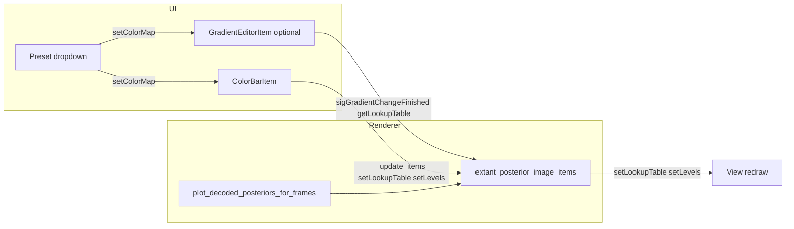

# Posterior Colormap Editor Widget (PyQtGraph)

## Context

- In [PhoOptimizedMultiEpochBatchRenderer.py](h:\TEMP\Spike3DEnv_ExploreUpgrade\Spike3DWorkEnv\pyPhoPlaceCellAnalysis\src\pyphoplacecellanalysis\PhoPositionalData\plotting\chunked_2d\PhoOptimizedMultiEpochBatchRenderer.py), posterior heatmaps are drawn in `plot_decoded_posteriors_for_frames` (lines 538–667). The colormap is used only when `**use_advanced_3D_cmap=False**` (line 621–654): `posterior_img_cmap` is applied via `img_item.setColorMap(posterior_img_cmap)`. When `use_advanced_3D_cmap=True` (default), RGBA is precomputed and no ImageItem colormap is set.
- Existing building blocks in the repo:
  - [ColorBarItem](h:\TEMP\Spike3DEnv_ExploreUpgrade\Spike3DWorkEnv\pyPhoPlaceCellAnalysis\src\pyphoplacecellanalysis\External\pyqtgraph\graphicsItems\ColorBarItem.py): `setColorMap()`, `setImageItem(img_list)`, `setLevels()`; when colormap/levels change it updates all linked ImageItems via `_update_items()` (LUT + levels). **Does not** edit gradient stops.
  - [GradientEditorItem](h:\TEMP\Spike3DEnv_ExploreUpgrade\Spike3DWorkEnv\pyPhoPlaceCellAnalysis\src\pyphoplacecellanalysis\External\pyqtgraph\graphicsItems\GradientEditorItem.py): full gradient editing, `getLookupTable(nPts)`, `setColorMap(pg.ColorMap)`, `sigGradientChanged` / `sigGradientChangeFinished`.
- [BinnedImageRenderingWindow](h:\TEMP\Spike3DEnv_ExploreUpgrade\Spike3DWorkEnv\pyPhoPlaceCellAnalysis\src\pyphoplacecellanalysis\GUI\PyQtPlot\BinnedImageRenderingWindow.py) already uses `pg.ColorBarItem` and `GradientEditorItem` (Gradients) elsewhere.

## Design

**Goal:** One widget that stays interactive and, on change, updates the posterior colormap and redraws the view without re-decoding or re-running the renderer.

**Performance constraints:**

- Only update LUT/levels on existing `ImageItem`s (no recompute of posteriors).
- Use a single LUT sample (e.g. 256 points) and `img.setLookupTable(lut)` / `img.setLevels(...)`.
- If using `GradientEditorItem`, throttle during drag: e.g. apply on `sigGradientChangeFinished`, and optionally debounce `sigGradientChanged` (e.g. 50–80 ms) for live preview.

**Behavior:**

- **Option A (simplest, recommended first):** A widget that holds a **ColorBarItem** and a **preset dropdown** (viridis, magma, plasma, inferno, jet, etc.). ColorBarItem is created with `colorMap=initial_cmap`, `interactive=True`, and `setImageItem(extant_posterior_image_items)`. When the user picks a preset, set a new `pg.ColorMap` (e.g. `pg.colormap.get(name, 'matplotlib')`) on the ColorBarItem; it will update all linked ImageItems and the bar. Levels remain adjustable via the bar’s handles. No gradient-stop editing.
- **Option B (full editor):** Add a **GradientEditorItem** (e.g. loaded from `GradientEditorItem.Gradients` or from a `pg.ColorMap`). On `sigGradientChangeFinished` (and optionally debounced `sigGradientChanged`): call `lut = gradient.getLookupTable(256)` then for each `img` in `extant_posterior_image_items`: `img.setLookupTable(lut)`. Optionally sync a ColorBarItem for level control and display. Preset dropdown can call `gradient.setColorMap(pg.colormap.get(name))`.

**Scope note:** The editor only affects the **2D posterior mode** (`use_advanced_3D_cmap=False`). When `use_advanced_3D_cmap=True`, posterior images are already RGBA; the widget can be hidden or disabled, or documented as “only for 2D mode.”

## Implementation plan

### 1. New widget: `PosteriorColormapEditorWidget`

- **Location:** New file under the same package as the renderer or under GUI, e.g.  
`pyphoplacecellanalysis/PhoPositionalData/plotting/chunked_2d/PosteriorColormapEditorWidget.py`  
or under `pyphoplacecellanalysis/GUI/PyQtPlot/Widgets/` if it should live with other PyQt plot widgets.
- **Constructor / API:**
  - Accept `image_items: List[pg.ImageItem]` (the `extant_posterior_image_items` / `posterior_image_items` from `plot_decoded_posteriors_for_frames`).
  - Optional `initial_cmap` (e.g. `pg.colormap.get('viridis','matplotlib')` or a `pg.ColorMap`).
  - Optional `values` (level range, default `(0, 1)`).
  - Optional `orientation` (e.g. `'vertical'` or `'horizontal'`).
- **Content (Option A – minimal):**
  - A `pg.ColorBarItem` with `interactive=True`, `colorMap=initial_cmap`, `values=values`.
  - Call `color_bar.setImageItem(image_items)` so it controls all posterior ImageItems.
  - A `QComboBox` of preset names (e.g. `['viridis','magma','plasma','inferno','jet']`). On change: `cmap = pg.colormap.get(name, 'matplotlib')`, then `color_bar.setColorMap(cmap)`.
  - Layout: e.g. `QWidget` with a layout that embeds the ColorBarItem’s layout (e.g. via `GraphicsLayoutWidget` or by adding the ColorBarItem to an existing `GraphicsLayout` next to the track plot).
- **Content (Option B – with gradient editing):**
  - Add a compact `GradientEditorItem` (e.g. orientation `'bottom'`). Initialize from `initial_cmap` with `gradient.setColorMap(initial_cmap)`.
  - Connect `sigGradientChangeFinished` to a slot that: builds `lut = self._gradient.getLookupTable(256)`, then for each `img` in `image_items`: `img.setLookupTable(lut)`.
  - Optional: connect `sigGradientChanged` to a QTimer (single-shot, 50–80 ms) to update LUT on ImageItems during drag (live preview) without flooding.
  - Optional: keep a ColorBarItem for level control only (levels only, no gradient editing): create ColorBarItem with same `values`, `setImageItem(image_items)`; on gradient change, update the bar’s LUT from the GradientEditorItem so the bar reflects the same colormap.
- **Redraw:** After updating all ImageItems, trigger a single redraw: e.g. get the view from the first image’s scene/view, or from a passed-in `plot_item`, and call `view.update()` or `scene().update()` once.

### 2. Integration with the renderer and callers

- **Renderer:** No change required inside `plot_decoded_posteriors_for_frames` or `plot_all` for Option A/B. The widget is created by the **caller** with the returned `posterior_image_items`.
- **Caller (e.g. docstring example around 1014–1037):** After `plot_all(..., track_plot_item=track_plot_item)` and reading `_out_dict['plotted_posterior_items_dict']['posterior_image_items']` (or equivalent), instantiate the editor and add it to the layout:
  - `editor = PosteriorColormapEditorWidget(image_items=extant_posterior_image_items, initial_cmap=pg.colormap.get('viridis','matplotlib'))`
  - Add `editor` to the same `GraphicsLayout` as the track (e.g. next to or below the track plot), or to a sibling panel.
- **Optional:** If you want the renderer to create the widget, add an optional kwarg to `plot_all` or `plot_decoded_posteriors_for_frames`, e.g. `create_colormap_editor=False`, and when True, build the widget, call `setImageItem(extant_posterior_image_items)`, and return it in `_out_dict` (e.g. `_out_dict['posterior_colormap_editor'] = editor`) so the caller can place it in the UI.

### 3. Performance details

- Use one LUT array of length 256 (or 512 if you prefer) for all ImageItems.
- Update only when colormap/levels actually change (ColorBarItem already does this internally).
- For GradientEditorItem, prefer `sigGradientChangeFinished` for the main update; use a short debounce on `sigGradientChanged` only if you want smooth drag preview.
- After batch `setLookupTable` / `setLevels`, one `view.update()` or `scene().update()` is enough.

### 4. File and dependency summary

| Item       | Action                                                                                                                                                  |
| ---------- | ------------------------------------------------------------------------------------------------------------------------------------------------------- |
| New file   | `PosteriorColormapEditorWidget.py` (under chunked_2d or GUI/PyQtPlot/Widgets)                                                                           |
| Imports    | `pg` (External pyqtgraph), `QtWidgets`/`QtCore`, `numpy` for LUT                                                                                        |
| Uses       | `pg.ColorBarItem`, optionally `GradientEditorItem`, `pg.colormap.get`, `pg.ColorMap`                                                                    |
| Call sites | Callers of `plot_all` / `plot_decoded_posteriors_for_frames` that have access to `posterior_image_items` and the layout (e.g. Spike2DRaster or similar) |

### 5. Optional: support when `use_advanced_3D_cmap=True`

- Today, in 3D mode the ImageItems display precomputed RGBA; changing a LUT has no effect. Options: (1) hide or disable the colormap editor when in 3D mode; (2) document that the editor applies only in 2D mode; (3) later, allow editing the two 3D colormaps and re-run the 3D LUT + composite + `setImage()` for each frame (expensive, separate feature).

## Mermaid: data flow

## Recommended order of work

1. Implement **Option A**: `PosteriorColormapEditorWidget` with ColorBarItem + preset ComboBox, and `setImageItem(image_items)`.
2. Wire a caller (or docstring example) to build the widget from `posterior_image_items` and add it to the layout; verify interaction and redraw.
3. If desired, add **Option B**: GradientEditorItem + throttled updates and optional ColorBarItem for levels.
4. Document that the editor applies only when `use_advanced_3D_cmap=False`.

