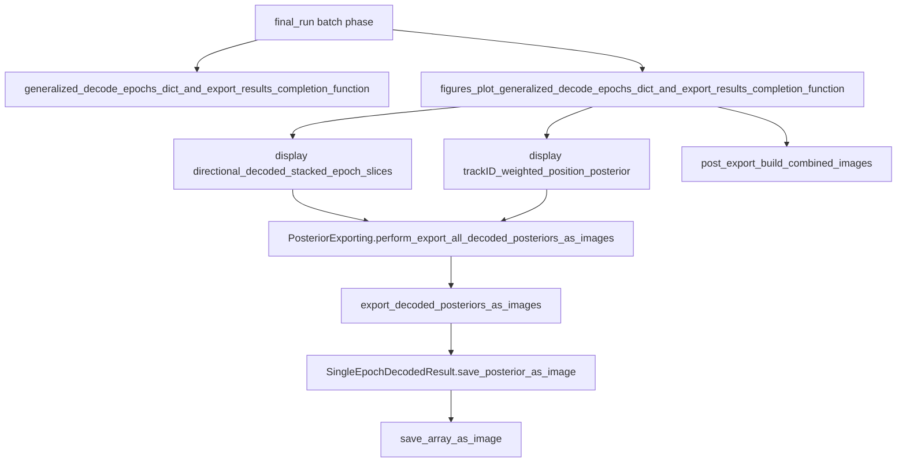

# PosteriorExportProcess.md Technical Reference

## Deliverable

Create one new markdown file:

[`Spike3D/EXTERNAL/DEVELOPER_NOTES/PosteriorExportProcess.md`](h:/TEMP/Spike3DEnv_ExploreUpgrade/Spike3DWorkEnv/Spike3D/EXTERNAL/DEVELOPER_NOTES/PosteriorExportProcess.md)

Placed next to existing export notes (e.g. `2023-08-10 - Output Files and Exports.md`). No code changes.

## Document scope (chosen defaults)

- **Primary focus:** KDiba directional / trackID-weighted posterior **PNG** export (PBE ≈ `ripple/` folder).
- **Brief secondary notes:** sibling HDF5 path (paper/dashboard hover), W-Maze `pbe`/`replay` image tree, interactive paginated export.
- **Out of scope:** DataFrameFilter Solara Copy/Save composite dashboard PNGs.

## Content outline (what the file will contain)

### 1. Purpose / mental model
Decode epoch posteriors → render each epoch’s `p_x_given_n` as PNG → organize by session/epoch/decoder/format → stitch into `combined/multi` for browsing.

### 2. What batch must run first

Registered in [`pythonScriptTemplating.py`](h:/TEMP/Spike3DEnv_ExploreUpgrade/Spike3DWorkEnv/pyPhoPlaceCellAnalysis/src/pyphoplacecellanalysis/General/Batch/pythonScriptTemplating.py) under **`ProcessingScriptPhases.final_run`** (`phase3`):

1. **`generalized_decode_epochs_dict_and_export_results_completion_function`** — builds `EpochComputations` / generic decode results (prerequisite for weighted/MultiColor export).
2. **`figures_plot_generalized_decode_epochs_dict_and_export_results_completion_function`** — drives the PNG displays + `post_export_build_combined_images`.

Also requires pipeline globals used by the directional exporter: `DirectionalDecodersEpochsEvaluations` (and related directional compute chain) providing:

- `decoder_laps_filter_epochs_decoder_result_dict`
- `decoder_ripple_filter_epochs_decoder_result_dict`

### 3. Call hierarchy (overview)



Key source anchors:

- Batch driver: [`batch_user_completion_helpers.py`](h:/TEMP/Spike3DEnv_ExploreUpgrade/Spike3DWorkEnv/pyPhoPlaceCellAnalysis/src/pyphoplacecellanalysis/General/Batch/BatchJobCompletion/UserCompletionHelpers/batch_user_completion_helpers.py) `figures_plot_…` (~L4543) — calls both displays; then `PosteriorExporting.post_export_build_combined_images` for `ripple` with `greyscale_shared_norm` layout.
- Display A: [`DirectionalPlacefieldGlobalComputationFunctions.py`](h:/TEMP/Spike3DEnv_ExploreUpgrade/Spike3DWorkEnv/pyPhoPlaceCellAnalysis/src/pyphoplacecellanalysis/General/Pipeline/Stages/ComputationFunctions/MultiContextComputationFunctions/DirectionalPlacefieldGlobalComputationFunctions.py) `_display_directional_merged_pf_decoded_stacked_epoch_slices`
- Display B: [`EpochComputationFunctions.py`](h:/TEMP/Spike3DEnv_ExploreUpgrade/Spike3DWorkEnv/pyPhoPlaceCellAnalysis/src/pyphoplacecellanalysis/General/Pipeline/Stages/ComputationFunctions/EpochComputationFunctions.py) `_display_decoded_trackID_weighted_position_posterior_withMultiColorOverlay`
- Core writer: [`data_exporting.py`](h:/TEMP/Spike3DEnv_ExploreUpgrade/Spike3DWorkEnv/pyPhoPlaceCellAnalysis/src/pyphoplacecellanalysis/Pho2D/data_exporting.py) `PosteriorExporting`
- Per-epoch PNG: [`reconstruction.py`](h:/TEMP/Spike3DEnv_ExploreUpgrade/Spike3DWorkEnv/pyPhoPlaceCellAnalysis/src/pyphoplacecellanalysis/Analysis/Decoder/reconstruction.py) `SingleEpochDecodedResult.save_posterior_as_image` → `media_output_helpers.save_array_as_image`

### 4. Outputs produced

| Artifact | Pattern |
|----------|---------|
| Per-epoch posterior | `p_x_given_n[NNN].png` |
| Per-decoder formats | `greyscale`, `color`, `raw_rgba`, `greyscale_shared_norm`, `viridis_shared_norm` |
| Auto 4-decoder stitch | `combined/{format}/merged{G\|V}_ripple[i].png` (and laps) |
| Final browse composites | `combined/multi/p_x_given_n[NNN].png` |
| Sibling data (not PNG) | `*(decoded_posteriors)*_tbin-….h5` via `perform_save_all_decoded_posteriors_to_HDF5` |

Naming note: KDiba PBE-like epochs are stored under folder name **`ripple`**, not `pbe`.

### 5. Where saved

Default tree (when parent discovery runs via `try_discover_default_collected_outputs_dir`):

```
{collected_outputs}/figures/_temp_individual_posteriors/
  {YYYY-MM-DD}/
    {animal}_{exper}_{session}/
      laps|ripple/
        {long_LR|long_RL|short_LR|short_RL}/{format}/p_x_given_n[NNN].png
        combined/{format}/merged….png
        combined/multi/p_x_given_n[NNN].png
```

Known `collected_outputs` roots include `K:/scratch/collected_outputs`, turbo/NFS paths, Dropbox MED-DibaLab, and local `Spike3D/output/collected_outputs`.

Batch figure completion passes `parent_output_folder=self.collected_outputs_path`; display helpers still typically resolve into `figures/_temp_individual_posteriors` when discovery runs (Path vs str quirk noted only if useful for operators).

### 6. Transfer / visualization handoff

Practical copy target for reviewing PBE/replay posteriors:

`…/ripple/combined/multi/*.png`

Consumers:

- **Obsidian:** `ObsidianCanvasHelper.build_canvas_for_exported_session_posteriors` ([`obsidian_canvas_helpers.py`](h:/TEMP/Spike3DEnv_ExploreUpgrade/Spike3DWorkEnv/pyPhoCoreHelpers/src/pyphocorehelpers/Filesystem/obsidian_canvas_helpers.py)) — globs from `{session}/…/combined/multi`
- **Paper / DataFrameFilter hover:** HDF5 via `LoadedPosteriorContainer.load_batch_hdf5_exports` (not the PNG tree)
- **Manual:** copy that folder tree to Dropbox / Obsidian vault / review machine; no dedicated rsync for these PNGs

### 7. Key knobs (short list)

- `included_figures_names` on the figures completion function
- `desired_height` (often ~1200), `custom_export_formats` / `HeatmapExportConfig`
- `post_export_build_combined_images_kwargs` (`epoch_name_list` defaults to `['ripple']`, layout `greyscale_shared_norm`)
- `masked_time_bin_fill_type`, `time_bin_size`, `filter_epochs_ripple_df`

### 8. Related / secondary paths (1 short section each)

- W-Maze: `figures_plot_nwb_wmaze_pbe_replay_decode_posteriors_completion_function` → `{BATCH}-{session}_pbe_replay_posterior_images/{pbe|replay}/…`
- Interactive: `PhoPaginatedMultiDecoderDecodedEpochsWindow.export_*` → `PosteriorExporting._perform_export_current_epoch_marginal_and_raster_images`

## Writing style

Concise operator-facing reference: short sections, one call-hierarchy diagram, path template, transfer checklist. Prefer concrete function/file names over narrative. No changelog tone.
