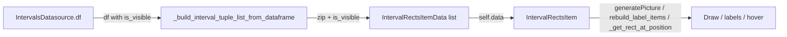

# Propagate `is_visible` through the interval rendering pipeline

## Data flow

- **IntervalsDatasource** already has `is_visible` on the df (default True). No change.
- **Render2DEventRectanglesHelper** must read `is_visible` from the df and pass it into the tuple/dataclass list.
- **IntervalRectsItemData** must carry `is_visible`; unpacking stays 6-tuple for backward compatibility.
- **IntervalRectsItem** must skip drawing, labels, and hit-test for rows where `is_visible` is False, and preserve `is_visible` when mutating data (setGreen/setBlue).

## 1. IntervalRectsItemData ([IntervalRectsItem.py](h:\TEMP\Spike3DEnv_ExploreUpgrade\Spike3DWorkEnv\pyPhoPlaceCellAnalysis\src\pyphoplacecellanalysis\GUI\PyQtPlot\Widgets\GraphicsObjects\IntervalRectsItem.py))

- Add optional field: `is_visible: bool = field(default=True)` (after `label`).
- **Do not** add `is_visible` to `UnpackableMixin_unpacking_includes()` so that existing 6-tuple unpacking `(start_t, series_vertical_offset, duration_t, series_height, pen, brush) = rect` and `for (...6 values...) in self.data` continue to work. Visibility is read via `getattr(rect, 'is_visible', True)` where needed.

## 2. Render2DEventRectanglesHelper ([Render2DEventRectanglesHelper.py](h:\TEMP\Spike3DEnv_ExploreUpgrade\Spike3DWorkEnv\pyPhoPlaceCellAnalysis\src\pyphoplacecellanalysis\GUI\PyQtPlot\Widgets\Mixins\RenderTimeEpochs\Render2DEventRectanglesHelper.py))

- `**_build_interval_tuple_list_from_dataframe**`: Build a single list that always passes 8 elements per row so `IntervalRectsItemData(*row)` works with (start_t, series_vertical_offset, duration_t, series_height, pen, brush, label, is_visible).
  - Use fixed column order: the six required columns, then `label` (use `df['label']` if `'label' in df.columns` else `[None] * len(df)`), then `is_visible` (use `df['is_visible']` if `'is_visible' in df.columns` else `[True] * len(df)`).
  - Replace the current if/else (label vs no label) with one comprehension: `zip(df.t_start, df.series_vertical_offset, df.t_duration, df.series_height, df.pen, df.brush, label_col, is_visible_col)` and `IntervalRectsItemData(*row)`.
- Do **not** add `'is_visible'` to `_required_interval_visualization_columns`; it remains optional (IntervalsDatasource ensures the column exists when built from that path; `build_IntervalRectsItem_from_epoch` may still receive dfs without it).

## 3. IntervalRectsItem ([IntervalRectsItem.py](h:\TEMP\Spike3DEnv_ExploreUpgrade\Spike3DWorkEnv\pyPhoPlaceCellAnalysis\src\pyphoplacecellanalysis\GUI\PyQtPlot\Widgets\GraphicsObjects\IntervalRectsItem.py))

Use a small helper for visibility so both tuple and IntervalRectsItemData work: `_is_rect_visible(rect) -> bool` implemented as `getattr(rect, 'is_visible', True)`.

- `**generatePicture**` (lines 161–164): Iterate over `self.data`; for each `rect`, unpack the 6 draw params and call `_is_rect_visible(rect)`; if False, `continue`; otherwise draw as today. Keeps one branch per rect and no extra allocations.
- `**rebuild_label_items**` (lines 234–247): When building labels, skip index `rect_index` if `_is_rect_visible(rect_data_tuple)` is False (do not create a label for that rect).
- `**_get_rect_at_position**` (lines 322–336): When iterating to find the rect under `pos`, skip rects where `_is_rect_visible(rect)` is False (invisible rects are not hoverable and do not show tooltips).
- `**setGreen` / `setBlue**` (lines 481–494 and 504–514): When building `IntervalRectsItemData(...)`, preserve visibility: pass `is_visible=getattr(a_tuple, 'is_visible', True)` so toggling colors does not clear visibility.

Optional: if `IntervalRectsItem` defines or will define `**getPath()**` (used by `mouseShape()` around line 413), implement it to add rects to the path only when `_is_rect_visible(rect)` is True, so the clickable shape excludes invisible rects. If `getPath()` is not defined on this class and is inherited from a base that does not know about rects, this step can be skipped or deferred.

## 4. Backward compatibility

- **Old 6-tuples**: Any code that passes a list of 6-tuples (no `is_visible`) is unchanged; `getattr(rect, 'is_visible', True)` yields True, so all rects are drawn and interactive.
- **Old 7-tuples (with label)**: The helper will always pass 8 elements (label + is_visible). Call sites that build `IntervalRectsItemData` with 7 args (e.g. from zips without is_visible) must be updated to the 8-arg form in the helper only; no other public API change.
- **ColorDataframeColumnHelpers.copy_data(self.data)** and **copy**/**deepcopy**: No change; they copy the list (and attrs instances), so `is_visible` is preserved.

## Summary of files and edits

| File                                                                                                                                                                                                                 | Change                                                                                                                                                                                                                                                                   |
| -------------------------------------------------------------------------------------------------------------------------------------------------------------------------------------------------------------------- | ------------------------------------------------------------------------------------------------------------------------------------------------------------------------------------------------------------------------------------------------------------------------ |
| [IntervalRectsItem.py](h:\TEMP\Spike3DEnv_ExploreUpgrade\Spike3DWorkEnv\pyPhoPlaceCellAnalysis\src\pyphoplacecellanalysis\GUI\PyQtPlot\Widgets\GraphicsObjects\IntervalRectsItem.py)                                 | Add `is_visible` to `IntervalRectsItemData`; add `_is_rect_visible(rect)`; in `generatePicture`, `rebuild_label_items`, `_get_rect_at_position`, `setGreen`, `setBlue` respect or preserve `is_visible`. Optionally implement `getPath()` to include only visible rects. |
| [Render2DEventRectanglesHelper.py](h:\TEMP\Spike3DEnv_ExploreUpgrade\Spike3DWorkEnv\pyPhoPlaceCellAnalysis\src\pyphoplacecellanalysis\GUI\PyQtPlot\Widgets\Mixins\RenderTimeEpochs\Render2DEventRectanglesHelper.py) | In `_build_interval_tuple_list_from_dataframe`, always pass 8 elements (add `is_visible` column or default True), single zip + `IntervalRectsItemData(*row)`.                                                                                                            |

Performance: One attribute check per rect in the hot paths (draw, label build, hit-test); no filtering of the list, so indices stay aligned with the datasource and tooltips/context menus keep correct rect_index.