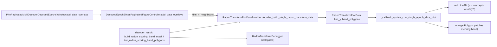

# Radon Transform line + scoring band in paginated data overlays

## Findings

- `add_data_overlays(included_columns=['score','wcorr'])` in [stacked_epoch_slices.py](h:/TEMP/Spike3DEnv_ExploreUpgrade/Spike3DWorkEnv/pyPhoPlaceCellAnalysis/src/pyphoplacecellanalysis/Pho2D/stacked_epoch_slices.py) (L2284) fans out to each controller's `add_data_overlays` (L1765), which calls `RadonTransformPlotDataProvider.decoder_build_single_radon_transform_data(...)` and registers `_callback_update_curr_single_epoch_slice_plot` in [DecoderPredictionError.py](h:/TEMP/Spike3DEnv_ExploreUpgrade/Spike3DWorkEnv/pyPhoPlaceCellAnalysis/src/pyphoplacecellanalysis/General/Pipeline/Stages/DisplayFunctions/DecoderPredictionError.py) (L1536-1927).
- The existing matplotlib "line" is `linestyle='none'` yellow `+` markers computed as `velocity*t + intercept`. But `radon_transform` (NeuroPy `decoders.py` L308-333) returns `-velocity` while `intercept` was computed with the un-negated slope against absolute `t`. So the stored DF line is `y = intercept - velocity_df*t`; the current `velocity_df*t + intercept` is off by `2*v*t` (thousands of cm) and never visible. The Silx debugger already draws the correct geometry from `debug_info.y_line` (`add_real_space_curve`).
- The scoring band (`add_scoring_band_overlay`) needs `n_neighbours`, which is not in the DF. Pipeline default is `margin=4.0` cm -> `n_neighbours = max(round(margin/pos_bin_size), 1)` (`get_radon_transform` L1080). `pos_bin_size`/`xbin` are available on `params` at `add_data_overlays` time.
- The band mask/polygon helpers in the debugger (`build_scoring_band_mask`, `iter_scoring_band_polygons`) are pure numpy and reusable; the posterior heatmap in the matplotlib view uses extent `(edges[0], edges[-1], xbin[0], xbin[-1])`, `origin='lower'`, so real-space polygons from `time_bin_containers[i].edges` + `xbin` align.

## Changes

### 1. Share the band geometry helpers (no silx import in DecoderPredictionError)
- Add module-level `build_radon_scoring_band_mask(best_y_line_idxs, n_pos, n_neighbours)` and `iter_radon_scoring_band_polygons(mask, origin, scale)` to [decoder_result.py](h:/TEMP/Spike3DEnv_ExploreUpgrade/Spike3DWorkEnv/pyPhoPlaceCellAnalysis/src/pyphoplacecellanalysis/Analysis/Decoder/decoder_result.py) next to `get_radon_transform` (move bodies verbatim from the debugger).
- In [RadonTransformDebuggerWidget.py](h:/TEMP/Spike3DEnv_ExploreUpgrade/Spike3DWorkEnv/pyPhoPlaceCellAnalysis/src/pyphoplacecellanalysis/GUI/Silx/RadonTransformDebuggerWidget.py), make `build_scoring_band_mask` / `iter_scoring_band_polygons` thin delegating wrappers (keeps existing callers working).

### 2. Extend `RadonTransformPlotData` + builder (DecoderPredictionError.py)
- `RadonTransformPlotData`: add `band_polygons: Optional[List[Tuple[NDArray, NDArray]]] = None` and `n_neighbours: Optional[int] = None`.
- `_subfn_build_radon_transform_plotting_data(...)`: add kwargs `pos_bin_edges: Optional[NDArray]=None`, `n_neighbours: Optional[int]=None`.
  - Fix geometry: `epoch_line_fn = lambda t: icpt - vel*t` (geometric slope is `-velocity_df`), evaluated at `time_bin_containers[i].centers` (keep `line_y`/`line_fn` field names).
  - When `pos_bin_edges` is given: `dx = mean(diff(xbin))`, `x0 = xbin[0] + dx/2`; `best_y_line_idxs = rint((line_y - x0)/dx)`; mask via `build_radon_scoring_band_mask(..., n_pos=len(xbin)-1, n_neighbours)`; polygons via `iter_radon_scoring_band_polygons(mask, origin=(edges[0], xbin[0]), scale=(dt, dx))` with `edges = time_bin_containers[i].edges`, `dt = median(diff(edges))`.
- `decoder_build_single_radon_transform_data(cls, curr_results_obj, included_columns=None, pos_bin_edges=None, n_neighbours=None)`: pass through.

### 3. Render in `_callback_update_curr_single_epoch_slice_plot`
- Replace the yellow marker-only `plot_kwargs` with the debugger's red line style: `color=(1.0, 0.0, 0.0, 0.7), linestyle='-', linewidth=3, marker=None`, `zorder` above the band. Keep extrapolation via `np.interp` over `curr_time_bins` as now.
- Add band rendering: remove any extant `plots['radon_transform'][data_idx]['band']` artists, then if `params.enable_radon_transform_info and params.setdefault('enable_radon_transform_scoring_band', True)` add one `matplotlib.patches.Polygon` per `(xs, ys)` with `facecolor=(1.0, 0.65, 0.0, 0.45), edgecolor=(1.0, 0.65, 0.0, 0.9), linewidth=1.0, zorder` just above the image. Store as `'band': [patches]` alongside `'line'` and `'score_text'`.
- Gate the line with new `params.setdefault('enable_radon_transform_line', True)` (band and line independently toggleable; text continues to follow `visible_overlay_label_keys`).
- Add `enable_radon_transform_line`, `enable_radon_transform_scoring_band`, `radon_transform_margin=4.0`, `radon_transform_n_neighbours=None` to `provided_params` so they exist on `params`.

### 4. Wire `n_neighbours` + `xbin` through `add_data_overlays` (stacked_epoch_slices.py L1783)
- Resolve `n_neighbours = params.get('radon_transform_n_neighbours') or max(round(params.get('radon_transform_margin', 4.0) / pos_bin_size), 1)` where `pos_bin_size = params.get('pos_bin_size') or mean(diff(params.xbin))`.
- Call `RadonTransformPlotDataProvider.decoder_build_single_radon_transform_data(deepcopy(result), included_columns=included_columns, pos_bin_edges=deepcopy(self.params.xbin), n_neighbours=n_neighbours)`.
- `remove_data_overlays` already drops the `radon_transform` plots dict; no change needed beyond the band artists living in that dict.

## Data flow

## Verification
- Launch the paginated window from the usual notebook flow and call `add_data_overlays(included_columns=['score','wcorr'])`; confirm red line sits on the posterior ridge and the orange band hugs it with height `(2*n_neighbours+1)*pos_bin_size`, matching the Silx debugger for the same epoch.
- Page forward/back and toggle `update_params(enable_radon_transform_scoring_band=False)` + `refresh_current_page()` to confirm artists are removed/re-added without duplicates.
- Run `ReadLints` on the three edited files.

## Assumptions (flagged)
- The yellow marker line is replaced (not kept alongside) by the red solid line, since its geometry was wrong and invisible.
- `n_neighbours` defaults to the pipeline's `margin=4.0` convention; the band is a reconstruction from `velocity`/`intercept` (identical to the debugger's `best_y_line_idxs` except possible 1-bin rounding at columns where the fitted line lands exactly on a bin boundary).