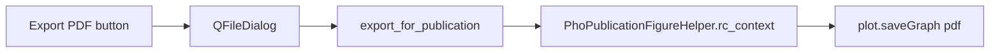

# Add publication PDF export to RadonTransformDebugger

Single-file change in [`RadonTransformDebuggerWidget.py`](h:\TEMP\Spike3DEnv_ExploreUpgrade\Spike3DWorkEnv\pyPhoPlaceCellAnalysis\src\pyphoplacecellanalysis\GUI\Silx\RadonTransformDebuggerWidget.py).

## Approach

Reuse the existing publication matplotlib defaults from [`PhoPublicationFigureHelper.rc_context_kwargs`](h:\TEMP\Spike3DEnv_ExploreUpgrade\Spike3DWorkEnv\pyPhoPlaceCellAnalysis\src\pyphoplacecellanalysis\SpecificResults\PhoDiba2023Paper.py) (`savefig.transparent`, `pdf.fonttype=42`, Arial, etc.) and silx’s matplotlib-backed `Plot2D.saveGraph(..., fileFormat='pdf')`.



## Method: `export_for_publication`

Add on `RadonTransformDebugger` (near `build_GUI` / after `_configure_plot_display`):

```python
def export_for_publication(self, figures_parent_folder: Path, export_suffix: Optional[str] = None) -> Dict[str, Path]:
```

- Require `self.window` (raise/`assert` if missing).
- Default `export_suffix` to `{active_decoder_name}_epoch{active_epoch_idx}`.
- Basename: `RadonTransform_{export_suffix}.pdf` under `figures_parent_folder` (mkdir parents if needed).
- Inside `mpl.rc_context(PhoPublicationFigureHelper.rc_context_kwargs(prepare_for_publication=True))`, call `self.window.plot.saveGraph(str(path), fileFormat='pdf')`.
- Return `{'pdf': path}` like the Plotly helper in `PhoDiba2023Paper.py`.

Imports to add: `Path`, `matplotlib as mpl`, and `PhoPublicationFigureHelper`.

## Easy GUI button

In `build_GUI`, after the window exists, install a toolbar **once** (guard with an attribute like `_export_toolbar` so `update_GUI` / re-`build_GUI` does not stack buttons):

- `QToolBar` on `self.window` with action/button labeled **Export PDF**.
- Click handler opens `qt.QFileDialog.getSaveFileName` with suggested name `RadonTransform_{decoder}_epoch{idx}.pdf`, filter `PDF (*.pdf)`.
- On accept, call `export_for_publication(figures_parent_folder=Path(chosen).parent, export_suffix=Path(chosen).stem.replace('RadonTransform_', '', 1))` — or write directly to the chosen path via a thin internal helper used by both dialog and method so the dialog path is exact.

Prefer exact-path write from the dialog: private `_save_publication_pdf(save_path: Path) -> Path` does the `rc_context` + `saveGraph`; `export_for_publication` builds the path then calls it; the button passes the dialog path straight through.

## Out of scope

No notebook edits. No changes to `silx_helpers.py` unless the toolbar must live on `_RoiStatsDisplayExWindow` — prefer wiring from `RadonTransformDebugger.build_GUI` to keep scope in the selected class.