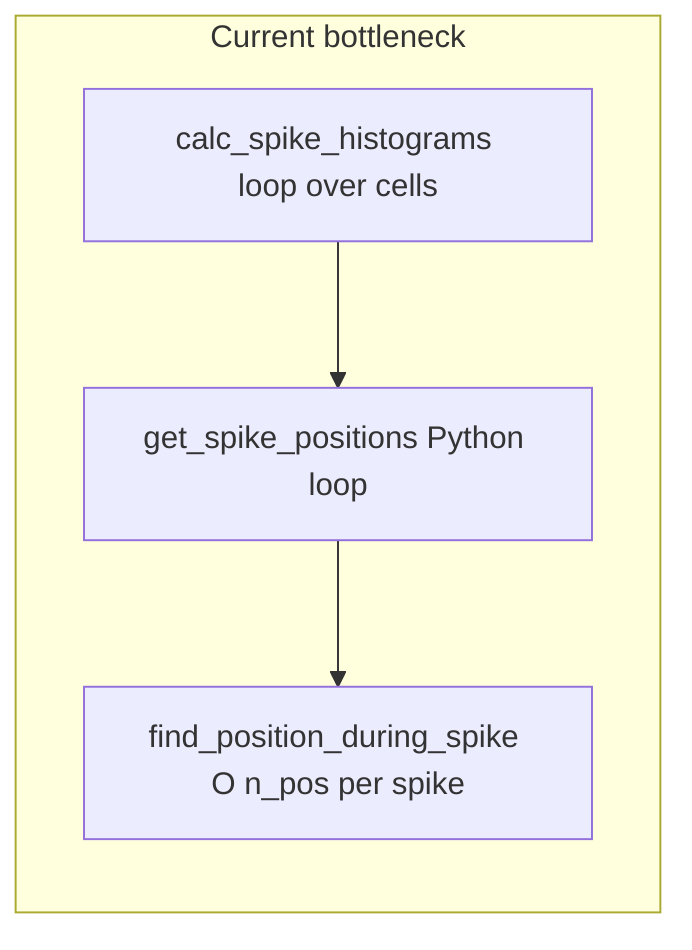

# Speed up `RatDay_Preprocessing` init (Bapun / matlab_like paths)

## Where time goes today

[`RatDay_Preprocessing.__init__`](h:\TEMP\Spike3DEnv_ExploreUpgrade\Spike3DWorkEnv\HippocampalSWRDynamics\replay_structure\ratday_preprocessing.py) runs: `reformat_data` → `clean_recording_data` → `calculate_velocity_info` → `calculate_place_fields`.

- **Run spike extraction** (`get_run_spike_and_pos_data`) was already fixed to use `searchsorted` + chunked `concatenate` (not part of this plan unless you want further micro-opts).
- The dominant cost for long open-field sessions is almost certainly **`calculate_place_fields` → `calc_spike_histograms`**.

In `calc_spike_histograms`, for **every** cell id in `range(self.data["n_cells"])` the code does:

1. `spike_times[spike_ids == cell_id]` — full pass per cell.
2. `get_spike_positions`, which is a **Python `for` over every spike** calling `find_position_during_spike`, which computes **`np.abs(pos_times - spike_time)` over all position samples** — **O(n_pos) per spike**, repeated across cells. That is effectively **O(n_cells × n_spikes × n_pos)** in the worst case and is catastrophic for Bapun-scale data.

Other init steps (`align_spike_and_position_recording_data`, gap NaN masking, velocity, `boolean_to_times`) are linear or small-factor loops and are unlikely to dominate once spike histograms are fixed.

## Strategy (preserve behavior, single code path)

Implement **numerically equivalent** (or tie-break–equivalent) logic inside [`ratday_preprocessing.py`](h:\TEMP\Spike3DEnv_ExploreUpgrade\Spike3DWorkEnv\HippocampalSWRDynamics\replay_structure\ratday_preprocessing.py) without changing the external API of `RatDay_Preprocessing(matlab_data, params)`.

### 1. Batch nearest-position assignment (replace inner hot path)

- Add a **static or module-level helper** (e.g. `_nearest_pos_xy_for_spike_times(spike_times, pos_times, pos_xy)`) that:
  - Asserts / enforces **non-decreasing `pos_times`** (same assumption as your existing `searchsorted` work; if not monotonic, **one-time `argsort`** on `pos_times` and reorder `pos_xy`, mirroring the pattern already used in `get_run_spike_and_pos_data`).
  - Uses **`np.searchsorted`** to pick the neighbor interval for each spike, compares distance to **left vs right** frame (clip at boundaries), picks the **smaller index on ties** to mirror `nearest_pos_xy = pos_xy[abs_diff == min_diff][0]` when duplicates exist.
  - Returns an `(n_spikes, 2)` float array of positions (including possible `nan` where the chosen frame is `nan`, matching current behavior for gap-cleaned tracks).

- Refactor **`get_spike_positions`** to call this vectorized path when `cell_spike_times.size > 0`, and keep **`find_position_during_spike`** as a thin wrapper (scalar) for readability/tests, implemented via the same helper with length-1 arrays (so one implementation, no drift).

### 2. Vectorized spike histogram accumulation

- Replace the per-cell `histogram2d` loop with:
  - One vectorized mapping: run **all** `(spike_times_s, spike_ids)` through the nearest-position helper (not per cell).
  - **Drop spikes whose assigned `xy` is non-finite** (same effect as `histogram2d` ignoring invalid samples).
  - Convert `x,y` to bin indices consistent with `spatial_grid["x"]` / `["y"]` (match `np.histogram2d(..., bins=(spatial_grid["x"], spatial_grid["y"]))` semantics, including out-of-range handling).
  - Accumulate counts with **`np.add.at(spike_histograms, (spike_ids, ix, iy), 1)`** into the existing `(n_cells, n_bins_x, n_bins_y)` array layout (including the `.T` convention currently applied to `histogram2d` output — match dimensions exactly).

This removes both the **per-cell full spike scan** and the **per-spike full position scan**.

### 3. Optional second win: batch `calc_place_fields` when `rotate_placefields` is False

[`RatDay_Preprocessing_Parameters.rotate_placefields`](h:\TEMP\Spike3DEnv_ExploreUpgrade\Spike3DWorkEnv\HippocampalSWRDynamics\replay_structure\config.py) **defaults to `False`**.

When `rotate_placefields` is False:

- Compute `place_field_raw` for **all cells at once** with NumPy broadcasting (same formulas as `calc_one_place_field` for `posterior=True` / `False` branches).
- Run **`scipy.ndimage.gaussian_filter`** once on the stacked array with `sigma=(0, sigma_bins, sigma_bins)` so smoothing applies only over spatial axes across all cells.

When `rotate_placefields` is True, **keep the existing per-cell loop** (random rolls are per-cell and harder to batch without changing RNG call order).

### 4. Safety / “do not break existing implementation”

- Add a **focused unit test** under [`HippocampalSWRDynamics/tests/`](h:\TEMP\Spike3DEnv_ExploreUpgrade\Spike3DWorkEnv\HippocampalSWRDynamics\tests\) (new file or extend an existing one) that builds a **small synthetic** `SimpleNamespace` / dict-like `matlab_data` with a handful of cells, spikes, and positions, runs `calculate_place_fields` inputs through **both**:
  - a reference implementation (either snapshot of old loop kept in test only, or call preserved private function if you split it), and
  - the new path,
  - and asserts **`np.allclose`** on `spike_histograms` and `place_fields` (or exact integer match on histograms and tight tolerance on smoothed fields).

- No change required to notebook code: `ratday_from_bapun = RatDay_Preprocessing(matlab_like_data, ratday_params)` stays the same.

### 5. Out of scope (optional follow-up)

- **Skip cleaning / alignment for “already clean” Bapun arrays** would require a new constructor or flags and risks subtle drift from the MATLAB path; defer unless you explicitly want that tradeoff.
- **Pickle cache**: [`read_write.load_ratday_data`](h:\TEMP\Spike3DEnv_ExploreUpgrade\Spike3DWorkEnv\HippocampalSWRDynamics\replay_structure\read_write.py) already avoids recomputation if you save/load a processed `RatDay_Preprocessing` object.

## Files to touch

- Primary: [`replay_structure/ratday_preprocessing.py`](h:\TEMP\Spike3DEnv_ExploreUpgrade\Spike3DWorkEnv\HippocampalSWRDynamics\replay_structure\ratday_preprocessing.py) — `calc_spike_histograms`, `get_spike_positions`, `find_position_during_spike`, optionally `calc_place_fields` / `calc_one_place_field`.
- New or updated: [`tests/test_ratday_preprocessing_histograms.py`](h:\TEMP\Spike3DEnv_ExploreUpgrade\Spike3DWorkEnv\HippocampalSWRDynamics\tests\test_ratday_preprocessing_histograms.py) (name flexible) — regression against reference loop on tiny data.

## Expected outcome

- Init time for Bapun-scale sessions should drop from “unusable” to roughly **O(n_spikes log n_pos + n_spikes + n_cells × n_bins²)** for histogram + smoothing dominated phases, with **no API change** and default params (`rotate_placefields=False`) getting the largest win.
