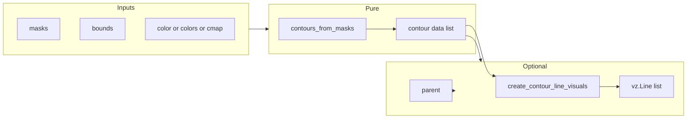

# Refactor render_contours to be decoupled from self and views

## Current state

- [vispy_helpers.py](h:\TEMP\Spike3DEnv_ExploreUpgrade\Spike3DWorkEnv\pyPhoPlaceCellAnalysis\src\pyphoplacecellanalysis\Pho2D\vispy\vispy_helpers.py) defines `VispyHelpers.render_contours(cls, _update_dict=None)` (lines 165–221).
- The method is tightly coupled: it uses `self` (e.g. `self.past_view`, `self.epoch_flat_mask_future_past_result`, `self._time_bin_colors`) and references undefined names (`posterior_2d_view`, `new_epoch_idx`, `x_min`, `x_max`, `y_min`, `y_max`, `time_bin_views`). As a `@classmethod` it has no `self`, so the code is currently broken when called as-is.
- `render_contours` is **not called** from any other file in the repo; only defined. Callers that need the old “epoch + multiple views” behavior will need to pass masks and bounds explicitly and attach results to their own views.
- Mask convention in the codebase: 2D masks are (n_y_bins, n_x_bins); current code uses `mask_slice.T` before `find_contours` (so skimage gets (n_x, n_y)) then maps contour (row, col) back with `contour[:, 0]` → y, `contour[:, 1]` → x. The refactor will treat each input mask as (n_rows, n_cols) and use the same world-mapping logic.

## Target API

**Core (pure, no views/self):**

- **Inputs:** list of 2D binary arrays (or one 3D array `(ny, nx, n)` as n masks), optional world bounds, and either a single color, a sequence of colors (one per mask), or a colormap name (+ alpha).
- **Output:** list of contour items that can be drawn anywhere: e.g. `List[Tuple[NDArray, Tuple[float,float,float,float]]]` — each item is `(pos, rgba)` with `pos` shape `(N, 2)` in world coordinates (x, y).

**Optional “attach to scene”:**

- A small helper that takes that list plus a vispy parent and creates `vz.Line` visuals (and optionally returns them). This keeps the core free of any view/scene dependency.

## Implementation plan

### 1. Add module-level contour extraction and color helpers

- **Contour extraction:** Add a function that takes one 2D binary mask and returns a list of (row, col) contour arrays (e.g. using `skimage.measure.find_contours` with a configurable `level`, default 0.5). Handle the existing `.T` convention if needed so that input mask shape is (n_rows, n_cols) and contours are in (row, col). If skimage is unavailable, keep the same contract and document dependency (or add a cv2 fallback later; the commented `_extract_contours_from_mask` in the file can be used as reference).
- **World transform:** Add a small helper that maps contour points from pixel (row, col) to world (x, y) given `(x_min, x_max, y_min, y_max)` and mask shape (n_rows, n_cols). Default bounds can be (0, 1) for both x and y.
- **Colors:** Add a helper that, given `n` (number of masks), returns a list of `n` RGBA tuples. Support:
  - Single `color` (RGBA or name) → same color for all.
  - `colors` sequence of length n → use as-is (normalize to RGBA).
  - `cmap` name (e.g. matplotlib) + optional `alpha` → generate n colors (e.g. linear spacing over the cmap). Use existing optional matplotlib import and the commented `_colormap_colors` / `to_rgba` pattern if present.

Keep function signatures on a single line per project rules.

### 2. Add pure `contours_from_masks` function

- **Signature (single line):**  
`def contours_from_masks(masks: Union[Sequence[NDArray], NDArray], x_bounds: Tuple[float, float] = (0.0, 1.0), y_bounds: Tuple[float, float] = (0.0, 1.0), color: Optional[Union[Tuple, str]] = None, colors: Optional[Sequence] = None, cmap: Optional[str] = None, cmap_alpha: float = 0.7, level: float = 0.5) -> List[Tuple[NDArray, Tuple[float, float, float, float]]]:`
- **Behavior:**
  - Normalize input: if a 3D array, treat as (n_rows, n_cols, n_masks) and convert to list of 2D masks.
  - For each mask index, get contour arrays (row/col), map to world (x, y) using the world-transform helper, and assign one color per mask index (from the color helper).
  - Return a flat list of `(pos, rgba)` where `pos` is (N, 2) float in world coordinates. No reference to `self` or any view.

### 3. Add optional helper to create vispy Line visuals

- **Signature (single line):**  
`def create_contour_line_visuals(contour_data: List[Tuple[NDArray, Tuple]], parent: Node, line_width: float = 2.0, order: int = 10) -> List:`
- **Behavior:** For each `(pos, rgba)` in `contour_data`, create `vz.Line(pos=pos, color=rgba, width=line_width, parent=parent)`, set `line.order = order`, collect and return the list of Line objects. This is the only place that touches vispy scene/parent.

### 4. Replace `VispyHelpers.render_contours` implementation

- **Option A (recommended):** Make `render_contours` a thin wrapper that:
  - Accepts explicit arguments: `masks`, `x_bounds`, `y_bounds`, `color`/`colors`/`cmap`, and optionally `parent` or `views` (e.g. list of scene nodes or view-like objects with `.scene`).
  - If `_update_dict` is still used for backward compatibility, derive masks/bounds/views from it when provided; otherwise require `masks` (and optionally bounds) as direct arguments.
  - Call `contours_from_masks(...)` to get contour data, then if a parent (or list of parents) is provided, call `create_contour_line_visuals` for each parent and return both the contour data and the created Line lists (e.g. in an updated dict or a simple result object).
- **Option B:** Replace the method body entirely with a call to `contours_from_masks` and, if callers pass a parent, `create_contour_line_visuals`; drop `_update_dict` and use a clear signature with `masks` and optional `parent`/`views` and color args.

Recommendation: **Option B** — a clear signature with no `_update_dict` coupling. If something in the codebase later needs the old “update dict” flow, the caller can build the list of masks and bounds from `epoch_flat_mask_future_past_result` and views, then call the new API and assign the returned Line lists into their own dict.

- New signature (single line):  
`def render_contours(cls, masks: Union[Sequence[NDArray], NDArray], x_bounds: Tuple[float, float] = (0.0, 1.0), y_bounds: Tuple[float, float] = (0.0, 1.0), color: Optional[Union[Tuple, str]] = None, colors: Optional[Sequence] = None, cmap: Optional[str] = None, cmap_alpha: float = 0.7, level: float = 0.5, parents: Optional[Sequence[Node]] = None, line_width: float = 2.0, order: int = 10) -> Union[List[Tuple[NDArray, Tuple]], Tuple[List[Tuple[NDArray, Tuple]], List[List]]]:`
- Return: contour data list always; if `parents` is not None, also return a list of Line lists (one list per parent), so return type is either `List[Tuple[...]]` or `Tuple[List[Tuple[...]], List[List[vz.Line]]]`. Alternatively, keep return type simple: always return contour data, and when `parents` is given, attach Lines to those parents and return the same contour data (caller can track Line lists via a mutable list passed in, or ignore). Simplest: return contour data only; when `parents` is provided, create and parent the Line visuals and return contour data (and optionally append created Lines to a list passed in, or return `(contour_data, line_lists)`). Prefer returning `(contour_data, line_lists)` when `parents` is not None so the caller can clear/update visuals.

### 5. Update `__main__` example

- The block at the bottom references `MaskContourRenderer`, which does not exist. Update the example to use the new API: e.g. build `masks_list` (already done), call `contours_from_masks(masks_list, cmap='viridis')` to get contour data, then `create_contour_line_visuals(contour_data, view.scene)` to draw on the canvas, then `app.run()`. Remove or stub the nonexistent `MaskContourRenderer` usage.

### 6. Uncomment/adapt commented helpers only if needed

- The file has commented `_extract_contours_from_mask` and color/colormap helpers. Implement the new logic inline or in new helpers; uncomment and adapt only if it reduces duplication and keeps the file consistent (e.g. one shared contour-from-mask and one shared color generator).

## Data flow (mermaid)

## Files to touch

- [vispy_helpers.py](h:\TEMP\Spike3DEnv_ExploreUpgrade\Spike3DWorkEnv\pyPhoPlaceCellAnalysis\src\pyphoplacecellanalysis\Pho2D\vispy\vispy_helpers.py): add contour/color helpers, `contours_from_masks`, `create_contour_line_visuals`, replace `render_contours` body (and signature if Option B), fix `__main__` example.

## Backward compatibility

- No other call sites for `render_contours` were found. Any future caller that has `epoch_flat_mask_future_past_result` and views can: extract the list of 2D masks from the epoch result, set `x_bounds`/`y_bounds` from their environment, call `VispyHelpers.render_contours(masks, x_bounds, y_bounds, parents=[v.scene for v in views], cmap='...')` and use the returned contour data and Line lists to update their own `past_mask_contours` / `posterior_mask_contours` / `future_mask_contours` as needed.

