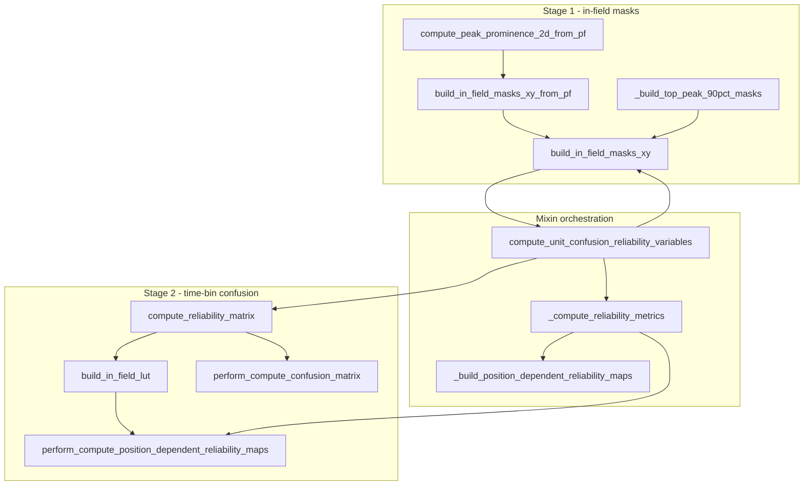

# Reliability function consolidation analysis

Scope: [`reliability.py`](h:/TEMP/Spike3DEnv_ExploreUpgrade/Spike3DWorkEnv/pyPhoPlaceCellAnalysis/src/pyphoplacecellanalysis/Analysis/reliability.py) lines 874–2058 (`CellIndividualReliabilityMatrix` + `CellIndividualReliabilityComputingMixin`).

---

## High value — combine / extract shared core

### 1. Shared Polars prep between the two confusion aggregators

[`perform_compute_confusion_matrix`](h:/TEMP/Spike3DEnv_ExploreUpgrade/Spike3DWorkEnv/pyPhoPlaceCellAnalysis/src/pyphoplacecellanalysis/Analysis/reliability.py) and [`perform_compute_position_dependent_reliability_maps`](h:/TEMP/Spike3DEnv_ExploreUpgrade/Spike3DWorkEnv/pyPhoPlaceCellAnalysis/src/pyphoplacecellanalysis/Analysis/reliability.py) duplicate ~40 lines of identical setup:

- cast/filter `time_bin_info_df` → `pos`
- optional `max_t_idx` filter
- cast/unique/filter `in_field_lut` → `lut`
- cast `per_tbin` spikes (with a **1-based vs 0-based `t_bin_idx` inconsistency** between the two — see note below)

**Recommendation:** extract `_prepare_visit_polars_frames(per_tbin, time_bin_info_df, neuron_ids, in_field_lut, max_t_idx, spike_t_bin_offset: int = 0) -> (pos, lut, spikes)` and call it from both. Keep the two public aggregators separate — their math and return types differ (per-cell rates DF vs `(R_active, R_silent, long_df)`).

**Do not fully merge** into one mode-switched function: outputs, visit semantics, and call sites differ enough that a mega-function would be harder to reason about than a shared prep helper.

**Indexing bug to fix while extracting:** confusion matrix joins spikes on raw `t_bin_idx` (doc says spike bins are 1-based, animal bins 0-based), while position-dependent maps explicitly do `t_bin_idx - 1`. Shared prep should standardize this once.

### 2. Orphan STAGE_1 docstring vs real pipeline

Class docstring still calls **`_partial_compute_reliability_matrix`**, and several `@function_attributes` `used_by` lists name it — but **the method does not exist**.

Real STAGE_1+2 orchestration is already:

[`compute_unit_confusion_reliability_variables`](h:/TEMP/Spike3DEnv_ExploreUpgrade/Spike3DWorkEnv/pyPhoPlaceCellAnalysis/src/pyphoplacecellanalysis/Analysis/reliability.py) → prominence → `build_in_field_masks_xy` → `compute_reliability_matrix` → `_compute_reliability_metrics`

**Recommendation:** treat the missing `_partial_*` as deleted; update the class docstring / metadata to point at `build_in_field_masks_xy` + `compute_reliability_matrix` (or the mixin entrypoint). No new combined function needed unless you want a single classmethod facade on `CellIndividualReliabilityMatrix` that mirrors the mixin (optional thin wrapper).

---

## Medium value — thin wrappers already “combined”

### 3. Mask builders: keep layers, optionally collapse one wrapper

Current chain is intentional and already thin:

| Method | Role |
|--------|------|
| `_build_top_peak_90pct_masks` | Contours → `(ny, nx)` masks |
| `build_in_field_masks_xy` | Transpose/fill → `(nx, ny)` dict |
| `compute_peak_prominence_2d_from_pf` | Build prominence results from `PfND` |
| `build_in_field_masks_xy_from_pf` | 2-line: prominence → `build_in_field_masks_xy` |

**Recommendation:** leave `_build_top_peak_90pct_masks` + `build_in_field_masks_xy` separate (shape contract). `build_in_field_masks_xy_from_pf` can stay as convenience **or** be inlined into callers (`compute_unit_confusion_reliability_variables` already bypasses it and calls the two steps itself). Combining into one mega `build_masks(..., pf=None, prominence=None)` gains little.

### 4. Mixin fallback vs visit-conditioned maps — do **not** merge

| Method | Semantics |
|--------|-----------|
| `perform_compute_position_dependent_reliability_maps` | Visit-conditioned local `p_fire` per animal bin |
| `_build_position_dependent_reliability_maps` | Global per-cell rates × in-field mask |

These are **different estimators**. The fallback exists for sliced/partial decoder state. Combining would obscure that distinction.

---

## Low value — already share a helper; keep separate APIs

### 5. Alpha metrics (`compute_skaggs_alpha` / `compute_sparsity_alpha` / `compute_dsnr_alpha`)

Already share [`_extract_pf_data`](h:/TEMP/Spike3DEnv_ExploreUpgrade/Spike3DWorkEnv/pyPhoPlaceCellAnalysis/src/pyphoplacecellanalysis/Analysis/reliability.py). Formulas and signatures differ (`dsnr` needs `n_i`, `tau`). A `compute_all_alphas(...)` bundle would only wrap three calls — fine as sugar, not a real simplification.

Note: these are **orthogonal** to the confusion-matrix reliability path (`_compute_reliability_metrics` no longer uses Skaggs).

### 6. Enum `list_values` / `list_names`

Duplicated on `ReliabilityDecoderModifierMode` and `ReliabilityEstimationMode`. Tiny shared base/mixin possible; not worth a reliability-pipeline refactor.

### 7. Plotting

`plot_in_field_masks_with_spikes` is standalone display — no merge candidate.

---

## Also notable (not “combine functions”, but related cruft)

- **Repeated spike binning** in `compute_unit_confusion_reliability_variables` and again inside `compute_reliability_matrix` (TODO already in code) — extract a single “prepare spikes + time_bin_info” helper inside `compute_reliability_matrix`’s prep block, or skip re-binning when columns exist.
- **`reliability_estimation_mode` is unused inside `compute_reliability_matrix`** (doc says “reserved”); mode switching lives only in mixin `_compute_reliability_metrics`. If combining stage-2 outputs, that would be the place — not by merging the two Polars aggregators blindly.

---

## Recommended consolidation order (if implementing later)

1. Extract shared Polars frame prep; fix `t_bin_idx` alignment once.
2. Delete/replace docstring + metadata references to missing `_partial_compute_reliability_matrix`.
3. Optionally have mixin call `build_in_field_masks_xy_from_pf` instead of duplicating prominence + mask steps.
4. Leave alpha trio, mask layering, and the two position-dependent estimators as-is.
