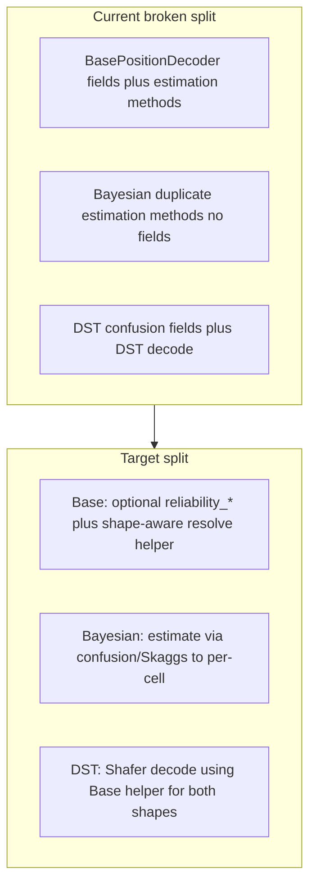

# Finish cell-reliability refactor

## Current state (partially done / inconsistent)

- [`BasePositionDecoder`](h:/TEMP/Spike3DEnv_ExploreUpgrade/Spike3DWorkEnv/pyPhoPlaceCellAnalysis/src/pyphoplacecellanalysis/Analysis/Decoder/reconstruction.py) already has the optional fields at ~2286–2292, but also incorrectly owns estimation methods `compute_unit_confusion_reliability_variables` / `_compute_reliability_metrics` (~2505–2605). Those methods reference `spikes_df`, `time_bin_size`, `n_top_peaks`, `in_field_masks`, `t_bin_aclus_reliability_df`, etc. that Base does **not** declare.
- [`BayesianPlacemapPositionDecoder`](h:/TEMP/Spike3DEnv_ExploreUpgrade/Spike3DWorkEnv/pyPhoPlaceCellAnalysis/src/pyphoplacecellanalysis/Analysis/Decoder/reconstruction.py) has a **duplicate** of those same methods (~3938–4038) but is missing the confusion-matrix storage/config fields still declared only on DST.
- [`BayesianPlacemapPositionDecoderDST`](h:/TEMP/Spike3DEnv_ExploreUpgrade/Spike3DWorkEnv/pyPhoPlaceCellAnalysis/src/pyphoplacecellanalysis/Analysis/Decoder/reconstruction_dst.py) still owns estimation fields and calls estimation in `setup` / factories; base reliability fields are commented out; constructors still pass `discount_silence=` while Base renamed the field to `should_discount_silence`; classmethods incorrectly call `self._compute_reliability_metrics()` instead of `_obj`.
- DST `compute_posterior` currently indexes `reliability_active[cell]` as a **per-cell scalar**; it does not yet handle position-dependent arrays.

## Target ownership

| Layer | Keep | Remove / do not add |
|---|---|---|
| `BasePositionDecoder` | `should_discount_silence`, `reliability_active`, `reliability_silent`, `drop_negative_contributing_terms_mode`, plus a small shape-aware resolve helper used by compute | confusion/Skaggs estimation methods |
| `BayesianPlacemapPositionDecoder` | estimation methods + confusion config/result fields (Skaggs/confusion still produce per-cell `(n_neurons,)`) | — |
| `BayesianPlacemapPositionDecoderDST` | DST `compute_posterior` / `decode`, DST-only config (`field_threshold_frac`), lazy call to inherited `_compute_reliability_metrics` when arrays missing | redeclared reliability/estimation fields/methods |

**“Use if available”:** Zhang `BasePositionDecoder.decode()` stays unchanged. Reliability is applied in DST `compute_posterior` via a Base helper that accepts either stored shape. Estimation remains opt-in via Bayesian methods / DST `setup` (still writes per-cell vectors). Callers may also assign position-dependent arrays directly onto `reliability_*`.

## Dual reliability shapes

Canonical field metadata stays position-dependent:

- Preferred / explicit settable: `(n_flat_position_bins, n_neurons)`
- Also accepted from estimation: `(n_neurons,)` per-cell scalars

Resolve rules for cell `i` and `active_mask` of shape `(nTimeBins, 1)`:

- **1D `(n_neurons,)`:** current behavior — `R_effective = where(active_mask, R_active[i], R_silent[i])` → broadcasts over position.
- **2D `(n_flat_position_bins, n_neurons)`:** `R_active_i = R_active[:, i][newaxis, :]` (and same for silent) → `R_effective = where(active_mask, R_active_i, R_silent_i)` with shape `(nTimeBins, nPositionBins)`.
- Assert / raise on unexpected ndim/shape rather than silently ignoring.

`get_by_id` neuron-slicing:

- 1D: `arr[keep]`
- 2D: `arr[:, keep]`

## Concrete edits

### 1. Slim [`BasePositionDecoder`](h:/TEMP/Spike3DEnv_ExploreUpgrade/Spike3DWorkEnv/pyPhoPlaceCellAnalysis/src/pyphoplacecellanalysis/Analysis/Decoder/reconstruction.py)

- Keep fields at ~2286–2292 with metadata shape `('n_flat_position_bins','n_neurons')` (canonical position-dependent form; 1D per-cell also accepted at runtime).
- Delete the Reliability estimation block ~2505–2605 (`compute_unit_confusion_reliability_variables`, `_compute_reliability_metrics`).
- Add a minimal helper on Base, e.g. `_resolve_cell_reliability(self, cell_idx, active_mask, n_position_bins) -> ndarray`, implementing the dual-shape rules above. This is the only “use for compute” surface on Base.
- Minimal reset in `setup` / `post_load`: set `reliability_active = reliability_silent = None` so Base never invents values.
- Minimal `get_by_id`: if arrays are present, neuron-slice with shape-aware indexing; otherwise leave `None`.

### 2. Complete estimation on [`BayesianPlacemapPositionDecoder`](h:/TEMP/Spike3DEnv_ExploreUpgrade/Spike3DWorkEnv/pyPhoPlaceCellAnalysis/src/pyphoplacecellanalysis/Analysis/Decoder/reconstruction.py)

- Keep the existing method copies at ~3938–4038 (delete the Base duplicates only).
- Move these fields **from DST onto Bayesian** (so the existing methods’ attribute accesses are valid):
  - Config: `n_top_peaks`, `slice_level_multiplier`, `fn_tn_mode`
  - Results: `t_bin_aclus_reliability_df`, `per_tbin_aclu_spike_counts_df`, `time_bin_info_df`, `per_tbin_aclu_spike_counts_sparse`, `in_field_masks`
- `_compute_reliability_metrics` continues to write **per-cell** `(n_neurons,)` into `reliability_active` / `reliability_silent` (compatible via the Base helper). Do not expand to position-dependent inside estimation in this pass.
- In Bayesian `setup` / `post_load`: clear those result fields (+ inherited `reliability_*`) to `None`; do **not** auto-call `_compute_reliability_metrics` (avoids changing normal Bayesian decode behavior).
- In Bayesian `get_by_id`: shape-aware slice of `reliability_active` / `reliability_silent` / `in_field_masks` when present; leave time-bin reliability tables `None` on the slice (same as current DST).
- Add the moved config keys to `serialized_key_allowlist()` if needed for save/load parity with DST’s current allowlist.

### 3. Thin [`BayesianPlacemapPositionDecoderDST`](h:/TEMP/Spike3DEnv_ExploreUpgrade/Spike3DWorkEnv/pyPhoPlaceCellAnalysis/src/pyphoplacecellanalysis/Analysis/Decoder/reconstruction_dst.py)

- Remove redeclared reliability fields (already commented) and remove confusion fields that move to Bayesian; keep DST-only `field_threshold_frac`.
- Keep DST `setup` calling `_compute_reliability_metrics()` (inherited) so DST decode still gets Skaggs alphas by default.
- In `compute_posterior`, replace direct `reliability_active[cell]` indexing with `self._resolve_cell_reliability(...)` so both shapes work; leave the rest of Shafer fusion unchanged.
- Fix factory bugs while touching those lines:
  - `self._compute_reliability_metrics()` → `_obj._compute_reliability_metrics()`
  - `discount_silence=` ctor / `self.discount_silence` → `should_discount_silence` (map legacy `discount_silence` kwarg → `should_discount_silence` in `from_dict` / `init_from_*` for minimal API breakage)
- Drop redundant clears of fields now owned by Bayesian where `super().setup()` / `super().post_load()` already handle them; keep only DST-specific leftovers if any.

## Out of scope

- No Zhang Bayesian formula changes.
- No rewrite of DST Shafer fusion beyond swapping in the shape-aware reliability resolve helper.
- No automatic estimation of position-dependent reliability maps in this pass (only consumption when set).
- No notebook edits.
