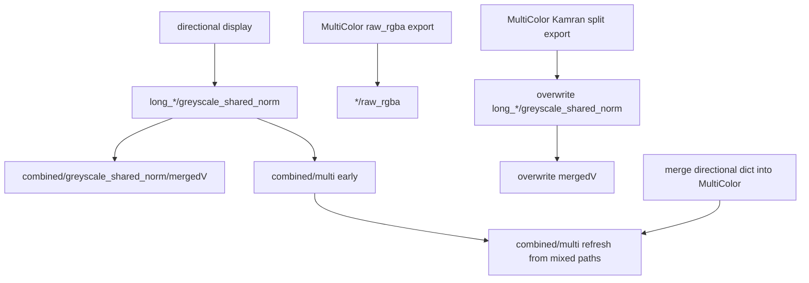

# Remove redundant posterior export passes

**Goal:** Stop writing the same posterior PNGs multiple times in `figures_plot_generalized_decode_epochs_dict_and_export_results_completion_function`, and stop building `combined/multi` from outdated directional panels.

**Default (locked):** When MultiColor is requested, MultiColor’s competition-normalized `greyscale_shared_norm` is the sole source of truth for per-decoder greyscale, `mergedV_*`, and `combined/multi`. Directional independent-1D export is skipped in that case. Keep `mergedV` and `multi` both (different products: stitch-during-export vs curated browse layout); only stop regenerating them from the wrong / duplicate pass.

## Redundancy map (current)

Observed on disk: directional writes, early `multi`, MultiColor overwrites greyscale + `mergedV`, then merge can reintroduce directional paths into the MultiColor dict before the second `multi` write — so `multi` can stay wrong even after `mergedV` is correct.

## File to change

Primary: [`batch_user_completion_helpers.py`](h:/TEMP/Spike3DEnv_ExploreUpgrade/Spike3DWorkEnv/pyPhoPlaceCellAnalysis/src/pyphoplacecellanalysis/General/Batch/BatchJobCompletion/UserCompletionHelpers/batch_user_completion_helpers.py) (~4610–4760).

No change needed in [`data_exporting.py`](h:/TEMP/Spike3DEnv_ExploreUpgrade/Spike3DWorkEnv/pyPhoPlaceCellAnalysis/src/pyphoplacecellanalysis/Pho2D/data_exporting.py) `_subfn_build_combined_output_images` / `post_export_build_combined_images` themselves — they are fine when called once with the right dict. MultiColor’s two-stage export in [`EpochComputationFunctions.py`](h:/TEMP/Spike3DEnv_ExploreUpgrade/Spike3DWorkEnv/pyPhoPlaceCellAnalysis/src/pyphoplacecellanalysis/General/Pipeline/Stages/ComputationFunctions/EpochComputationFunctions.py) (raw_rgba then Kamran greyscale) stays: those write different format folders, not the same greyscale path twice from directional.

## Concrete edits

1. **Detect MultiColor in the figures list** once near the top of the figure sections:
   - `wants_multicolor = ('_display_decoded_trackID_weighted_position_posterior_withMultiColorOverlay' in included_figures_names) or ('trackID_weighted_position_posterior' in included_figures_names)`
   - `wants_directional = ('_display_directional_merged_pf_decoded_stacked_epoch_slices' in included_figures_names) or ('directional_decoded_stacked_epoch_slices' in included_figures_names)`

2. **Skip directional when MultiColor is requested**
   - Change the directional `if` to require `wants_directional and not wants_multicolor`.
   - Log a one-line skip reason when both were requested so batch logs explain the omission.
   - Removes: full directional PNG write, early `mergedV` from that pass, and the early `post_export_build_combined_images` block (lines ~4633–4642) for the default batch path.

3. **Directional-only path**
   - If `wants_directional and not wants_multicolor`, keep directional export **and** keep a single `post_export_build_combined_images(..., layout=greyscale_shared_norm)` after it so directional-only runs still get `combined/multi`.

4. **Remove directional→MultiColor dict merge**
   - Delete `_out['out_paths'].merge(_prev...)` and `_out['out_custom_formats_dict'].merge(_prev...)` (~4735–4738). MultiColor’s returned dict already has the competition-normalized greyscale paths; merging reintroduces directional file paths under the same keys.

5. **Keep one MultiColor `multi` build**
   - Leave the existing `post_export_build_combined_images` after MultiColor (~4748–4758) as the only `combined/multi` writer when MultiColor runs.

6. **Default `included_figures_names`**
   - Drop `'_display_directional_merged_pf_decoded_stacked_epoch_slices'` from the default list (~4545) so the default matches the intended single path. Callers who only want independent directional greyscale can still pass that name alone.

## Out of scope

- Not deleting `mergedV` in favor of `multi` (or vice versa).
- Not removing MultiColor stage-1 `raw_rgba` export.
- Not changing `PosteriorExporting` internals beyond what the completion helper stops calling twice.
- Notebook cells already often comment directional out; no notebook edits unless you ask.

## Verification

- Run (or inspect logs from) one local non-batch / one-session call with default figures: expect **one** `post_export_build_combined_images after MultiColor` line, **no** `after directional`, and no skip of MultiColor.
- Confirm timestamps: `long_LR/.../greyscale_shared_norm`, `combined/greyscale_shared_norm/mergedV_ripple[*]`, and `combined/multi/p_x_given_n[*]` all written in the MultiColor window; `multi` panels should match competition-normalized look of `mergedV` (same source), not independent directional brightness.
- Spot-check: calling with only directional still exports and still builds `multi` once.