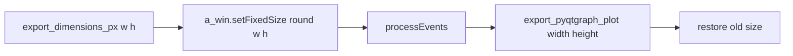

# Resize TemplateDebugger panels before export

## Why

Exporter `width`/`height` alone scales the **current** scene rect. Docked panels are ~`(300, 200)` at build time, so forcing `(114.68, 156.47)` without resizing stretches the wrong layout. Resizing each `CustomPlotWidget` first makes the scene match the desired AR, then export captures that geometry.

## Change

Update [`TemplateDebugger.save_figure`](h:/TEMP/Spike3DEnv_ExploreUpgrade/Spike3DWorkEnv/pyPhoPlaceCellAnalysis/src/pyphoplacecellanalysis/GUI/PyQtPlot/Widgets/ContainerBased/TemplateDebugger.py) only (keep existing `export_pyqtgraph_plot` both-dims support).

When `export_dimensions_px=(w, h)` is set, for each panel `a_win`:

1. Remember prior size: `old_size = a_win.size()`
2. Apply target size with rounded ints (Qt widget pixels):
   ```python
   tw, th = int(round(w)), int(round(h))
   a_win.setFixedSize(tw, th)
   ```
3. Settle layout: `pg.QtWidgets.QApplication.processEvents()`
4. Export with `export_pyqtgraph_plot(..., width=w, height=h)` (float SVG / int PNG still via helper)
5. Restore prior size so interactive UI is unchanged:
   ```python
   a_win.setMinimumSize(0, 0)
   a_win.setMaximumSize(16777215, 16777215)  # QWIDGETSIZE_MAX
   a_win.resize(old_size)
   ```

Do this inside the existing per-decoder export loop (not a global main-window resize), so each of the four heatmaps independently matches `(w, h)`.



## Usage (unchanged call site)

```python
template_debugger.save_figure(
    shared_output_file_prefix='output/2025-07-23',
    export_dimensions_px=(114.6818, 156.474),
)
```

## Out of scope

- Resizing the root dock area window as a whole
- Changing dock `dockSize` at init time
- Track-boundary-lines display-fn wiring
