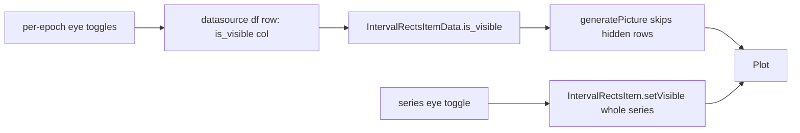

# Rewrite epoch interval visibility system

## Root problem (why multi-epoch toggling is unreliable)

A multi-epoch series is rendered as ONE `IntervalRectsItem` graphics object drawing all N rectangles, with a single Qt `setVisible` flag, and `isVisible` is never stored in the datasource dataframe. Confirmed via [the widget investigation](13947307-7eb1-44f9-ba58-f59e4e42e4a6) and [the render-flow investigation](afaa6cb7-08f3-42db-94ae-c0f6054dc99e). Consequences:
- Per-epoch visibility is architecturally impossible (one flag for all rows).
- "Show again" is unreliable: the row toggle flips 5 child checkboxes one-by-one, each firing a full update whose intermediate "mixed" state is explicitly skipped ([EpochRenderingMixin.py:874-875](h:\TEMP\Spike3DEnv_ExploreUpgrade\Spike3DWorkEnv\pyPhoPlaceCellAnalysis\src\pyphoplacecellanalysis\GUI\PyQtPlot\Widgets\Mixins\RenderTimeEpochs\EpochRenderingMixin.py)); widget rebuilds re-read configs from the df where `isVisible` is forced back to `True` ([epochs_plotting_mixins.py:167](h:\TEMP\Spike3DEnv_ExploreUpgrade\Spike3DWorkEnv\pyPhoPlaceCellAnalysis\src\pyphoplacecellanalysis\PhoPositionalData\plotting\mixins\epochs_plotting_mixins.py)); `len==1` lists collapse to a single widget, forcing constant full rebuilds.

## Target architecture

Two composable layers: per-epoch visibility = a persisted `is_visible` dataframe column honored by `IntervalRectsItem`; per-series visibility = the existing whole-item Qt `setVisible`.

## Part A: Render/visibility model (per-row visibility)

1. `IntervalRectsItemData` ([IntervalRectsItem.py:33-45](h:\TEMP\Spike3DEnv_ExploreUpgrade\Spike3DWorkEnv\pyPhoPlaceCellAnalysis\src\pyphoplacecellanalysis\GUI\PyQtPlot\Widgets\GraphicsObjects\IntervalRectsItem.py)): add `is_visible: bool = field(default=True)`. Keep the 6-item `UnpackableMixin_unpacking_includes` allowlist unchanged for tuple back-compat.
2. `generatePicture()` ([IntervalRectsItem.py:146-166](h:\TEMP\Spike3DEnv_ExploreUpgrade\Spike3DWorkEnv\pyPhoPlaceCellAnalysis\src\pyphoplacecellanalysis\GUI\PyQtPlot\Widgets\GraphicsObjects\IntervalRectsItem.py)): iterate rows as objects and skip drawing rows whose `is_visible` is False (handle plain tuples as always-visible). Apply the same skip in `rebuild_label_items` and in hover/hit-testing so hidden epochs have no label/tooltip/hit area.
3. `_build_interval_tuple_list_from_dataframe` ([Render2DEventRectanglesHelper.py:30-45](h:\TEMP\Spike3DEnv_ExploreUpgrade\Spike3DWorkEnv\pyPhoPlaceCellAnalysis\src\pyphoplacecellanalysis\GUI\PyQtPlot\Widgets\Mixins\RenderTimeEpochs\Render2DEventRectanglesHelper.py)): include an `is_visible` column (default True when absent) when constructing `IntervalRectsItemData`.
4. `_update_df_visualization_columns` ([Specific2DRenderTimeEpochs.py:38-84](h:\TEMP\Spike3DEnv_ExploreUpgrade\Spike3DWorkEnv\pyPhoPlaceCellAnalysis\src\pyphoplacecellanalysis\GUI\PyQtPlot\Widgets\Mixins\RenderTimeEpochs\Specific2DRenderTimeEpochs.py)): accept `is_visible`/`isVisible` (scalar or list) and write it to the df `is_visible` column (mirroring the pen/brush list handling). This makes per-row visibility persist in the datasource.
5. Datasource serialization: ensure `is_visible` survives `get_serialized_data` / `copy_data` so in-place `update_data` keeps it.

## Part B: Visibility application (drop "skip if mixed")

Rewrite both apply paths so they no longer bail on mixed visibility, and instead rely on the persisted per-row `is_visible` (drawn correctly by `generatePicture`) plus a series-level `setVisible`:
- `update_rendered_intervals_visualization_properties` ([EpochRenderingMixin.py:809-884](h:\TEMP\Spike3DEnv_ExploreUpgrade\Spike3DWorkEnv\pyPhoPlaceCellAnalysis\src\pyphoplacecellanalysis\GUI\PyQtPlot\Widgets\Mixins\RenderTimeEpochs\EpochRenderingMixin.py)): pass per-row `is_visible` through to the datasource update; set whole-item `setVisible(any row visible)` for the series-level flag. Remove lines 862-875 "skip if differ" logic.
- `perform_update_epoch_interval_render_configs_from_configs` ([EpochRenderingMixin.py:1340-1394](h:\TEMP\Spike3DEnv_ExploreUpgrade\Spike3DWorkEnv\pyPhoPlaceCellAnalysis\src\pyphoplacecellanalysis\GUI\PyQtPlot\Widgets\Mixins\RenderTimeEpochs\EpochRenderingMixin.py)): same change at lines 1382-1394; rebuild rect data (now carrying `is_visible`) and set series-level `setVisible`.

## Part C: Config extraction round-trip

1. `init_from_visualization_dataframe_row` ([epochs_plotting_mixins.py:127-167](h:\TEMP\Spike3DEnv_ExploreUpgrade\Spike3DWorkEnv\pyPhoPlaceCellAnalysis\src\pyphoplacecellanalysis\PhoPositionalData\plotting\mixins\epochs_plotting_mixins.py)): take an `is_visible` argument and use it for `isVisible` instead of hardcoding `True`.
2. `init_configs_list_from_interval_datasource_df` ([epochs_plotting_mixins.py:170-205](h:\TEMP\Spike3DEnv_ExploreUpgrade\Spike3DWorkEnv\pyPhoPlaceCellAnalysis\src\pyphoplacecellanalysis\PhoPositionalData\plotting\mixins\epochs_plotting_mixins.py)): read per-row `is_visible` from the df (default True) and pass it through. Keep the Fix 2 serialization (QPen/QBrush -> tuple) so the per-row good path is used; this also keeps labels correct.

## Part D: Sidebar widget rewrite ([EpochRenderConfigWidget.py](h:\TEMP\Spike3DEnv_ExploreUpgrade\Spike3DWorkEnv\pyPhoPlaceCellAnalysis\src\pyphoplacecellanalysis\GUI\Qt\Widgets\EpochRenderConfigWidget\EpochRenderConfigWidget.py))

1. Normalize internal model: store every series as a `List[EpochRenderConfigWidget]` (even length 1), eliminating the `len==1` collapse asymmetry across `_build_children_widgets` (394-586), `configs_from_states` (853-884), and `update_from_configs` (774-847). This removes the spurious full-rebuild-on-every-refresh and the round-trip type mismatch.
2. Per-series row: a series eye toggle (whole-series on/off) plus a horizontal list of per-epoch sub-widgets, each with its own eye toggle. Single-row series still get a series toggle (currently only `len>1` get one, per investigation).
3. Fix the signal storm in `_toggle_row_visibility` (719-754): block child widget signals while flipping all checkboxes, then emit exactly one `sigAnyConfigChanged`. Same batching for any multi-write operation.
4. Robust `update_from_configs`: only rebuild on true structure change (keys differ or per-series count differs); otherwise update child widgets in place under `_is_programmatic_update` to avoid feedback loops.
5. `config_dicts_from_states` returns a consistent `Dict[str, List[dict]]` (each dict includes per-row `isVisible`), so the apply path always takes the list branch.

## Part E: Validation (live, user-run)

Requires the loaded pipeline + Qt GUI; cannot run headless here:
- custom_paradigm: toggle individual epochs (e.g. hide `maze1` only) and confirm only that rectangle disappears while others remain.
- Series eye: hide all then show all; confirm reliable round-trip including repeated off/on.
- Confirm labels remain `pre/maze1/post1/maze2/post2` and pen/brush per-epoch colors are unaffected.
- Regression: PBEs, Laps, SessionEpochs (single-label/single-series) still render and toggle correctly.

## Conventions
- Keep function signatures on one line where reasonable; two blank lines between methods; minimal edits to untouched logic.
- Preserve tuple back-compat for `IntervalRectsItem` data (older callers pass 6-tuples).