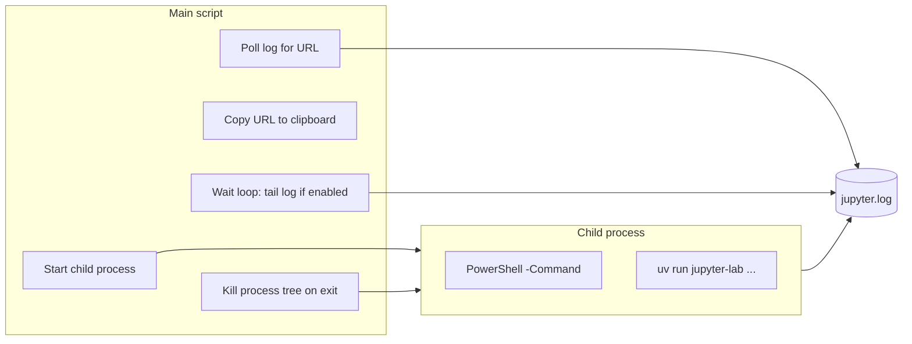

# Rewrite launch_jupyter_lab_with_remote_access.ps1 for Windows

## Why the current script is unreliable on Windows

The current script uses **PowerShell background jobs** (`Start-Job`):

- Jobs run in a separate runspace; `uv run jupyter-lab` and the tail job both touch `jupyter.log`, which can hit **file locking** or timing issues on Windows.
- **Job lifecycle** is not the same as process lifecycle: stopping/removing the job does not guarantee the Jupyter process is terminated, and `$job.State` can be flaky with multiple jobs.
- No direct handle to the real Jupyter process, so cleanup is indirect and can leave orphaned Python processes.

The working script [launch_jupyer_lab.ps1](scripts/windows/launch_jupyer_lab.ps1) simply runs `uv run jupyter-lab ...` in the foreground; the remote-access script needs the same command but in the background with URL capture and clipboard, so it must use a different, Windows-reliable approach.

## Target behavior (unchanged)

- Start Jupyter Lab with remote access (same flags as the working script: `--no-browser`, port 8889, `ServerApp.ip='0.0.0.0'`, etc.).
- Wait until the startup URL appears, then copy it to the clipboard and print it.
- Optionally stream `JUPYTER_LOG` to the console (configurable via `$PRINT_JUPYTER_LOG`).
- Keep running until the user stops the script (e.g. Ctrl+C); then **reliably terminate Jupyter** (no orphaned processes).

## Proposed approach: process-based launcher

Replace the job-based design with a **single child process** that runs the Jupyter command and writes to the log file. The main script keeps a process handle, polls the log for the URL, then waits while optionally tailing the log, and on exit kills the **process tree** so Jupyter is always stopped.

### 1. Start Jupyter via a child process (not Start-Job)

- Use **Start-Process** with **-PassThru** so the script gets a **process object** for cleanup.
- Run a **single child process** that performs the redirect and runs Jupyter:
  - **Option A (recommended):** Start `powershell.exe` with `-NoProfile -Command "Set-Location '…'; uv run jupyter-lab ... *> '…\jupyter.log'"` and `-WorkingDirectory $PROJECT_DIR`. Use an absolute path for the log so the child and main script agree. The process we hold is this PowerShell; when we kill it, we must kill the **process tree** so the `uv`/Jupyter child is also terminated.
  - **Option B:** If you need to avoid a nested PowerShell, use `cmd /c "…"` with `> log 2>&1` and Start-Process that cmd; cleanup still via process tree kill.
- **Important:** Do not use `Start-Process -RedirectStandardOutput` for the Jupyter process itself: PowerShell cannot redirect both stdout and stderr to the same file with Start-Process. Running a wrapper (PowerShell or cmd) that does `*>` or `> log 2>&1` avoids that limitation.

### 2. Poll the log file for the URL

- Keep the existing logic: poll `$JUPYTER_LOG` until the same regex matches (`http://127\.0\.0\.1:\d+/lab\?token=\w+`) or timeout (e.g. 60s). No jobs; only the main script reads the file, so no file locking between job and main script.

### 3. Clipboard and messaging

- Unchanged: copy the captured URL to the clipboard (Set-Clipboard), print the access message.

### 4. Wait loop and optional log streaming

- **Single loop** in the main script: `while (-not $proc.HasExited) { ... }`.
- If `$PRINT_JUPYTER_LOG` is true: in each iteration, read **new** content from `$JUPYTER_LOG` (e.g. track last read position or line count) and `Write-Host` it. This avoids a second job and any cross-process file locking.
- Sleep ~300 ms between iterations to avoid busy-waiting.

### 5. Cleanup on exit (critical for Windows)

- In a **finally** block (and optionally in a **trap** or handler for Ctrl+C): if the process exists and has not exited, terminate it.
- Use **process-tree kill** so the Jupyter (and uv) processes are stopped:
  - `Stop-Process -Id $proc.Id -Force` may leave child processes running.
  - Use `**taskkill /PID $proc.Id /T /F**` to kill the process and its descendants, or implement a small helper that finds child PIDs and kills them, then kills the main process.
- After that, no reliance on job state or job removal.

### 6. Error handling and UX

- Keep `$ErrorActionPreference = "Stop"` if desired, but ensure that **Ctrl+C** is handled so the finally block runs (default behavior in PowerShell is to abort; if needed, add a trap for `[Console]::TreatControlCAsInput` or document that users should close the window / use one Ctrl+C so cleanup runs).
- Preserve existing checks: UV available, project dir exists, timeout with log dump on failure.

## Files to change

- **[scripts/windows/launch_jupyter_lab_with_remote_access.ps1](scripts/windows/launch_jupyter_lab_with_remote_access.ps1):** Full rewrite. Remove all `Start-Job` / `Receive-Job` / `Wait-Job` / `Remove-Job` usage. Introduce:
  - `$proc = Start-Process ... -PassThru` (wrapper command that redirects to `$JUPYTER_LOG`).
  - Same URL polling and clipboard logic.
  - One wait loop with optional in-process log tailing (position- or line-based).
  - `finally` (and optional Ctrl+C handler) calling process-tree kill (e.g. `taskkill /T`).

## Optional: Ctrl+C handling

- To make Ctrl+C reliably trigger cleanup, register a handler that sets a “shutdown requested” flag and then calls the same cleanup (taskkill process tree). The wait loop can check that flag and break, then finally runs and performs cleanup again (idempotent).

## Summary

| Current (jobs)        | New (process-based)                                          |
| --------------------- | ------------------------------------------------------------ |
| Start-Job for Jupyter | Start-Process wrapper that runs Jupyter and redirects to log |
| Start-Job for tail    | Main script reads new log lines in wait loop                 |
| Get-Job / $job.State  | $proc.HasExited                                              |
| Stop-Job / Remove-Job | taskkill /PID $proc.Id /T /F (process tree)                  |

This keeps behavior the same for the user (URL to clipboard, optional log streaming, script runs until stopped) while making startup, waiting, and shutdown reliable on Windows.