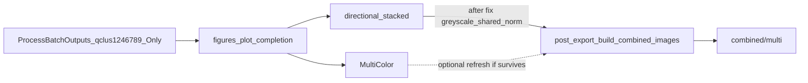

# Robust `combined/multi` for ProcessBatchOutputs batch scripts

## Success criterion

Batch scripts generated by [`ProcessBatchOutputs_qclus1246789_Only.ipy`](h:/TEMP/Spike3DEnv_ExploreUpgrade/Spike3DWorkEnv/Spike3D/ProcessBatchOutputs_qclus1246789_Only.ipy) (via `figures_plot_generalized_decode_epochs_dict_and_export_results_completion_function` with directional + MultiColor in `included_figures_names`) must leave:

- `…/ripple/*/greyscale_shared_norm/p_x_given_n[…].png`
- `…/ripple/combined/multi/p_x_given_n[…].png` (stacked white columns)

even when MultiColor dies mid-run (as in `debug_2026-09-15_12-09-41…Final.log`). Failures that are Python exceptions must leave a **full flushed traceback** in the batch `*.log`.

Do **not** edit the `.ipy`; fix the library path those scripts already call.

## Root cause

Directional stacked finishes; MultiColor often does not. Today `post_export_build_combined_images` runs **only after MultiColor**, and the layout hard-requires `greyscale_shared_norm`, which directional never exports (`greyscale`/`color` only).



## Approach

### 1. Directional display: export `greyscale_shared_norm`

[`DirectionalPlacefieldGlobalComputationFunctions.py`](h:/TEMP/Spike3DEnv_ExploreUpgrade/Spike3DWorkEnv/pyPhoPlaceCellAnalysis/src/pyphoplacecellanalysis/General/Pipeline/Stages/ComputationFunctions/MultiContextComputationFunctions/DirectionalPlacefieldGlobalComputationFunctions.py) (~L10437)

Add to default `custom_export_formats`:

```python
'greyscale_shared_norm': HeatmapExportConfig.init_greyscale(vmin=0.0, vmax=1.0, **common_export_config_kwargs),
```

Keep `greyscale` and `color`. Auto-stitched `combined/greyscale_shared_norm/` follows from existing `_subfn_build_combined_output_images`.

### 2. Harden `post_export_build_combined_images` (robust)

[`data_exporting.py`](h:/TEMP/Spike3DEnv_ExploreUpgrade/Spike3DWorkEnv/pyPhoPlaceCellAnalysis/src/pyphoplacecellanalysis/Pho2D/data_exporting.py) (~L1337)

- If requested layout format is missing, fall back through `greyscale_shared_norm` → `viridis_shared_norm` → `greyscale` for all four 1D decoders.
- Missing epoch type / missing single-epoch image: print warning + skip (do not raise).
- Progress prints use `flush=True`; log which format was actually used when falling back.

Output path stays `…/ripple/combined/multi/`.

### 3. Batch wiring + informative logs

[`batch_user_completion_helpers.py`](h:/TEMP/Spike3DEnv_ExploreUpgrade/Spike3DWorkEnv/pyPhoPlaceCellAnalysis/src/pyphoplacecellanalysis/General/Batch/BatchJobCompletion/UserCompletionHelpers/batch_user_completion_helpers.py) — `figures_plot_generalized_decode_epochs_dict_and_export_results_completion_function`

- After directional succeeds: call `post_export_build_combined_images` with `custom_merge_layout_dict=[['greyscale_shared_norm']]`, `epoch_name_list=['ripple']`, `should_use_raw_rgba_export_image=False`.
- Keep MultiColor-side combine as an optional refresh if MultiColor completes.
- Per-display `except` blocks (directional + MultiColor at minimum): print message + `traceback.format_exc()` with `flush=True`; raise only if `fail_on_exception_for_debugging` or `self.fail_on_exception` (remove unconditional `raise` on MultiColor so a late failure cannot block reporting after `multi` already exists).
- Flush `\t trying "..."` progress prints in this function.

## Out of scope

- Editing `ProcessBatchOutputs_qclus1246789_Only.ipy`
- Fixing MultiColor OOM / raw_rgba performance
- Changing global `ExceptionPrintingContext` in `BatchCompletionHandler`

## Verification

Re-run (or inspect) a session like `pin01_one_fet11-01_12-58-54` after directional completes:

1. `ripple/long_LR/greyscale_shared_norm/` (and siblings) exist
2. `ripple/combined/multi/p_x_given_n[…].png` exist
3. If MultiColor fails with a Python exception: `*.log` contains a multi-frame traceback under the failure banner
4. If MultiColor is hard-killed: `*.log` still ends on a flushed `trying` / mid-step marker after directional + multi combine already succeeded
