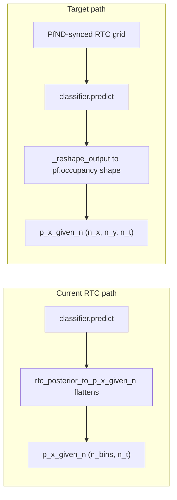

# RTC Clusterless Posterior Reshaping (Bayesian Parity)

## Problem

`ClusterlessRTCPositionDecoder` stores `p_x_given_n` as a **flat** `(n_position_bins, n_time_bins)` array because:

1. [`rtc_posterior_to_p_x_given_n`](h:\TEMP\Spike3DEnv_ExploreUpgrade\Spike3DWorkEnv\pyPhoPlaceCellAnalysis\src\pyphoplacecellanalysis\Analysis\Decoder\rtc_clusterless_adapters.py) always flattens spatial dims (line 306).
2. [`compute_all()`](h:\TEMP\Spike3DEnv_ExploreUpgrade\Spike3DWorkEnv\pyPhoPlaceCellAnalysis\src\pyphoplacecellanalysis\Analysis\Decoder\rtc_clusterless_decoder.py) stores that flat array without reshaping (unlike Bayesian's always-reshape in `decode()`).
3. RTC grid defaults diverge from PfND: `rtc_2d_place_bin_size_override=16.0` is applied when `ndim>1` (line 368-369), producing a different bin count than `pf.occupancy` (e.g. 289 vs 41×63).

`BayesianPlacemapPositionDecoder` always reshapes via:

```2207:2208:h:\TEMP\Spike3DEnv_ExploreUpgrade\Spike3DWorkEnv\pyPhoPlaceCellAnalysis\src\pyphoplacecellanalysis\Analysis\Decoder\reconstruction.py
p_x_given_n = np.reshape(curr_flat_p_x_given_n, (*self.original_position_data_shape, num_time_windows))
```

where `original_position_data_shape = np.shape(pf.occupancy)`.



## Implementation Plan

### 1. Sync RTC environment to PfND bin edges (with track-interior masking)

**File:** [`rtc_clusterless_adapters.py`](h:\TEMP\Spike3DEnv_ExploreUpgrade\Spike3DWorkEnv\pyPhoPlaceCellAnalysis\src\pyphoplacecellanalysis\Analysis\Decoder\rtc_clusterless_adapters.py)

- Add `PfNDSyncedEnvironment(Environment)` subclass that overrides `fit_place_grid()`:
  - When `pf.xbin` is available, build `edges_`, `place_bin_centers_`, `centers_shape_`, and `place_bin_edges_` directly from `pf.xbin` / `pf.ybin` (using RTC's `get_centers` from `replay_trajectory_classification.core`).
  - Compute `is_track_interior_` via RTC's `get_track_interior(position, bins=centers_shape, ...)` using the PfND-aligned grid (**user preference: keep track-interior masking**).
  - Fall back to standard `Environment.fit_place_grid()` when PfND bins are unavailable.
- Update `build_rtc_environment_from_pfnd()` to return `PfNDSyncedEnvironment` with `pf` attached.
- Fix default bin-size selection in `_ensure_fitted_classifier` path:
  - Change `ClusterlessDecodingParameters.rtc_2d_place_bin_size_override` default from `16.0` to `None`.
  - Only apply explicit overrides when user sets them; otherwise `_pfnd_place_bin_size(pf)` uses `pf.pos_bin_size` / `pf.config.grid_bin`.
  - For 2D asymmetric bins, prefer PfND edge injection (not scalar `place_bin_size`) so RTC grid dimensions match `np.shape(pf.occupancy)`.

### 2. Reshape posterior to PfND occupancy shape by default

**File:** [`rtc_clusterless_adapters.py`](h:\TEMP\Spike3DEnv_ExploreUpgrade\Spike3DWorkEnv\pyPhoPlaceCellAnalysis\src\pyphoplacecellanalysis\Analysis\Decoder\rtc_clusterless_adapters.py)

Refactor `rtc_posterior_to_p_x_given_n()`:

- Sum over `state` dim if present (unchanged).
- Transpose to `(spatial_dims..., time)` and extract values.
- **Default output:** reshape to `(*np.shape(pf.occupancy), n_time)` with `order='F'` (matching PfND histogram flatten order).
- Keep `should_match_pf_grid` behavior as a safety net for size mismatches (pad/truncate with warning), but change its default to `True` in `ClusterlessDecodingParameters` since PfND alignment is now the default path.
- Add helper `rtc_posterior_flat_p_x_given_n()` (or internal branch) for callers that need the flat `(n_bins, n_t)` view.

### 3. Add Bayesian-style reshape helpers to ClusterlessRTCPositionDecoder

**File:** [`rtc_clusterless_decoder.py`](h:\TEMP\Spike3DEnv_ExploreUpgrade\Spike3DWorkEnv\pyPhoPlaceCellAnalysis\src\pyphoplacecellanalysis\Analysis\Decoder\rtc_clusterless_decoder.py)

Mirror [`BayesianPlacemapPositionDecoder._reshape_output` / `_flatten_output`](h:\TEMP\Spike3DEnv_ExploreUpgrade\Spike3DWorkEnv\pyPhoPlaceCellAnalysis\src\pyphoplacecellanalysis\Analysis\Decoder\reconstruction.py) (lines 3320-3325):

```python
def _reshape_output(self, flat_p_x_given_n):
    return np.reshape(flat_p_x_given_n, (*self.original_position_data_shape, flat_p_x_given_n.shape[-1]), order='F')

def _flatten_output(self, p_x_given_n):
    return np.reshape(p_x_given_n, (int(np.prod(self.original_position_data_shape)), p_x_given_n.shape[-1]), order='F')
```

Add `_format_decoder_posterior_outputs(flat_p_x_given_n)` used by `decode()`, `_predict_clusterless_posterior()`, and `compute_all()` to:
- Always produce shaped `p_x_given_n` (ndim = `pf.ndim + 1`).
- Always store `flat_p_x_given_n` alongside.
- Use `perform_compute_most_likely_positions(flat_p_x_given_n, self.original_position_data_shape)` unconditionally (like Bayesian).
- Compute `most_likely_positions` via `xbin_centers` / `ybin_centers` indexing (same as Bayesian `decode()` lines 2217-2221), replacing the current conditional RTC-centers path.

### 4. Update `decode()` and `compute_all()`

**File:** [`rtc_clusterless_decoder.py`](h:\TEMP\Spike3DEnv_ExploreUpgrade\Spike3DWorkEnv\pyPhoPlaceCellAnalysis\src\pyphoplacecellanalysis\Analysis\Decoder\rtc_clusterless_decoder.py)

- Remove the `pf_flat_size == flat_p_x_given_n.shape[0]` conditional in `decode()` (lines 194-200); always reshape.
- `compute_all()`: after predict, call `_format_decoder_posterior_outputs`, build marginals via `perform_build_marginals`, and store `self.marginal = DynamicContainer(x=..., y=...)` for parity with Bayesian `hyper_perform_decode`.
- Fix `most_likely_position_flat_indicies` to use `flat_p_x_given_n` argmax (axis 0), not shaped `p_x_given_n` argmax (current line 412 can be wrong for 3D).

### 5. Tests

**File:** [`tests/test_rtc_clusterless_decoder.py`](h:\TEMP\Spike3DEnv_ExploreUpgrade\Spike3DWorkEnv\pyPhoPlaceCellAnalysis\tests\test_rtc_clusterless_decoder.py)

- Extend `_MockPfND` with realistic `xbin`/`ybin` edge arrays and `occupancy` shape.
- **New:** `test_rtc_environment_matches_pfnd_bin_shape` — fitted environment `centers_shape_` equals `pf.occupancy.shape`.
- **New:** `test_clusterless_decode_2d_p_x_given_n_shape` — after `decode()`, `p_x_given_n.ndim == 3` and shape `(n_x, n_y, n_t)`.
- **Update:** `test_rtc_posterior_to_p_x_given_n_shape` for 2D xarray dims (`time`, `x_position`, `y_position`).
- **New:** `test_perform_build_marginals_with_shaped_posterior` — marginals have `(n_x, n_t)` / `(n_y, n_t)` shapes.
- Run: `uv run pytest tests/test_rtc_clusterless_decoder.py -q`

## Files Changed

| File | Change |
|------|--------|
| `rtc_clusterless_adapters.py` | `PfNDSyncedEnvironment`, posterior reshape defaults, param defaults |
| `rtc_clusterless_decoder.py` | `_reshape_output`, unified output formatting, `compute_all` marginals |
| `test_rtc_clusterless_decoder.py` | 2D shape + grid-alignment regression tests |

## Notes / Risks

- Track-interior masking means many bins in the shaped `(n_x, n_y, n_t)` array will be 0/NaN outside the visited track — this is expected and differs from Bayesian only in that Bayesian uses the full occupancy support for P(x).
- If `pf.xbin` is not yet computed when the decoder is built, environment falls back to bounds+bin-size RTC grid; a warning should be logged when reshape size mismatches occur.
- Memory estimate in `raise_if_log_likelihood_exceeds_memory_limit` should use `np.prod(pf.occupancy.shape)` once grids are PfND-aligned.
