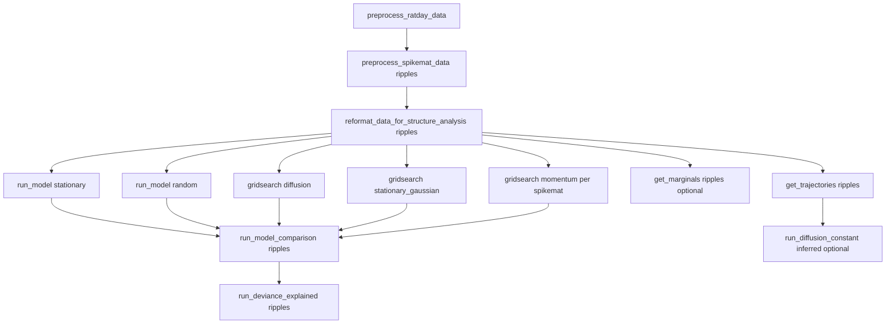

# Standalone orchestrator: `run_all_comps_for_sess.py`

## Relationship to `generate_model_recovery_data.py`

[`generate_model_recovery_data.py`](h:\TEMP\Spike3DEnv_ExploreUpgrade\Spike3DWorkEnv\HippocampalSWRDynamics\scripts\local\generate_model_recovery_data.py) is the **simulated model-recovery** path: it loads real **ripples** structure from **`Session_List[0]` only** (hardcoded) and marginalized priors from **`Session_List[0]`** via `load_marginalized_gridsearch_results` ([lines 72–106, 132–140](h:\TEMP\Spike3DEnv_ExploreUpgrade\Spike3DWorkEnv\HippocampalSWRDynamics\scripts\local\generate_model_recovery_data.py)). It is **not** part of the per-session ripples pipeline you selected; the new script can document an optional follow-up block or a `--include-model-recovery` flag that only makes sense after session **0** ripples + marginalized results exist.

## Target: one real session, ripples, “all needed” dynamics computations

Per [README.md](h:\TEMP\Spike3DEnv_ExploreUpgrade\Spike3DWorkEnv\HippocampalSWRDynamics\README.md) and script dependencies, **recommended order** for session index `N` (passed as `--session N` to existing CLIs, consistent with `string_to_session_indicator` in [`metadata.py`](h:\TEMP\Spike3DEnv_ExploreUpgrade\Spike3DWorkEnv\HippocampalSWRDynamics\replay_structure\metadata.py)):

| Step | Script | Why this order |
|------|--------|----------------|
| 1 | [`preprocess_ratday_data.py`](h:\TEMP\Spike3DEnv_ExploreUpgrade\Spike3DWorkEnv\HippocampalSWRDynamics\scripts\local\preprocess_ratday_data.py) | Produces ratday pickles consumed by spikemat preprocessing. |
| 2 | [`preprocess_spikemat_data.py`](h:\TEMP\Spike3DEnv_ExploreUpgrade\Spike3DWorkEnv\HippocampalSWRDynamics\scripts\local\preprocess_spikemat_data.py) `--data_type ripples --session N` | Needs ratday. |
| 3 | [`reformat_data_for_structure_analysis.py`](h:\TEMP\Spike3DEnv_ExploreUpgrade\Spike3DWorkEnv\HippocampalSWRDynamics\scripts\local\reformat_data_for_structure_analysis.py) `--data_type ripples --session N` | Produces structure blobs used by models, gridsearch, marginals, trajectories. |
| 4–5 | [`run_model.py`](h:\TEMP\Spike3DEnv_ExploreUpgrade\Spike3DWorkEnv\HippocampalSWRDynamics\scripts\local\run_model.py) `stationary` and `random` | `run_model_comparison` loads these for non-gridsearch models ([`run_model_comparison.py`](h:\TEMP\Spike3DEnv_ExploreUpgrade\Spike3DWorkEnv\HippocampalSWRDynamics\scripts\local\run_model_comparison.py) `load_model_evidences`). |
| 6–8 | Gridsearch | [`run_model_comparison.run_gridsearch_marginalization`](h:\TEMP\Spike3DEnv_ExploreUpgrade\Spike3DWorkEnv\HippocampalSWRDynamics\scripts\local\run_model_comparison.py) calls `load_gridsearch_results` for diffusion, momentum, stationary_gaussian. **Momentum** is one job per spikemat: mirror [`scripts/o2/momentum_gridsearch_ratdayripple.py`](h:\TEMP\Spike3DEnv_ExploreUpgrade\Spike3DWorkEnv\HippocampalSWRDynamics\scripts\o2\momentum_gridsearch_ratdayripple.py) by calling [`scripts/o2/o2_lib.py`](h:\TEMP\Spike3DEnv_ExploreUpgrade\Spike3DWorkEnv\HippocampalSWRDynamics\scripts\o2\o2_lib.py) `submit_*` with **`o2=False`** so results land under the local results layout (same as cluster paths in `read_write`). Diffusion and stationary Gaussian: `submit_diffusion_gridsearch` / `submit_stationary_gaussian_gridsearch`. Spikemat count for `N` comes from `SESSION_RATDAY[N]["n_SWRs"]` in metadata (same source as README session table). |
| 9 | [`run_model_comparison.py`](h:\TEMP\Spike3DEnv_ExploreUpgrade\Spike3DWorkEnv\HippocampalSWRDynamics\scripts\local\run_model_comparison.py) `--data_type ripples --session N` | Runs `aggregate_momentum_gridsearch`, marginalization, and saves model comparison. |
| 10 | [`run_deviance_explained.py`](h:\TEMP\Spike3DEnv_ExploreUpgrade\Spike3DWorkEnv\HippocampalSWRDynamics\scripts\local\run_deviance_explained.py) | Requires `load_model_comparison_results` ([`run_deviance_explained.py`](h:\TEMP\Spike3DEnv_ExploreUpgrade\Spike3DWorkEnv\HippocampalSWRDynamics\scripts\local\run_deviance_explained.py) lines 54–62). |
| 11 | [`get_marginals.py`](h:\TEMP\Spike3DEnv_ExploreUpgrade\Spike3DWorkEnv\HippocampalSWRDynamics\scripts\local\get_marginals.py) | Only needs `load_structure_data`; **very heavy** (loop over all spikemats). Default **skip** or behind `--run-marginals`. |
| 12 | [`get_trajectories.py`](h:\TEMP\Spike3DEnv_ExploreUpgrade\Spike3DWorkEnv\HippocampalSWRDynamics\scripts\local\get_trajectories.py) | Requires `--sd_meters` (raises if missing). Default **`0.98`** to match `DIFFUSION_PARAMS["ripples"]` in `get_marginals.py`; allow override. |
| 13 | [`run_diffusion_constant.py`](h:\TEMP\Spike3DEnv_ExploreUpgrade\Spike3DWorkEnv\HippocampalSWRDynamics\scripts\local\run_diffusion_constant.py) `--trajectory_type inferred` | Optional; needs trajectory results. |

**Out of scope for strict “single session”** (existing scripts aggregate all sessions; do not silently claim single-session behavior):

- [`get_descriptive_stats.py`](h:\TEMP\Spike3DEnv_ExploreUpgrade\Spike3DWorkEnv\HippocampalSWRDynamics\scripts\local\get_descriptive_stats.py) and [`run_predictive_analysis.py`](h:\TEMP\Spike3DEnv_ExploreUpgrade\Spike3DWorkEnv\HippocampalSWRDynamics\scripts\local\run_predictive_analysis.py) iterate `Session_List`. The orchestrator should **omit** them by default and mention in the module docstring / CLI help that they are cross-session figure pipelines.

**Optional parallel branches** (not required for core ripples dynamics):

- **PF / Stella-style paths**: `ripples_pf` uses different `data_type`, time window, and [`run_pf_analysis.py`](h:\TEMP\Spike3DEnv_ExploreUpgrade\Spike3DWorkEnv\HippocampalSWRDynamics\scripts\local\run_pf_analysis.py); keep out of default sequence unless you add an explicit flag later.

## Implementation sketch for `run_all_comps_for_sess.py`

- **Location**: [`HippocampalSWRDynamics/scripts/local/run_all_comps_for_sess.py`](h:\TEMP\Spike3DEnv_ExploreUpgrade\Spike3DWorkEnv\HippocampalSWRDynamics\scripts\local\run_all_comps_for_sess.py) (new file).
- **Runner**: Resolve repo root (e.g. parent of `scripts/local`), run each step with `subprocess.run` using **`sys.executable`** and the **absolute path** to each sibling script (avoids `uv run` ambiguity on Windows while remaining compatible with `uv`-managed envs when the user invokes `uv run python ...`).
- **Args**: Forward `--bin_size_cm`, `--time_window_ms`, `--filename_ext`, and likelihood where applicable; `--session` required (`INT` 0–7).
- **Gridsearch**:
  - `--skip-gridsearch`: assume `load_gridsearch_results` inputs already exist.
  - Otherwise call `o2_lib.submit_diffusion_gridsearch`, `submit_stationary_gaussian_gridsearch`, and `submit_momentum_gridsearch` in-process with `o2=False` (import from `scripts.o2.o2_lib`), looping spikemat indices — **wrap each momentum job** in try/except so one failed spikemat can log and optionally continue (`--continue-on-gridsearch-error`).
- **Error policy**:
  - Default: on failure, **log** full exception / return code, append to a summary list, **continue** for steps marked non-critical (e.g. optional marginals, optional diffusion_constant); **abort subsequent steps that depend on failed steps** (simple phase bitmask or “critical failure” flag after preprocess/reformat/gridsearch/model_comparison).
  - `--strict`: re-raise or `sys.exit(1)` on first failure.
- **Exit code**: `0` if all critical steps succeeded; non-zero if any critical step failed.

## Small repo hygiene (optional, separate minimal commit)

[`generate_model_recovery_data.py`](h:\TEMP\Spike3DEnv_ExploreUpgrade\Spike3DWorkEnv\HippocampalSWRDynamics\scripts\local\generate_model_recovery_data.py) `--data_type` default is `"simulated_ripples"`, which is **not** in the `click.Choice` list (lines 186–189); fix only if you want click to accept defaults without error.

## Verification

From repo root with env synced: `uv run python scripts/local/run_all_comps_for_sess.py --session 0 --skip-gridsearch` (or a dry-run flag if you add `--dry-run` that only prints the ordered command list) to validate wiring without recomputing gridsearch.
