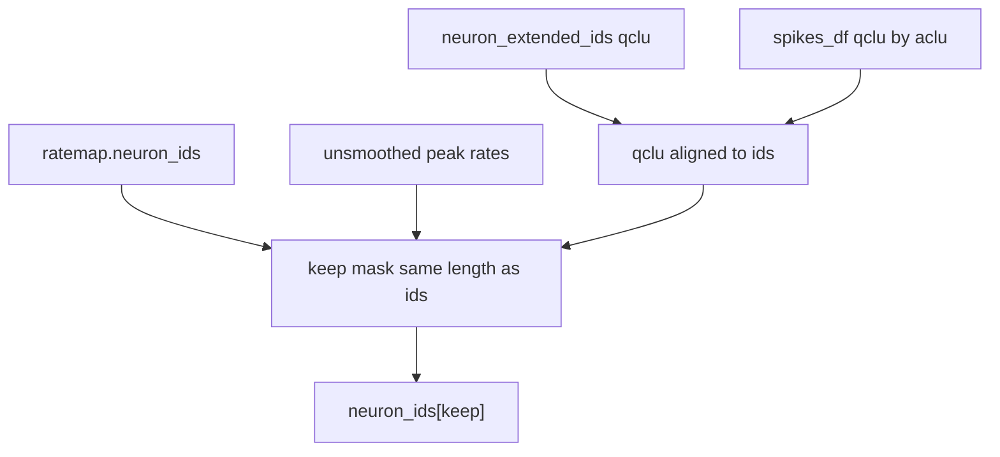

# Safe ratemap-aligned aclu filter

The current mask in [`DirectionalPlacefieldGlobalComputationFunctions.py`](h:\TEMP\Spike3DEnv_ExploreUpgrade\Spike3DWorkEnv\pyPhoPlaceCellAnalysis\src\pyphoplacecellanalysis\General\Pipeline\Stages\ComputationFunctions\MultiContextComputationFunctions\DirectionalPlacefieldGlobalComputationFunctions.py) is the same intersection as the old two `np.isin` filters: it walks `filtered_spikes_df` identities and then replaces the ratemap id list with those rows. A safe version builds one boolean mask of length `len(ratemap.neuron_ids)` and returns `neuron_ids[mask]`.

The same body is copied in three places. Only the `TrackTemplates` override at line 1435 actually runs; `BaseTrackTemplates` (line 784) is shadowed, and [`PfND._perform_determine_pf_aclus_filtered_by_qclu_and_frate`](h:\TEMP\Spike3DEnv_ExploreUpgrade\Spike3DWorkEnv\NeuroPy\neuropy\analyses\placefields.py) is an older copy. `placefields.py` must not import `TrackTemplates` (that import cycle already points the other way), so the algorithm lives in NeuroPy and both call sites use it.

## Shared function

Add `filter_neuron_ids_by_frate_and_qclu` in [`neuropy/analyses/placefields.py`](h:\TEMP\Spike3DEnv_ExploreUpgrade\Spike3DWorkEnv\NeuroPy\neuropy\analyses\placefields.py). One-line signature. Inputs: `neuron_ids`, `peak_frate_Hz`, `minimum_inclusion_fr_Hz=None`, `included_qclu_values=None`, `neuron_extended_ids=None`, `spikes_df=None`. Returns a 1d ndarray in ratemap order.

- `neuron_ids = np.asarray(neuron_ids)` and `peak_frate_Hz = np.asarray(peak_frate_Hz)`. Raise `ValueError` if their lengths differ. `Ratemap.__init__` checks ids against `tuning_curves` only, not against `unsmoothed_tuning_maps`.
- `keep = np.ones(len(neuron_ids), dtype=bool)`.
- Rate filter only when `minimum_inclusion_fr_Hz is not None` and `minimum_inclusion_fr_Hz > 0.0`. That keeps the existing contract: `None` and `0` still mean "do not rate-filter" (callers pass `0.0` as off). When the filter is on: `keep &= np.isfinite(peak_frate_Hz) & (peak_frate_Hz >= minimum_inclusion_fr_Hz)`.
- Qclu filter only when `included_qclu_values is not None`. Resolve one qclu per ratemap neuron, in that same order:
  1. If `neuron_extended_ids` has the same length and its `aclu` values equal `neuron_ids`, use each entry's `qclu`.
  2. Otherwise build an `aclu -> qclu` map from `spikes_df`. Read `qclu` only. Do not require `shank` or `cluster`. If `qclu` is absent, raise `ValueError` naming the missing column.
  3. If one aclu has more than one distinct qclu, raise `ValueError` instead of letting `extract_unique_neuron_identities` assert.
- `keep &= np.isfinite(qclu) & np.isin(qclu, included_qclu_values)`. `NaN` and the `-1` missing-qclu sentinel fail this test, so those cells are excluded while a qclu filter is active. Numeric `1.0` still matches `1`.
- Return `neuron_ids[keep]`. Cells that pass the rate cut and have an allowed qclu stay, in ratemap order, including when they have no remaining spike row but their extended identity has qclu.

## Call sites

- [`BaseTrackTemplates._perform_determine_decoder_aclus_filtered_by_qclu_and_frate`](h:\TEMP\Spike3DEnv_ExploreUpgrade\Spike3DWorkEnv\pyPhoPlaceCellAnalysis\src\pyphoplacecellanalysis\General\Pipeline\Stages\ComputationFunctions\MultiContextComputationFunctions\DirectionalPlacefieldGlobalComputationFunctions.py) becomes a loop over `decoders_dict` that calls the helper with `a_decoder.pf.ratemap.neuron_ids`, `tuning_curve_unsmoothed_peak_firing_rates`, `neuron_extended_ids`, and `a_decoder.pf.filtered_spikes_df`. Keep the existing comment that qclu `[6, 7]` are the double-field clusters. Close the `for` with `## END for a_decoder_name, a_decoder in decoders_dict.items()...`.
- Delete the `TrackTemplates` override at line 1435 so `TrackTemplates._perform_...` resolves to that single base method. Existing `TrackTemplates._perform_...` call sites keep working.
- `PfND._perform_determine_pf_aclus_filtered_by_qclu_and_frate` becomes the same loop over `pf.ratemap` and `pf.filtered_spikes_df`.

Leave `determine_decoder_aclus_filtered_by_frate_and_qclu` alone. It already sorts with `np.union1d` and slices with `get_by_id`. The instance method that returns this dict directly will now get ratemap order in both the rate-only and qclu cases.
