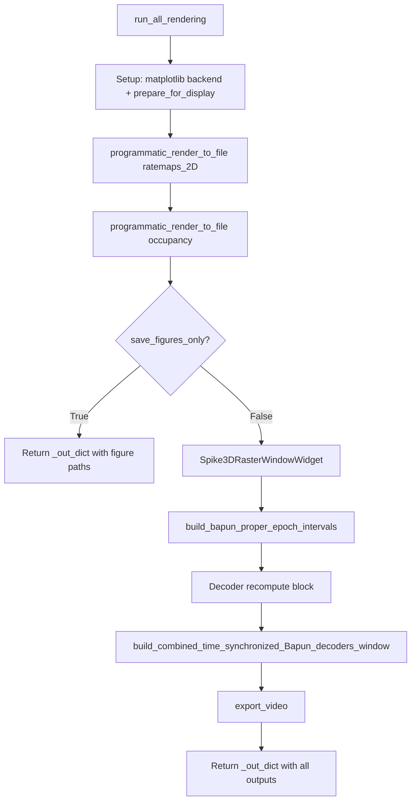

# save_figures_only + resilient rendering in run_all_rendering

## Problem

[`run_all_rendering`](h:\TEMP\Spike3DEnv_ExploreUpgrade\Spike3DWorkEnv\pyPhoPlaceCellAnalysis\src\pyphoplacecellanalysis\SpecificResults\PendingNotebookCode.py) accepts `save_figures_only: bool = False` but **never reads it**. Batch completion already calls it with `save_figures_only=True` inside `matplotlib_file_only()` ([`BatchCompletionHandler.try_complete_figure_generation_to_file`](h:\TEMP\Spike3DEnv_ExploreUpgrade\Spike3DWorkEnv\pyPhoPlaceCellAnalysis\src\pyphoplacecellanalysis\General\Batch\BatchJobCompletion\BatchCompletionHandler.py)), yet the method still:

- Forces `Qt5Agg` matplotlib backend (line 605)
- Creates `Spike3DRasterWindowWidget` PyQt hierarchy (line 668)
- Recomputes decoders for sync plotters (lines 701–727)
- Builds decoder dock windows and exports `.avi` video (lines 731–781)

Any one failure aborts the whole method (no per-output isolation).

## Reference pattern

[`main_complete_figure_generations`](h:\TEMP\Spike3DEnv_ExploreUpgrade\Spike3DWorkEnv\pyPhoPlaceCellAnalysis\src\pyphoplacecellanalysis\SpecificResults\PhoDiba2023Paper.py) (lines 1825–1942):

- Sets `defer_show = save_figures_only`
- Wraps optional figure calls in `try/except` with “failed. Continuing.” messages
- Skips interactive return values when `save_figures_only`

## Output classification



| Stage | Type | When `save_figures_only=True` |
|-------|------|-------------------------------|
| Matplotlib setup + `programmatic_render_to_file` x2 | File export (AGG-safe) | **Run** |
| `Spike3DRasterWindowWidget`, epoch intervals, decoder recompute, sync plotters, video | PyQt / interactive | **Skip** (per your confirmation) |

## Implementation (single file edit)

**File:** [`PendingNotebookCode.py`](h:\TEMP\Spike3DEnv_ExploreUpgrade\Spike3DWorkEnv\pyPhoPlaceCellAnalysis\src\pyphoplacecellanalysis\SpecificResults\PendingNotebookCode.py) — `BapunBatchHelpers.run_all_rendering` (~lines 585–784)

### 1. Early `_out_dict` and backend branch

- Initialize `_out_dict = {}` at the top.
- Replace unconditional `Qt5Agg` setup with:

```python
_restore_previous_matplotlib_settings_callback = matplotlib_configuration_update(
    is_interactive=not save_figures_only,
    backend='AGG' if save_figures_only else 'Qt5Agg',
)
```

This aligns with the outer `matplotlib_file_only()` context in batch completion and avoids requiring Qt for file-only runs even if the outer wrapper is absent.

### 2. Wrap each graphics output in try/except

Follow existing project style (`run_all` line 544, `PhoDiba2023Paper` lines 1924–1935): catch `Exception`, print a labeled message including `{e}`, continue.

**File-export stages (always attempted):**

1. **Setup block** — `reload_default_display_functions()`, `prepare_for_display()`, `fig_man.close_all()`
2. **`_display_2d_placefield_result_plot_ratemaps_2D`** — store result in `_out_dict['ratemaps_2D_paths']`
3. **`_display_2d_placefield_occupancy`** — store in `_out_dict['occupancy_paths']`

**Interactive stages (only when `not save_figures_only`):**

Wrap each separately so a spike-raster failure does not block video export attempts:

4. `Spike3DRasterWindowWidget.find_or_create_if_needed(...)`
5. `build_bapun_proper_epoch_intervals(...)`
6. Decoder recompute block (`force_recompute` / `build_contextual_pf2D_decoder` / cache write)
7. `build_combined_time_synchronized_Bapun_decoders_window(...)` + title loop
8. `a_plotter.export_video(...)`

When `save_figures_only=True`, log once: `Skipping interactive PyQt rendering (save_figures_only=True).`

### 3. Guard interactive block

Wrap lines ~633–783 in:

```python
if not save_figures_only:
    # ... all PyQt imports and logic ...
```

Move PyQt-specific imports inside this block to avoid importing GUI modules in headless file-only runs (minor startup benefit).

### 4. Return value and cleanup

- Always `return _out_dict` (never raise from individual output failures).
- Optionally call `_restore_previous_matplotlib_settings_callback()` in a `finally` block (pre-existing callback was never restored; low-risk addition).

### 5. Docstring update

Add a short note that `save_figures_only=True` runs matplotlib file exports only and skips PyQt spike-raster / decoder-window / video outputs.

## What will NOT change

- [`BatchCompletionHandler`](h:\TEMP\Spike3DEnv_ExploreUpgrade\Spike3DWorkEnv\pyPhoPlaceCellAnalysis\src\pyphoplacecellanalysis\General\Batch\BatchJobCompletion\BatchCompletionHandler.py) — already passes `save_figures_only=True` and wraps with `matplotlib_file_only()`; no edit needed.
- `run_all()` — keeps calling `run_all_rendering(curr_active_pipeline)` without the flag (interactive default preserved).
- Decoder computation in `run_all_computations` — unchanged; file-only mode relies on that precomputed cache instead of the interactive recompute block.

## Verification

After implementation, confirm logically (no full batch run required unless you want one):

1. `save_figures_only=True` path executes only the two `programmatic_render_to_file` calls and returns early before any PyQt import.
2. Simulated failure in one wrapped block (e.g. comment out a dependency) allows subsequent blocks to still run when `save_figures_only=False`.
3. Batch handler call site remains compatible: `_rendering_out_dict = BapunBatchHelpers.run_all_rendering(..., save_figures_only=True)` completes without Qt/display errors.
