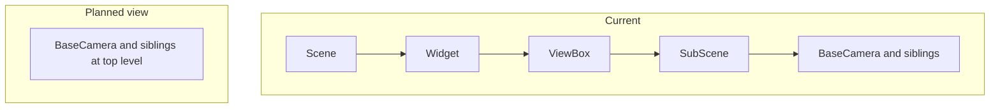

# Flatten leading single-child chain in VispySceneTreeWidget

## Problem

`[VispySceneTreeWidget._populate](h:\TEMP\Spike3DEnv_ExploreUpgrade\Spike3DWorkEnv\pyPhoplaceCellAnalysis\src\pyphoplacecellanalysis\Pho2D\vispy\vispy_helpers.py)` currently mirrors **every** scene node starting at `root_node` (`canvas.scene`). Typical vispy layouts use a deep chain of structural nodes (`SubScene` → `Widget` → `ViewBox` → `SubScene`, each with **one** child) before the real content. Those rows have empty names and only add horizontal indent.

## Intended behavior (matches your screenshot)

- **Display root**: Walk down from `self._root_node` while the current node has **exactly one** child; the first node where `len(children) != 1` is the **effective display root** (the “true” branch point).
- **Top-level rows**:
  - If that node has **multiple** children: do **not** create a row for the display root; call `_populate` for **each child** with `parent_item=None` so they appear at **indent 0**.
  - If that node has **zero** children (degenerate case: long single-child chain ending in a leaf): create **one** top-level row for that node (so the tree is not empty).
- **Deeper levels**: Unchanged — `_populate` continues to recurse under each item as today.

This is purely a **view** transform; `self._root_node` stays `canvas.scene` for API compatibility. No changes needed in `[predicitive_decoding_vispy.py](h:\TEMP\Spike3DEnv_ExploreUpgrade\Spike3DWorkEnv\pyPhoplaceCellAnalysis\src\pyphoplacecellanalysis\Pho2D\vispy\predicitive_decoding_vispy.py)` call sites.

## Implementation details

1. Add a small private helper on `VispySceneTreeWidget`, e.g. `_effective_display_root(self, node: Node) -> Node`, implementing the `while len(node.children) == 1: node = node.children[0]` walk (with a **safety cap** on iterations, e.g. 256, to guard against unexpected cycles).
2. Change `**rebuild()`** (not `_populate` signature): compute `effective = self._effective_display_root(self._root_node)`, then branch as above (multi-child → loop `_populate(child, None)`; zero-child → `_populate(effective, None)`).
3. `**expandToDepth(3)`**: After flattening, depth semantics change slightly; keeping `3` is usually fine. Optionally reduce to `2` if the tree feels over-expanded — trivial follow-up.
4. Extend the class docstring with one sentence describing that leading single-child wrapper chains are collapsed in the tree view.

## Alternatives (not default)

- **Type-based skipping** (only skip `SubScene`/`Widget`/etc.): more brittle across vispy versions.
- **Constructor flag** to show the full graph: only add if you need to debug wrappers later.

No new dependencies.