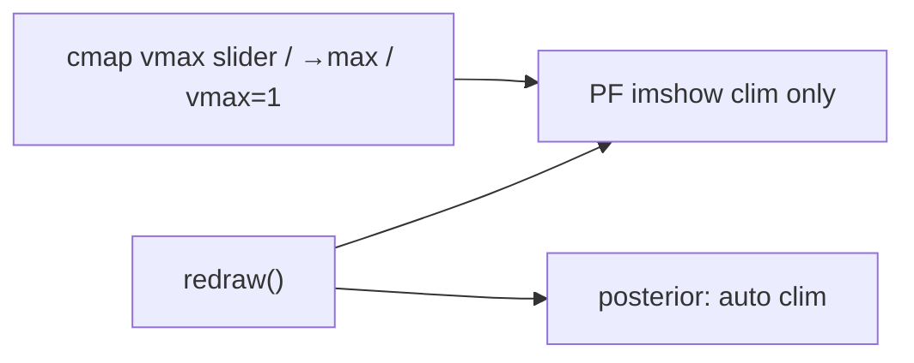

# Separate placefield clim from posterior

## Problem

In [`InteractiveBayesian2DEquationDebugger`](h:/TEMP/Spike3DEnv_ExploreUpgrade/Spike3DWorkEnv/pyPhoPlaceCellAnalysis/src/pyphoplacecellanalysis/SpecificResults/PendingNotebookCode.py), `cmap_vmax` is documented and used as a **shared** clim for both the decoded posterior and peak-normalized placefields:

```1636:1639:h:/TEMP/Spike3DEnv_ExploreUpgrade/Spike3DWorkEnv/pyPhoPlaceCellAnalysis/src/pyphoplacecellanalysis/SpecificResults/PendingNotebookCode.py
    cmap_vmax: float = field(default=1.0)  # shared clim upper for posterior + PF heatmaps ([0, cmap_vmax])
    cmap_vmax_slider: Any = field(default=None)
    cmap_vmax_slider_ax: Any = field(default=None)
    observed_cmap_nanmax: Optional[float] = field(default=None)  # nanmax of current posterior (for →max button)
```

`redraw()` passes the same `vmax` into both `ims['post']` and `ims[f'pf_{i}']`, and `on_cmap_vmax` / `set_cmap_vmax_to_observed_nanmax` update the posterior too. Posterior probabilities and peak-normalized ratemaps live on different scales, so that shared clim is wrong.

## Approach

Scope clim controls to **placefield (PF) ratemaps only**. Posterior uses auto clims (`vmin`/`vmax` omitted → matplotlib data range). Reliability `R_i` maps stay at fixed `[0, 1]` (unchanged). Likelihood / power / exp / conflict panels stay auto (unchanged).



## Changes (single file)

All edits in [`PendingNotebookCode.py`](h:/TEMP/Spike3DEnv_ExploreUpgrade/Spike3DWorkEnv/pyPhoPlaceCellAnalysis/src/pyphoplacecellanalysis/SpecificResults/PendingNotebookCode.py) on `InteractiveBayesian2DEquationDebugger`:

1. **Field docs** — Update `cmap_vmax` comment to “PF ratemap clim upper”; change `observed_cmap_nanmax` to track nanmax of peak-normalized PF maps (for →max), not the posterior.

2. **`redraw()`** — Plot posterior without forced clim:
   - `self._imshow_map(..., post_title)` with no `vmin`/`vmax` (auto).
   - Drop posterior title `clim=[0, …]` suffix.
   - Stop setting `observed_cmap_nanmax` from `parts['posterior']`; instead set it from `nanmax` over peak-normalized `tuning_curves[i] / peak_rates[i]` (or the PF image arrays).
   - Keep PF `_imshow_map(..., vmin=0.0, vmax=vmax)` and PF title clim hint as today.

3. **`on_cmap_vmax()`** — Update only `ims[f'pf_{i}']` via `set_clim(0.0, vmax)` and PF titles. Do **not** call `im_post.set_clim` or change `ax_post` title.

4. **`set_cmap_vmax_to_observed_nanmax()`** — Keep snapping the slider to `observed_cmap_nanmax`, but that value is now the PF-normalized nanmax (fallback: max over `ims['pf_*']` arrays if the cached value is missing). Docstring: PF clim only, not posterior.

5. **`reset_cmap_vmax()`** — Docstring only (behavior already sets slider to 1.0, which remains correct for peak-normalized PFs).

6. **UI labels** — Relabel slider to something like `PF cmap vmax` and clarify the →max button comment so it is obvious these control placefields only. Keep `vmax=1` action as-is.

No other panels, export chrome, or caller APIs need changes; `fig._bayes_eqn_ui` still exposes the same callables.