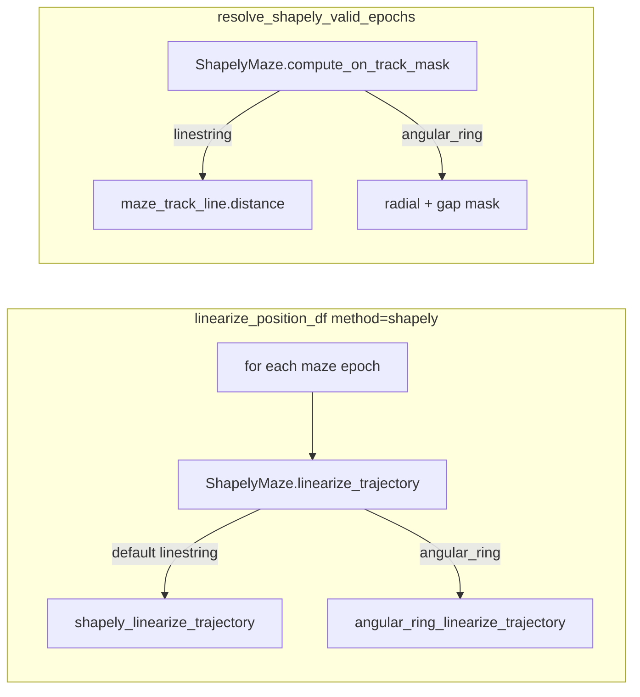

# ShapelyMaze Angular Ring Linearization

## Goal

Add angular displacement linearization (`lin_pos` in `[0, 1]`, gap excluded) for circular tracks, scoped to individual mazes via optional fields on `ShapelyMaze`. All existing templates and call sites keep current behavior without changes.

## Architecture



## File 1: [`neuropy/utils/position_util.py`](h:\TEMP\Spike3DEnv_ExploreUpgrade\Spike3DWorkEnv\NeuroPy\neuropy\utils\position_util.py)

### A. Add `CircularRingLinearizationParams` (attrs, same file as `ShapelyMaze`)

Small frozen-style config object (not a free function):

- `center_x`, `center_y`, `radius_cm`
- `gap_angle_start_rad`, `gap_angle_end_rad` — excluded arc in `atan2` space
- `arc_direction: str = 'ccw'` — valid travel along complement arc
- `max_radius_deviation_cm: float = 35.0` — on-track radial tolerance
- `output_range: Tuple[float, float] = (0.0, 1.0)`

### B. Extend `ShapelyMaze` (backwards compatible defaults)

```python
@define(slots=False)
class ShapelyMaze:
    nodes: List[Tuple[float, float]] = field(default=Factory(list))
    linearization_mode: str = 'linestring'  # 'linestring' | 'angular_ring'
    ring_params: Optional[CircularRingLinearizationParams] = None
    maze_track_line: LineString = field(default=None, init=False)
```

- **`__attrs_post_init__` unchanged** — still builds `LineString(self.nodes)` for plotting, validation fallback, and all existing templates.
- **`shapely_linearize_trajectory` unchanged** — existing callers and tests keep identical behavior.

### C. New methods on `ShapelyMaze` only (no new module-level functions)

| Method | Role |
|--------|------|
| `linearize_trajectory(df)` | Dispatches to linestring or angular_ring |
| `angular_ring_linearize_trajectory(df)` | Vectorized `atan2` → normalized arc position; `NaN` for gap/off-ring |
| `compute_on_track_mask(x, y, max_track_distance_cm)` | Used by epoch validation; ring mode uses radial deviation + gap exclusion |

Implementation notes (inside class methods, using private `@staticmethod` helpers if needed for angle wrap):

- Map valid arc from `gap_angle_end` → `gap_angle_start` (CCW) to `[output_range[0], output_range[1]]`.
- Gap test: angle falls in excluded arc (handle ±π wrap).
- Off-ring: `abs(r - radius_cm) > max_radius_deviation_cm` (reuse `max_track_distance_cm` from validation when called from `resolve_shapely_valid_epochs`).

### D. Two one-line call-site updates in same file

1. **`resolve_shapely_valid_epochs` → `_subfn_compute_on_track_mask`**

Replace LineString-only logic with:

```python
return shapely_maze.compute_on_track_mask(pos_df['x'].to_numpy(), pos_df['y'].to_numpy(), max_track_distance_cm)
```

2. **`linearize_position_df` shapely branch (~line 337)**

```python
linearized_values = shapely_maze.linearize_trajectory(track_pos_df)
```

No new top-level `method=`; session config stays `method='shapely'`.

## File 2: [`neuropy/core/session/Formats/Specific/BapunDataSessionFormat.py`](h:\TEMP\Spike3DEnv_ExploreUpgrade\Spike3DWorkEnv\NeuroPy\neuropy\core\session\Formats\Specific\BapunDataSessionFormat.py)

Enable angular mode **only** on RatJ maze2 (~lines 96–101):

```python
'maze2': ShapelyMaze(
    nodes=[(149.84, 64.67), (187.69, -154.38), (111.17, 102.19), (-205.84, 116.18)],
    linearization_mode='angular_ring',
    ring_params=CircularRingLinearizationParams(
        center_x=-34.0, center_y=-76.0, radius_cm=235.0,
        gap_angle_start_rad=np.deg2rad(-25), gap_angle_end_rad=np.deg2rad(25),
        arc_direction='ccw', output_range=(0.0, 1.0),
    ),
),
```

- Import `CircularRingLinearizationParams` alongside existing `ShapelyMaze` import.
- **`maze1` and all other session templates unchanged** (implicit `linearization_mode='linestring'`).
- Keep existing `nodes` for skeleton overlay / backwards compatibility.
- Gap/center/radius are initial estimates from prior RatJ occupancy analysis; tune after visual overlay if needed.

Optional (same file, RatJ `HardcodedProcessingParameters`): ensure `regularization_approach=RegularizationApproach.RAW_VALUES` in `linearization_parameters` so `[0,1]` is not rescaled — only if not already default.

## File 3: [`neuropy/tests/test_shapely_valid_epochs.py`](h:\TEMP\Spike3DEnv_ExploreUpgrade\Spike3DWorkEnv\NeuroPy\tests\test_shapely_valid_epochs.py)

Add focused tests (no new test file):

1. **Backwards compatibility**: existing horizontal-track `ShapelyMaze(nodes=...)` still linearizes via LineString (unchanged output).
2. **Angular ring**: synthetic points on a circle excluding gap → `lin_pos` in `[0,1]`, monotonic along arc; gap points → `NaN`.
3. **On-track mask**: ring mode marks off-radius and in-gap points as off-track.

Run: `uv run pytest neuropy/tests/test_shapely_valid_epochs.py -q` from NeuroPy root.

## Backwards compatibility checklist

| Concern | Mitigation |
|---------|------------|
| Existing `ShapelyMaze(nodes=[...])` calls | Default `linearization_mode='linestring'`, `ring_params=None` |
| `shapely_linearize_trajectory` direct use | Method untouched |
| `PendingNotebookCode` local `shapely_linearize_trajectory` helper | Independent; unaffected |
| `deepcopy` in `build_shapely_maze_collection_for_session` | attrs copies new optional fields automatically |
| RatK/RatS/RatU templates | No edits |

## Out of scope (minimal diff)

- No new top-level `method='angular_ring'` in `linearize_position_df`.
- No changes to lap estimation or `placefields.py` re-linearization (separate follow-up if filtered epochs overwrite `lin_pos`).
- No changes to maze2 `reward_zones` (orthogonal to linearization).

## Verification

1. Unit tests pass.
2. Notebook sanity check on RatJ maze2 filtered position: plot `lin_pos` vs time and vs angle — should be monotonic during on-track runs, `NaN` in gap.
3. Confirm maze1 RatJ still uses polyline projection (unchanged nodes).
