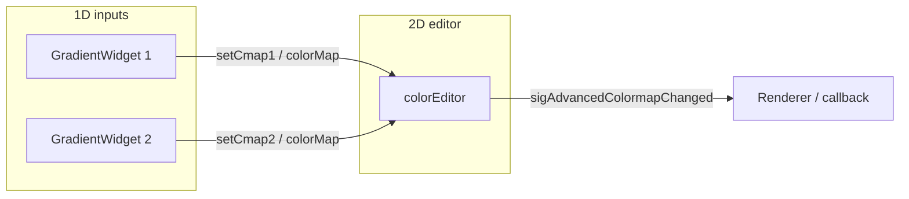

# Replace silx ColormapDialogs with pyqtgraph GradientWidgets in EditableColormap2DEditorWidget

## Current behavior

- [EditableColormap2DEditorWidget](pyPhoPlaceCellAnalysis/src/pyphoplacecellanalysis/PhoPositionalData/plotting/chunked_2d/PosteriorColormapEditorWidget.py) creates two silx `ColormapDialog` widgets and initializes each with `_pg_colormap_to_silx_colormap(self.colormap_1D_list[i])`. The 2D editor (`PosteriorColormap2DEditorWidget`) already uses `_cmap1` / `_cmap2` (pg.ColorMap) and exposes `setCmap1` / `setCmap2`, `getCmap1` / `getCmap2`, and `sigAdvancedColormapChanged`.
- The file already uses `GradientEditorItem` and the codebase has `pg.GradientWidget`, which wraps it and exposes `setColorMap`, `colorMap()`, and `sigGradientChangeFinished` (and `sigGradientChanged`).

## Target behavior

- **EditableColormap2DEditorWidget** uses only pyqtgraph and Qt (no silx) for its UI: two **pg.GradientWidget** instances (one per 1D colormap), each showing/editing a `pg.ColorMap`. Edits update `self.colormap_1D_list`, the 2D editor’s `setCmap1`/`setCmap2`, and thus the 2D preview and `sigAdvancedColormapChanged`.

## Implementation plan

### 1. Use pyqtgraph’s Qt for EditableColormap2DEditorWidget

- In the **EditableColormap2DEditorWidget** section only, stop using `silx.gui.qt` for that class. Use the already-imported `QtWidgets` / `QtCore` from `pyphoplacecellanalysis.External.pyqtgraph.Qt` (line 13) for `QMainWindow`, `QWidget`, `QHBoxLayout`, `QVBoxLayout`, etc., so that class has no silx dependency.
- Keep silx imports and the rest of the file (e.g. `ColormapDialogExample`) unchanged.

### 2. Replace the two ColormapDialogs with two GradientWidgets

- **Layout:** Keep a horizontal layout: left = `self.colorEditor` (2D widget), right = a vertical stack of two panels, each containing one 1D colormap editor.
- **Widgets:** For each of the two 1D colormaps:
  - Create a small container (e.g. `QWidget` with `QVBoxLayout`) with an optional label (e.g. “Cmap 1 (early t)” / “Cmap 2 (late t)”).
  - Add a **pg.GradientWidget** (e.g. `orientation='bottom'`) and call `setColorMap(self.colormap_1D_list[i])` with the initial `pg.ColorMap`.
- Store references: e.g. `self.gradient_widgets = [gw1, gw2]` (or two named attributes) and keep `self.colormap_1D_list = [custom_cmap1, custom_cmap2]` as the canonical pg colormaps.

### 3. Wire gradient changes to the 2D editor and signal

- For each GradientWidget, connect `sigGradientChangeFinished` to a slot that:
  - Gets the current colormap from the widget: `cmap = self.gradient_widgets[i].colorMap()` (GradientEditorItem’s `colorMap()` returns a pg ColorMap).
  - Updates `self.colormap_1D_list[i] = cmap`.
  - Calls `self.colorEditor.setCmap1(cmap)` or `self.colorEditor.setCmap2(cmap)` so the 2D preview and `sigAdvancedColormapChanged` are updated.
- Optionally debounce with `sigGradientChanged` + QTimer (as in the 2D editor’s gradient handling) if you want live preview without firing too often; otherwise `sigGradientChangeFinished` alone is sufficient.

### 4. Remove dialog add/remove and silx-only code from EditableColormap2DEditorWidget

- Remove `createColorDialog()` and `removeColorDialog()`; remove the `self.colorDialogs` list and any `ColormapDialog` / `_pg_colormap_to_silx_colormap` usage from this class.
- Build the two gradient panels once in `__init`__ (no dynamic add/remove of 1D editors).

### 5. Leave silx helpers and ColormapDialogExample as-is

- **Do not** remove `_HashableLUTColormap`, `_pg_colormap_to_silx_colormap`, or `pg_to_silx_colormap_dense`; **ColormapDialogExample** (and any other code) still uses silx `ColormapDialog` and may rely on them.
- Keep the silx import block and the “Simple Silx Example” section unchanged unless you later decide to deprecate that example.

## Files to touch

- [PosteriorColormapEditorWidget.py](pyPhoPlaceCellAnalysis/src/pyphoplacecellanalysis/PhoPositionalData/plotting/chunked_2d/PosteriorColormapEditorWidget.py): only the `EditableColormap2DEditorWidget` class and its `__init`__ / `createColorDialog` / `removeColorDialog` (replace/remove as above). Add `pg.GradientWidget` usage (import if not already available via `pg`).

## Data flow (after change)

- User edits in GW1 or GW2 → `sigGradientChangeFinished` → update `colormap_1D_list[i]` and `colorEditor.setCmap1`/`setCmap2` → 2D preview and `sigAdvancedColormapChanged(cmap1, cmap2)`.

## Summary

- Replace the two silx ColormapDialogs in **EditableColormap2DEditorWidget** with two **pg.GradientWidget** panels.
- Use pg’s Qt for that class; keep silx elsewhere in the file.
- On gradient change finished, read `pg.ColorMap` from the widget, update `colormap_1D_list`, and call `colorEditor.setCmap1`/`setCmap2` so the 2D colormap and external signal stay correct.

